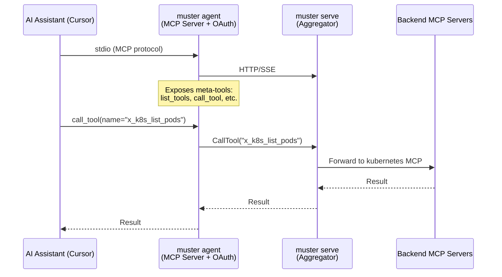
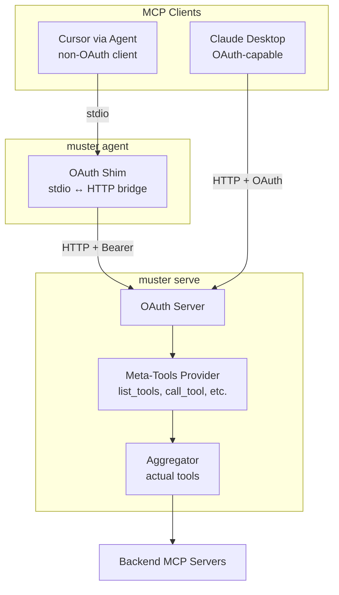

# Server-Side Agent Tools

## Current Architecture




**Current Agent Package** (`internal/agent/`):

- `server_mcp.go` - MCPServer that exposes meta-tools via stdio
- `server_mcp_handlers.go` - Handlers for list_tools, call_tool, etc.
- `client.go` - MCP client that connects to aggregator
- `oauth/` - OAuth authentication manager

**Meta-tools exposed by agent today:**

- `list_tools` - List all available tools
- `call_tool` - Execute any tool (main indirection)
- `describe_tool` / `describe_resource` / `describe_prompt` - Get schemas
- `list_resources` / `get_resource` - Resource operations
- `list_prompts` / `get_prompt` - Prompt operations
- `filter_tools` / `list_core_tools` - Discovery helpers

## Proposed Architecture




**Connection Options:**

1. **Via Agent (for non-OAuth MCP clients like Cursor)**
  - Agent handles browser-based OAuth authentication
  - Agent bridges stdio ↔ HTTP (thin transport layer)
  - Server exposes meta-tools
2. **Direct HTTP (for OAuth-capable MCP clients)**
  - Client connects directly to `muster serve` via HTTP/SSE
  - Client handles OAuth flow (if supported by MCP client)
  - Server exposes meta-tools

## Key Components to Modify/Create

### 1. New Server-Side Meta-Tools Package

Create `internal/metatools/` package containing:

- `**provider.go**` - MetaToolsProvider that exposes:
  - `list_tools`, `describe_tool`, `call_tool`
  - `list_resources`, `describe_resource`, `get_resource`
  - `list_prompts`, `describe_prompt`, `get_prompt`
  - `filter_tools`, `list_core_tools`
- `**handlers.go**` - Handler implementations (moved from `internal/agent/server_mcp_handlers.go`)
- `**api_adapter.go**` - Integration with central API layer

**Key differences from agent version:**

- Uses `api.GetAggregator()` to call tools (not a Client)
- Session-aware (uses context session ID for tool visibility)
- No local caching needed (aggregator already caches)

### 2. Aggregator Integration

Modify `internal/aggregator/server.go` to:

- Register meta-tools from MetaToolsProvider
- Meta-tools get prefixed as `core_*` (e.g., `core_list_tools`, `core_call_tool`)
- **Remove all direct tool exposure** - only meta-tools are available

### 3. Agent Simplification

Simplify `internal/agent/` to be a thin OAuth shim:

- **Remove**: `server_mcp.go`, `server_mcp_handlers.go`
- **Keep**: OAuth package, client transport
- **New**: `transport_bridge.go` - bridges stdio ↔ HTTP

The simplified agent:

1. Handles OAuth browser flow when receiving 401
2. Forwards all MCP messages to server over HTTP
3. Forwards all server responses back to stdio

### 4. No Configuration Toggle

**This is a breaking change with no backwards compatibility mode.** The aggregator always exposes only meta-tools. There is no configuration option to switch between modes.

---

## Implementation Phases

### Phase 1: Server-Side Meta-Tools

Create the server-side meta-tools infrastructure:

1. Create `internal/metatools/` package
2. Implement handlers (moved from agent)
3. Ensure handlers preserve `CallToolResult` structure
4. Register with aggregator
5. Test meta-tools work via direct HTTP

### Phase 2: Agent Client Wrapping

Modify `agent.Client` to wrap calls transparently:

1. Add `callToolDirect()` for raw meta-tool calls
2. Modify `CallTool()` to wrap through `call_tool`
3. Add `unwrapMetaToolResponse()` for nested results
4. Test with REPL mode

### Phase 3: CLI Executor Updates

Update CLI response handling:

1. Update `formatOutput()` for unwrapped responses
2. Update `formatError()` for nested errors
3. Verify all output formats (table, wide, json, yaml)
4. Test all CLI commands manually

### Phase 4: BDD Test Framework

Update test framework for meta-tools:

1. Update `MCPTestClient.CallTool()` with wrapping
2. Add unwrapping logic
3. Run all 165 scenarios
4. Fix any regressions

### Phase 5: Agent Simplification

Convert agent to transport bridge:

1. Remove `server_mcp_handlers.go`
2. Simplify `server_mcp.go` to pure forwarding
3. Test `muster agent --mcp-server` with Cursor
4. Verify OAuth flow still works

### Phase 6: Documentation & Cleanup

**This phase is critical** - the architectural change affects 15+ documentation files.

1. Update architecture documentation (see detailed section below)
2. Create ADR-010 for server-side meta-tools
3. Add CHANGELOG entry with migration guide
4. Update all AI agent integration guides
5. Remove deprecated code

---

## File Changes Summary


| Action | File                                    | Description                      |
| ------ | --------------------------------------- | -------------------------------- |
| Create | `internal/metatools/doc.go`             | Package documentation            |
| Create | `internal/metatools/provider.go`        | MetaToolsProvider implementation |
| Create | `internal/metatools/handlers.go`        | Tool handlers (from agent)       |
| Create | `internal/metatools/api_adapter.go`     | API layer integration            |
| Create | `internal/metatools/formatters.go`      | Response formatting (from agent) |
| Modify | `internal/aggregator/tool_factory.go`   | Register meta-tools              |
| Modify | `internal/api/handlers.go`              | Add MetaToolsHandler interface   |
| Modify | `internal/app/services.go`              | Initialize MetaToolsProvider     |
| Modify | `internal/agent/server_mcp.go`          | Convert to transport bridge      |
| Delete | `internal/agent/server_mcp_handlers.go` | Moved to metatools package       |
| Modify | `cmd/agent.go`                          | Use transport bridge mode        |


## Breaking Changes

**This is a breaking change with no backwards compatibility.**

### What Breaks


| Component                 | What Breaks                                                                              | Migration                                                            |
| ------------------------- | ---------------------------------------------------------------------------------------- | -------------------------------------------------------------------- |
| **Aggregator API**        | Direct tool access removed. Clients can no longer call `x_kubernetes_list_pods` directly | Must use `call_tool(name="x_kubernetes_list_pods", arguments={...})` |
| **Agent MCP Server**      | Agent no longer exposes meta-tools; server does                                          | Clients connecting via agent get meta-tools from server, not agent   |
| **External Integrations** | Any code calling tools directly via HTTP/SSE                                             | Must wrap all calls through `call_tool` meta-tool                    |


### What Continues Working (Transparent Migration)


| Component                                                | Why It Works                                                |
| -------------------------------------------------------- | ----------------------------------------------------------- |
| **CLI Commands** (`muster list`, `get`, etc.)            | `agent.Client` wraps calls transparently                    |
| **Agent REPL** (`muster agent --repl`)                   | Uses same `agent.Client` with transparent wrapping          |
| **BDD Test Scenarios**                                   | `MCPTestClient` wraps calls transparently                   |
| **MCP Native Protocol** (`tools/list`, `resources/list`) | Not affected - these are MCP spec methods, not muster tools |
| **Shell Completion**                                     | Uses MCP native protocol, not tool calls                    |


### Migration Timeline

**No transition phase.** All clients must update simultaneously with the server:

1. Deploy updated `muster serve` with meta-tools
2. Deploy updated `muster` binary with wrapped client
3. All external integrations must update to use `call_tool`

## Benefits

1. **Simpler Agent**: Agent becomes a thin auth+transport shim (~200 lines vs ~700)
2. **Direct Access**: OAuth-capable clients can connect directly without agent
3. **Centralized Logic**: Meta-tool logic lives in one place (server)
4. **Session Consistency**: Server-side meta-tools use session-scoped tool visibility
5. **Better Testability**: Meta-tools can be tested as part of server tests

---

## CLI Command Impact Analysis

This migration affects the entire muster CLI, not just the agent command. All commands that call tools through the aggregator must be updated.

### Command Classification

#### Category 1: Commands That Call Tools Directly (HIGH IMPACT)

These commands use `cli.ToolExecutor` which calls `agent.Client.CallTool()` to execute tools by name:


| Command         | Tools Called                                                                                                               | Current Code Path                          |
| --------------- | -------------------------------------------------------------------------------------------------------------------------- | ------------------------------------------ |
| `muster list`   | `core_service_list`, `core_serviceclass_list`, `core_mcpserver_list`, `core_workflow_list`, `core_workflow_execution_list` | `executor.Execute()` → `client.CallTool()` |
| `muster get`    | `core_service_status`, `core_serviceclass_get`, `core_mcpserver_get`, `core_workflow_get`, `core_workflow_execution_get`   | `executor.Execute()` → `client.CallTool()` |
| `muster create` | `core_serviceclass_create`, `core_workflow_create`, `core_service_create`, `core_mcpserver_create`                         | `executor.Execute()` → `client.CallTool()` |
| `muster start`  | `core_service_start`, `workflow_<name>` (dynamic)                                                                          | `executor.Execute()` → `client.CallTool()` |
| `muster stop`   | `core_service_stop`                                                                                                        | `executor.Execute()` → `client.CallTool()` |
| `muster check`  | `core_serviceclass_available`, `core_service_status`, `core_workflow_available`                                            | `executor.Execute()` → `client.CallTool()` |
| `muster events` | `core_events`                                                                                                              | `executor.Execute()` → `client.CallTool()` |


#### Category 2: Agent-Based Commands (HIGH IMPACT)


| Command                     | Current Behavior                        | Impact                          |
| --------------------------- | --------------------------------------- | ------------------------------- |
| `muster agent`              | Uses `agent.Client.CallTool()` directly | Client must wrap all calls      |
| `muster agent --repl`       | Interactive tool exploration/execution  | REPL calls go through client    |
| `muster agent --mcp-server` | Exposes meta-tools, bridges stdio↔HTTP  | This is what the plan refactors |
| `muster standalone`         | Combines `serve` + `agent`              | Inherits agent impact           |


#### Category 3: Test Framework (HIGH IMPACT)


| Command                         | Current Behavior                                                 | Impact                       |
| ------------------------------- | ---------------------------------------------------------------- | ---------------------------- |
| `muster test`                   | BDD scenarios call tools directly via `MCPTestClient.CallTool()` | Covered in BDD section below |
| `muster test --generate-schema` | Uses `ListToolsWithSchemas()` via MCP native protocol            | Keep using MCP protocol      |


#### Category 4: Local-Only Commands (NO IMPACT)


| Command              | Reason                                |
| -------------------- | ------------------------------------- |
| `muster serve`       | Server-side - produces the meta-tools |
| `muster auth *`      | Local token storage, no tool calls    |
| `muster context *`   | Local file operations only            |
| `muster version`     | Prints version, no network            |
| `muster self-update` | GitHub API calls, no aggregator       |


### Layered Implementation Approach

Rather than modifying every CLI command individually, we implement **transparent wrapping at the agent.Client level**:

```
┌─────────────────────────────────────────────────────────────────┐
│                         CLI Commands                            │
│  list.go, get.go, create.go, start.go, stop.go, check.go, ...  │
│                      (NO CHANGES NEEDED)                        │
└─────────────────────────────────────────────────────────────────┘
                               │
                               ▼
┌─────────────────────────────────────────────────────────────────┐
│                      cli.ToolExecutor                           │
│  Execute() → client.CallTool(toolName, args)                    │
│                   (MINIMAL CHANGES)                             │
│  - Update error handling for nested format                      │
│  - Update result formatting for nested response                 │
└─────────────────────────────────────────────────────────────────┘
                               │
                               ▼
┌─────────────────────────────────────────────────────────────────┐
│                       agent.Client                              │
│  CallTool(name, args) → CallTool("call_tool", {name, args})    │
│                   (PRIMARY CHANGES)                             │
│  - Wrap all tool calls through call_tool meta-tool             │
│  - Unwrap nested CallToolResult from response                  │
└─────────────────────────────────────────────────────────────────┘
                               │
                               ▼
┌─────────────────────────────────────────────────────────────────┐
│                    muster serve (Aggregator)                    │
│              Exposes ONLY: call_tool, list_tools, etc.         │
└─────────────────────────────────────────────────────────────────┘
```

### Agent Client Modification

The key change is in `internal/agent/client.go`:

```go
// CallTool wraps all tool calls through the call_tool meta-tool.
// This is transparent to all callers (CLI, REPL, tests).
func (c *Client) CallTool(ctx context.Context, name string, args map[string]interface{}) (*mcp.CallToolResult, error) {
    // Wrap through call_tool meta-tool
    wrappedArgs := map[string]interface{}{
        "name":      name,
        "arguments": args,
    }
    
    result, err := c.callToolDirect(ctx, "call_tool", wrappedArgs)
    if err != nil {
        return nil, err
    }
    
    // Unwrap the nested response
    return c.unwrapMetaToolResponse(result, name)
}

// callToolDirect calls a tool without wrapping (used for meta-tools themselves)
func (c *Client) callToolDirect(ctx context.Context, name string, args map[string]interface{}) (*mcp.CallToolResult, error) {
    // Original CallTool implementation
    ...
}

// unwrapMetaToolResponse extracts the actual tool result from meta-tool response
func (c *Client) unwrapMetaToolResponse(result *mcp.CallToolResult, toolName string) (*mcp.CallToolResult, error) {
    if len(result.Content) == 0 {
        return result, nil
    }

    textContent, ok := mcp.AsTextContent(result.Content[0])
    if !ok {
        return result, nil
    }

    // Parse the nested result structure
    var nested struct {
        IsError bool            `json:"isError"`
        Content json.RawMessage `json:"content"`
    }
    if err := json.Unmarshal([]byte(textContent.Text), &nested); err != nil {
        // Not a wrapped response, return as-is
        return result, nil
    }

    // Reconstruct CallToolResult
    unwrapped := &mcp.CallToolResult{
        IsError: nested.IsError,
    }
    
    var contentItems []map[string]interface{}
    if err := json.Unmarshal(nested.Content, &contentItems); err == nil {
        for _, item := range contentItems {
            if item["type"] == "text" {
                unwrapped.Content = append(unwrapped.Content, mcp.TextContent{
                    Type: "text",
                    Text: item["text"].(string),
                })
            }
        }
    }

    return unwrapped, nil
}
```

### MCP Native Protocol Methods

The `cli.ToolExecutor` also uses MCP native protocol methods for listing primitives:

```go
// These use MCP protocol's tools/list, resources/list - NOT muster tools
func (e *ToolExecutor) ListMCPTools(ctx context.Context) ([]mcp.Tool, error)
func (e *ToolExecutor) ListMCPResources(ctx context.Context) ([]mcp.Resource, error)
func (e *ToolExecutor) ListMCPPrompts(ctx context.Context) ([]mcp.Prompt, error)
```

**Decision: Keep using MCP native protocol** for these methods. The MCP spec's `tools/list`, `resources/list`, and `prompts/list` methods are independent from muster's meta-tools and should continue to work. These are used for:

- Shell completion in CLI commands
- Schema generation in `muster test --generate-schema`

### Special Considerations

#### Dynamic Workflow Tools

The `muster start workflow <name>` command constructs dynamic tool names:

```go
// cmd/start.go:205
toolName := fmt.Sprintf("workflow_%s", resourceName)
return executor.Execute(ctx, toolName, workflowParams)
```

These dynamic names must work through `call_tool`. The aggregator's meta-tools must resolve `workflow_*` tools correctly.

#### Error Message Preservation

Current error messages from tools should flow through unchanged. The unwrapping logic must preserve:

- `IsError` flag
- Error text content
- Tool name in error context

---

## BDD Test Suite Impact Analysis

### Current Test Architecture

The BDD test suite (`internal/testing/`) calls tools **directly** via the MCP protocol:

```go
// internal/testing/test_runner.go:485
response, err := client.CallTool(stepCtx, step.Tool, resolvedArgs)
```

Test scenarios (YAML files in `internal/testing/scenarios/`) reference tools directly:

```yaml
# Example from service-lifecycle.yaml
- id: "developer-checks-available-services"
  tool: "core_service_list"    # Direct tool name
  expected:
    success: true
```

**Key components involved:**


| File                              | Purpose                                               |
| --------------------------------- | ----------------------------------------------------- |
| `internal/testing/mcp_client.go`  | MCP client that calls `CallTool(ctx, toolName, args)` |
| `internal/testing/test_runner.go` | Executes scenario steps, validates responses          |
| `internal/testing/validation.go`  | Schema validation for `core_*` tools                  |
| `internal/testing/types.go`       | `MCPTestClient` interface definition                  |


### Breaking Change: Aggregator Only Exposes Meta-Tools

**This is a breaking change with no transition phase.**

The aggregator exposes **only** meta-tools (`call_tool`, `list_tools`, etc.). Direct tool access is removed entirely. All clients must use `call_tool` to execute any tool.

**Required BDD Test Changes:**

The BDD test client (`MCPTestClient`) must wrap all tool calls through the `call_tool` meta-tool transparently. Test scenarios remain unchanged - the wrapping is internal to the test client.


| File                              | Change                                       |
| --------------------------------- | -------------------------------------------- |
| `internal/testing/mcp_client.go`  | Wrap all tool calls through call_tool        |
| `internal/testing/test_runner.go` | Update response validation for nested format |


**Response unwrapping requirement:**

The current agent's `handleCallTool` flattens responses to text. The server-side meta-tools **must preserve the full `CallToolResult` structure** to maintain test validation fidelity.

---

## Implementation Details

### Critical: Preserve CallToolResult Structure

The current agent's `handleCallTool` flattens responses to text. For BDD tests to work, the server-side meta-tools must **preserve the full `CallToolResult` structure**:

```go
// internal/metatools/handlers.go - MUST preserve structure

func (m *MetaToolsProvider) handleCallTool(ctx context.Context, request mcp.CallToolRequest) (*mcp.CallToolResult, error) {
    name, _ := request.RequireString("name")
    args := extractArgs(request)
    
    // Execute via aggregator
    result, err := api.GetAggregator().CallToolInternal(ctx, name, args)
    if err != nil {
        return mcp.NewToolResultError(fmt.Sprintf("Tool execution failed: %v", err)), nil
    }
    
    // CRITICAL: Return result as structured JSON, not flattened text
    // This allows BDD tests to unwrap and validate IsError, Content, etc.
    resultJSON, _ := json.Marshal(struct {
        IsError bool          `json:"isError"`
        Content []interface{} `json:"content"`
    }{
        IsError: result.IsError,
        Content: serializeContent(result.Content),
    })
    
    return mcp.NewToolResultText(string(resultJSON)), nil
}
```

### BDD Test Client Modifications

#### 1. `internal/testing/mcp_client.go` - Meta-Tool Wrapping (Always)

```go
// CallTool always wraps tool calls through the call_tool meta-tool.
// There is no direct tool access - the server only exposes meta-tools.
func (c *mcpTestClient) CallTool(ctx context.Context, toolName string, toolArgs map[string]interface{}) (interface{}, error) {
    if c.client == nil {
        return nil, fmt.Errorf("MCP client not connected")
    }

    // All tool calls go through call_tool - no direct access
    request := mcp.CallToolRequest{
        Params: struct {
            Name      string    `json:"name"`
            Arguments any       `json:"arguments,omitempty"`
            Meta      *mcp.Meta `json:"_meta,omitempty"`
        }{
            Name: "call_tool",
            Arguments: map[string]interface{}{
                "name":      toolName,
                "arguments": toolArgs,
            },
        },
    }

    result, err := c.client.CallTool(ctx, request)
    if err != nil {
        return nil, fmt.Errorf("tool call %s failed: %w", toolName, err)
    }

    // Unwrap the nested response
    return c.unwrapMetaToolResponse(result, toolName)
}

// unwrapMetaToolResponse extracts the actual tool result from meta-tool response
func (c *mcpTestClient) unwrapMetaToolResponse(result *mcp.CallToolResult, toolName string) (*mcp.CallToolResult, error) {
    // The meta-tool returns JSON with the nested result structure
    if len(result.Content) == 0 {
        return result, nil
    }

    textContent, ok := mcp.AsTextContent(result.Content[0])
    if !ok {
        return result, nil
    }

    // Parse the nested result
    var nested struct {
        IsError bool            `json:"isError"`
        Content json.RawMessage `json:"content"`
    }
    if err := json.Unmarshal([]byte(textContent.Text), &nested); err != nil {
        // Not a wrapped response, return as-is
        return result, nil
    }

    // Reconstruct CallToolResult
    unwrapped := &mcp.CallToolResult{
        IsError: nested.IsError,
    }
    
    // Parse content array
    var contentItems []map[string]interface{}
    if err := json.Unmarshal(nested.Content, &contentItems); err == nil {
        for _, item := range contentItems {
            if item["type"] == "text" {
                unwrapped.Content = append(unwrapped.Content, mcp.TextContent{
                    Type: "text",
                    Text: item["text"].(string),
                })
            }
            // Handle other content types as needed
        }
    }

    return unwrapped, nil
}
```

#### 2. `internal/testing/mcp_client.go` - Add ListTools via Meta-Tool

```go
// ListTools returns available MCP tools via list_tools meta-tool
func (c *mcpTestClient) ListTools(ctx context.Context) ([]string, error) {
    if c.client == nil {
        return nil, fmt.Errorf("MCP client not connected")
    }

    // Call list_tools meta-tool
    request := mcp.CallToolRequest{
        Params: struct {
            Name      string    `json:"name"`
            Arguments any       `json:"arguments,omitempty"`
            Meta      *mcp.Meta `json:"_meta,omitempty"`
        }{
            Name: "list_tools",
        },
    }

    result, err := c.client.CallTool(ctx, request)
    if err != nil {
        return nil, fmt.Errorf("failed to list tools: %w", err)
    }

    // Parse tool names from JSON response
    return c.parseToolListFromResponse(result)
}
```

#### 3. `internal/testing/validation.go` - Update Schema Validation

The schema validation needs to understand that `core_*` tools are now accessed via `call_tool`:

```go
// validateStep validates a single test step
func validateStep(step TestStep, toolSchemas map[string]interface{}, verbose, debug bool) StepValidationResult {
    result := StepValidationResult{
        StepID: step.ID,
        Tool:   step.Tool,
        Valid:  true,
    }

    // All tool prefixes are valid - they go through call_tool
    validPrefixes := []string{"core_", "x_", "workflow_", "api_"}
    hasValidPrefix := false
    for _, prefix := range validPrefixes {
        if strings.HasPrefix(step.Tool, prefix) {
            hasValidPrefix = true
            break
        }
    }

    if !hasValidPrefix {
        result.Valid = false
        result.Errors = append(result.Errors, ValidationError{
            Type:    "unknown_tool",
            Message: fmt.Sprintf("Tool '%s' has invalid prefix", step.Tool),
        })
    }

    // Schema validation for core_ tools (validate args structure)
    if strings.HasPrefix(step.Tool, "core_") {
        if toolSchema, exists := toolSchemas[step.Tool]; exists {
            // Validate arguments against schema
            errors := validateArguments(step.Args, toolSchema, step.Tool)
            result.Errors = append(result.Errors, errors...)
        }
    }

    return result
}
```

### Complete File Changes Summary

#### Server-Side Meta-Tools (New Package)


| Action | File                                | Description                                         |
| ------ | ----------------------------------- | --------------------------------------------------- |
| Create | `internal/metatools/doc.go`         | Package documentation                               |
| Create | `internal/metatools/provider.go`    | MetaToolsProvider implementation                    |
| Create | `internal/metatools/handlers.go`    | Tool handlers with structured response preservation |
| Create | `internal/metatools/api_adapter.go` | API layer integration                               |
| Create | `internal/metatools/formatters.go`  | Response formatting (from agent)                    |


#### Aggregator & API Integration


| Action | File                                  | Description                    |
| ------ | ------------------------------------- | ------------------------------ |
| Modify | `internal/aggregator/tool_factory.go` | Register only meta-tools       |
| Modify | `internal/api/handlers.go`            | Add MetaToolsHandler interface |
| Modify | `internal/app/services.go`            | Initialize MetaToolsProvider   |


#### Agent Package (Simplification)


| Action | File                                    | Description                 |
| ------ | --------------------------------------- | --------------------------- |
| Modify | `internal/agent/server_mcp.go`          | Convert to transport bridge |
| Delete | `internal/agent/server_mcp_handlers.go` | Moved to metatools package  |
| Modify | `cmd/agent.go`                          | Use transport bridge mode   |


#### Agent Client (Transparent Wrapping)


| Action     | File                       | Description                                         |
| ---------- | -------------------------- | --------------------------------------------------- |
| **Modify** | `internal/agent/client.go` | **Wrap CallTool() through call_tool meta-tool**     |
| **Modify** | `internal/agent/client.go` | **Add unwrapMetaToolResponse() for nested results** |


#### CLI Package (Response Handling)


| Action     | File                       | Description                                             |
| ---------- | -------------------------- | ------------------------------------------------------- |
| **Modify** | `internal/cli/executor.go` | **Update formatOutput() for unwrapped response format** |
| **Modify** | `internal/cli/executor.go` | **Update formatError() for nested error format**        |


#### BDD Test Framework


| Action     | File                              | Description                                               |
| ---------- | --------------------------------- | --------------------------------------------------------- |
| **Modify** | `internal/testing/mcp_client.go`  | **Wrap all tool calls through call_tool, add unwrapping** |
| **Modify** | `internal/testing/test_runner.go` | **Handle unwrapped responses in validation**              |
| **Modify** | `internal/testing/validation.go`  | **Update schema validation for meta-tools**               |
| **Modify** | `internal/testing/types.go`       | **Update MCPTestClient interface if needed**              |


#### CLI Commands (NO CHANGES)

Due to the transparent wrapping in `agent.Client`, these files require **no modifications**:


| File                | Reason                                              |
| ------------------- | --------------------------------------------------- |
| `cmd/list.go`       | Uses `executor.Execute()` which uses wrapped client |
| `cmd/get.go`        | Uses `executor.Execute()`                           |
| `cmd/create.go`     | Uses `executor.Execute()`                           |
| `cmd/start.go`      | Uses `executor.Execute()`                           |
| `cmd/stop.go`       | Uses `executor.Execute()`                           |
| `cmd/check.go`      | Uses `executor.Execute()`                           |
| `cmd/events.go`     | Uses `executor.Execute()`                           |
| `cmd/standalone.go` | Uses modified agent                                 |
| `cmd/auth.go`       | Local only, no aggregator calls                     |
| `cmd/context.go`    | Local only                                          |
| `cmd/serve.go`      | Server-side                                         |
| `cmd/version.go`    | Local only                                          |
| `cmd/selfupdate.go` | GitHub API only                                     |


### Test Scenarios Unchanged

All 165 existing YAML scenario files remain unchanged. The wrapping is transparent:

```yaml
# This continues to work - wrapping happens in mcp_client.go
- id: "developer-checks-available-services"
  tool: "core_service_list"
  expected:
    success: true
```

### Validation Fidelity Preservation

With structured response preservation in meta-tools, BDD tests retain full validation capabilities:


| Validation Type         | Preserved? | How                                            |
| ----------------------- | ---------- | ---------------------------------------------- |
| `success: true/false`   | Yes        | `IsError` field in unwrapped response          |
| `contains: [...]`       | Yes        | Text content extracted from unwrapped response |
| `json_path: {...}`      | Yes        | JSON parsed from text content                  |
| `error_contains: [...]` | Yes        | Error text from `IsError=true` responses       |


### Risk Mitigation

#### Response & Protocol Risks

1. **Response format compatibility**: Add integration tests that verify unwrapping works for all content types
2. **Edge cases**: Handle empty responses, binary content, multi-part content
3. **Timeout propagation**: Ensure timeouts flow correctly through the meta-tool layer
4. **Error message clarity**: Preserve tool name in error messages for debugging

#### CLI-Specific Risks

1. **Dynamic workflow tools**: Verify `workflow_<name>` tools resolve correctly through `call_tool`
2. **Shell completion**: Ensure `ListMCPTools()` continues working via MCP native protocol (not meta-tools)
3. **Output formatting**: Verify table/JSON/YAML output formats work with unwrapped responses
4. **Spinner/progress**: Ensure CLI spinners still work correctly during wrapped calls

#### Testing Requirements

1. **All BDD scenarios must pass**: Run `muster test --parallel 50` before merge
2. **All CLI commands must work**: Manual verification of list, get, create, start, stop, check, events
3. **REPL mode must work**: Verify `muster agent --repl` interactive commands
4. **MCP server mode must work**: Verify `muster agent --mcp-server` with Cursor

#### Rollout

1. **No partial rollout**: All clients must update simultaneously with the server
2. **Breaking change announcement**: Document in CHANGELOG.md with migration guide

---

## Documentation Changes (Detailed)

This architectural change fundamentally alters the "two-layer architecture" that is documented throughout the `docs/` directory. Every reference to "agent provides meta-tools" must be updated.

### Priority Matrix


| Priority | Files                                          | Reason                           |
| -------- | ---------------------------------------------- | -------------------------------- |
| P0       | `docs/explanation/architecture.md`             | Core architectural understanding |
| P0       | `docs/getting-started/ai-agent-setup.md`       | First user touchpoint            |
| P0       | `CHANGELOG.md`                                 | Migration guidance               |
| P1       | `docs/reference/cli/agent.md`                  | CLI reference accuracy           |
| P1       | ADR-010 (new)                                  | Decision documentation           |
| P2       | `docs/explanation/components/aggregator.md`    | Component understanding          |
| P2       | `docs/getting-started/ai-agent-integration.md` | Advanced setup                   |
| P2       | `docs/reference/mcp-tools.md`                  | Tool reference                   |
| P3       | `docs/how-to/ai-agent-integration.md`          | Advanced patterns                |
| P3       | Testing documentation                          | Developer-focused                |


### 1. `docs/explanation/architecture.md` (P0 - Major Rewrite)

**Current State**: Documents agent as exposing 11 meta-tools, aggregator as exposing 36+ core tools.

**Required Changes**:


| Section                               | Change                                                          |
| ------------------------------------- | --------------------------------------------------------------- |
| Two-Layer Architecture (lines 62-104) | Rewrite - agent is transport bridge, not meta-tool provider     |
| Key Architectural Flow diagram        | Update sequence diagram - agent forwards, doesn't process       |
| Tool Architecture (lines 136-180)     | Remove "Agent Layer Tools (11 meta-tools)" - agent has no tools |
| Agent Layer Tools mermaid diagram     | Remove or restructure entirely                                  |
| Usage Pattern (lines 182-201)         | Update - clients use meta-tools from server                     |


**New Architecture Description**:

```markdown
### Layer 1: Aggregator Server (`muster serve`)

The aggregator server provides the **meta-tools interface**:

**Meta-Tools Available:**
- `list_tools`, `describe_tool`, `call_tool`
- `list_resources`, `describe_resource`, `get_resource`
- `list_prompts`, `describe_prompt`, `get_prompt`
- `filter_tools`, `list_core_tools`

**Actual Tools (accessed via call_tool):**
- 36 Core Tools: `core_service_list`, `core_workflow_create`, etc.
- Dynamic Workflow Tools: `workflow_*`
- External MCP Tools: `x_kubernetes_*`, etc.

### Layer 2: Agent (`muster agent --mcp-server`)

The agent is a **thin transport bridge**:
- Bridges stdio ↔ HTTP/SSE transport
- Handles OAuth authentication for non-OAuth MCP clients
- Forwards all MCP messages to server
- Does NOT process meta-tools locally
```

**Diagram Updates**:

Current diagram shows:

```
AI Agent → Agent (meta-tools) → Aggregator (core tools)
```

New diagram should show:

```
AI Agent → Agent (OAuth shim) → Server (meta-tools → actual tools)
```

### 2. `docs/getting-started/ai-agent-setup.md` (P0 - Major Rewrite)

**Current State**: Explains that AI agents see 11 meta-tools from the agent.

**Sections to Rewrite**:


| Section                                  | Change                                                |
| ---------------------------------------- | ----------------------------------------------------- |
| Understanding Architecture (lines 19-27) | Agent is transport, server has meta-tools             |
| Expected Response (lines 96-114)         | Remove "11 agent meta-tools" - tools come from server |
| Key Concepts (lines 185-207)             | Complete rewrite of patterns                          |
| Common Usage Patterns                    | Same patterns, different explanation                  |


**Key Message Change**:

Current:

> "Your AI agent connects to the Agent layer and uses meta-tools to access the underlying functionality."

New:

> "Your AI agent connects through the Agent (for OAuth) to the Server, which exposes meta-tools for accessing all functionality."

### 3. `docs/reference/cli/agent.md` (P1 - Significant Update)

**Current State**: Documents agent as exposing 11 meta-tools in `--mcp-server` mode.

**Required Changes**:


| Section                                | Change                                          |
| -------------------------------------- | ----------------------------------------------- |
| Description                            | Rewrite to describe transport bridge role       |
| MCP Server Mode (lines 41-48)          | No longer exposes meta-tools locally            |
| MCP Server Tools table (lines 332-347) | **Remove entirely** - these are server-side now |


**New MCP Server Mode Description**:

```markdown
### 3. MCP Server Mode (`--mcp-server`)

Runs as an MCP transport bridge for AI assistant integration.

- Bridges stdio ↔ HTTP/SSE to the aggregator server
- Handles OAuth authentication when server requires it
- Forwards all MCP protocol messages to the server
- Server exposes meta-tools (`list_tools`, `call_tool`, etc.)
```

### 4. `docs/explanation/components/aggregator.md` (P2)

**Add New Section**:

```markdown
### Meta-Tools Interface

The aggregator now exposes ONLY meta-tools as its primary interface:

**Tool Discovery:**
- `list_tools` - List all available tools
- `describe_tool` - Get tool schema and documentation
- `filter_tools` - Filter tools by pattern
- `list_core_tools` - List built-in Muster tools

**Tool Execution:**
- `call_tool` - Execute any tool by name

**Resources & Prompts:**
- `list_resources`, `describe_resource`, `get_resource`
- `list_prompts`, `describe_prompt`, `get_prompt`

All other tools (core_*, workflow_*, x_*) are accessed via `call_tool`.
```

### 5. `docs/reference/mcp-tools.md` (P2)

**Add Meta-Tools Section** at the beginning:

```markdown
## Meta-Tools (Primary Interface)

All tool access goes through these meta-tools:

### `list_tools`
List all available tools from the aggregator.

### `call_tool`
Execute any tool by name.

**Arguments:**
- `name` (string, required) - Tool name to execute
- `arguments` (object, optional) - Tool arguments

**Example:**
```json
{
  "name": "call_tool",
  "arguments": {
    "name": "core_service_list",
    "arguments": {}
  }
}
```

### `describe_tool`

Get detailed schema for a specific tool.
...

```

### 6. ADR-010: Server-Side Meta-Tools (P1 - New File)

Create `docs/explanation/decisions/010-server-side-meta-tools.md`:

```markdown
# ADR-010: Server-Side Meta-Tools

## Status
Accepted

## Date
2026-02-04

## Context

The Muster agent package (`internal/agent/`) was responsible for:
1. OAuth authentication handling
2. Transport bridging (stdio ↔ HTTP)
3. Exposing 11 meta-tools (list_tools, call_tool, etc.)
4. Formatting responses for MCP clients

This created several issues:
- **Complexity**: Agent was ~700 lines handling both transport and meta-tools
- **Duplication**: Meta-tool logic would need duplication for direct HTTP clients
- **Limited access**: OAuth-capable clients couldn't connect directly
- **Inconsistency**: Session-scoped tool visibility was harder to maintain

## Decision

Move all meta-tools to the server-side (aggregator):

1. **Create `internal/metatools/` package** with handlers moved from agent
2. **Aggregator exposes ONLY meta-tools** - no direct tool access
3. **Agent becomes thin OAuth shim** - pure transport bridge
4. **Breaking change** - no backwards compatibility mode

## Consequences

### Positive

- **Simpler agent**: ~200 lines (transport + OAuth) vs ~700 lines
- **Direct HTTP access**: OAuth-capable clients connect without agent
- **Centralized logic**: Meta-tool logic in one place
- **Session consistency**: Server-side meta-tools use session-scoped visibility
- **Better testability**: Meta-tools tested as part of server tests

### Negative

- **Breaking change**: External integrations must update
- **Extra wrapping**: All tool calls have additional layer
- **Coordinated deployment**: Server and clients must update together

## Migration

- CLI commands: Transparent (client wraps automatically)
- Agent REPL: Transparent (client wraps automatically)
- BDD tests: Transparent (test client wraps automatically)
- External HTTP clients: Must use `call_tool(name="...", arguments={...})`
```

### 7. CHANGELOG.md Entry (P0)

Add under `## [Unreleased]`:

```markdown
### Breaking Changes

#### Server-Side Meta-Tools Migration

**What Changed**: Meta-tools (`list_tools`, `call_tool`, `describe_tool`, etc.) 
have moved from the agent to the aggregator server.

**Impact**:
- The agent no longer exposes meta-tools; it acts as an OAuth shim and transport bridge
- The aggregator now exposes ONLY meta-tools - no direct tool access
- All tool calls go through `call_tool` meta-tool

**What Continues Working** (transparent migration):
- CLI commands (`muster list`, `muster get`, etc.)
- Agent REPL (`muster agent --repl`)
- BDD test scenarios
- MCP native protocol methods (`tools/list`, `resources/list`)

**What Breaks** (requires update):
- External integrations calling tools directly via HTTP
- Custom clients connecting directly to aggregator

**Migration for External Clients**:
```json
// Before: Direct tool call
{"method": "tools/call", "params": {"name": "core_service_list"}}

// After: Wrap through call_tool
{"method": "tools/call", "params": {
  "name": "call_tool",
  "arguments": {"name": "core_service_list", "arguments": {}}
}}
```

**Benefits**:

- OAuth-capable clients can connect directly to server
- Simpler agent architecture
- Consistent tool visibility across all clients

See [ADR-010](docs/explanation/decisions/010-server-side-meta-tools.md) for details.

```

### 8. Testing Documentation (P3)

**`docs/contributing/testing/README.md`** - Add note:

```markdown
### Meta-Tools Wrapping

The test framework transparently wraps all tool calls through the `call_tool` 
meta-tool. Test scenarios continue to reference tools by name (e.g., 
`core_service_list`), and the test client handles wrapping internally.
```

### 9. Files Summary


| Action  | File                                                       | Priority | Effort |
| ------- | ---------------------------------------------------------- | -------- | ------ |
| Rewrite | `docs/explanation/architecture.md`                         | P0       | High   |
| Rewrite | `docs/getting-started/ai-agent-setup.md`                   | P0       | High   |
| Add     | `CHANGELOG.md` (breaking change)                           | P0       | Medium |
| Rewrite | `docs/reference/cli/agent.md`                              | P1       | Medium |
| Create  | `docs/explanation/decisions/010-server-side-meta-tools.md` | P1       | Medium |
| Update  | `docs/explanation/components/aggregator.md`                | P2       | Medium |
| Update  | `docs/getting-started/ai-agent-integration.md`             | P2       | Medium |
| Update  | `docs/reference/mcp-tools.md`                              | P2       | Medium |
| Update  | `docs/how-to/ai-agent-integration.md`                      | P3       | Low    |
| Update  | `docs/contributing/testing/README.md`                      | P3       | Low    |
| Update  | `docs/contributing/testing/testing-via-mcp.md`             | P3       | Low    |
| Update  | `docs/explanation/decisions/README.md`                     | P3       | Low    |


### 10. Diagram Updates Required


| Location                          | Current                         | New                      |
| --------------------------------- | ------------------------------- | ------------------------ |
| architecture.md High-Level        | Agent has "Meta-Tool Interface" | Agent is "OAuth Shim"    |
| architecture.md Key Flow          | Agent processes meta-tools      | Agent forwards to server |
| architecture.md Tool Architecture | Shows agent meta-tools          | Shows server meta-tools  |
| aggregator.md (if diagrams)       | Shows direct tool access        | Shows meta-tool layer    |


