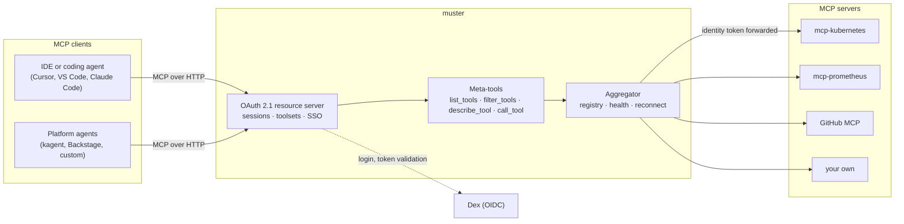

<p align="center">
  
</p>

<h1 align="center">muster</h1>

<p align="center">
  One MCP endpoint for every MCP server your platform runs.
</p>

<p align="center">
  <a href="https://github.com/giantswarm/muster/releases/latest"></a>
  <a href="https://circleci.com/gh/giantswarm/muster"></a>
  <a href="https://goreportcard.com/report/github.com/giantswarm/muster"></a>
  <a href="https://pkg.go.dev/github.com/giantswarm/muster"></a>
  <a href="LICENSE"></a>
  <a href="https://giantswarm.github.io/muster/"></a>
</p>

---

muster is an aggregating [Model Context Protocol](https://modelcontextprotocol.io) server.
It connects to the MCP servers a platform team runs (Kubernetes, Prometheus, Grafana, GitHub,
Flux, in-house tools) and serves all of their tools through a single MCP endpoint. AI agents
connect once, discover tools through a small set of meta-tools instead of loading hundreds of
tool definitions, and call them under the identity of the person they work for.

It runs as a single binary on a laptop, bridging an IDE to local and remote MCP servers, and as a
Kubernetes service that gives a whole organisation one authenticated, observable tool gateway.

## What it does

- **Aggregation.** Registered MCP servers (`stdio`, `streamable-http`, `sse`) are connected,
  health-checked and reconnected; their tools appear as `x_<server>_<tool>`. Servers that offer
  the same tools for different targets can form a *family* and appear as one tool surface with an
  instance argument.
- **Discovery that fits a context window.** Clients see thirteen meta-tools: `list_tools`,
  `filter_tools`, `describe_tool`, `call_tool` and their resource and prompt counterparts.
  Listings are paged and summarised; `filter_tools` ranks by relevance, so finding the right tool
  costs a few hundred tokens rather than the whole catalogue.
- **Toolsets.** A request declares the tools it may see and call with the `X-muster-Toolset`
  header: built-in presets such as `read-only`, operator-defined presets, and inline selectors by
  server, pattern, workflow or label. An agent runs with exactly the surface it was given.
- **Authentication and single sign-on.** muster protects its endpoint as an OAuth 2.1 resource
  server in front of Dex, keeps one session per person and forwards the person's identity token
  to the MCP servers that accept it, so every downstream call is made as that person. Remote
  servers with their own OAuth get a browser login once per person; AWS-hosted servers can be
  signed with SigV4.
- **Kubernetes-native.** `MCPServer`, `Workflow` and `WorkflowExecution` are custom resources
  reconciled by muster, with status, conditions and events. The Helm chart ships the CRDs,
  RBAC, network policies, a Prometheus rule set and a Grafana dashboard.
- **Workflows.** Multi-step procedures become deterministic tools (`workflow_<name>`) with
  templated arguments, conditions, `forEach` and `parallel` steps and a durable execution record.
- **Observability.** OpenTelemetry traces, Prometheus metrics and structured logs for every
  session, server and tool call.

## How it works


```mermaid
flowchart LR
    subgraph clients [MCP clients]
        IDE["IDE or coding agent<br/>(Cursor, VS Code, Claude Code)"]
        Agent["Platform agents<br/>(kagent, Backstage, custom)"]
    end

    subgraph muster [muster]
        Meta["Meta-tools<br/>list_tools · filter_tools · describe_tool · call_tool"]
        Auth["OAuth 2.1 resource server<br/>sessions · toolsets · SSO"]
        Agg["Aggregator<br/>registry · health · reconnect"]
    end

    subgraph servers [MCP servers]
        K8s["mcp-kubernetes"]
        Prom["mcp-prometheus"]
        GH["GitHub MCP"]
        Own["your own"]
    end

    Dex["Dex (OIDC)"]

    IDE -- "MCP over HTTP" --> Auth
    Agent -- "MCP over HTTP" --> Auth
    Auth --> Meta --> Agg
    Auth -. "login, token validation" .-> Dex
    Agg -- "identity token forwarded" --> K8s
    Agg --> Prom
    Agg --> GH
    Agg --> Own
```

An MCP client connects to `/mcp` and receives the meta-tools. `filter_tools` and `describe_tool`
find and explain a tool; `call_tool` runs it. muster resolves the name to the server behind it,
attaches the session's credentials and forwards the call.

## Quick start

Install the latest release. Binaries are signed in CI and verified by `muster self-update`.

```bash
brew install giantswarm/muster/muster
```

Without Homebrew, download the binary for the platform:

```bash
os="$(uname -s | tr '[:upper:]' '[:lower:]')"
arch="$(uname -m | sed 's/x86_64/amd64/; s/aarch64/arm64/')"
curl -fsSL -o muster "https://github.com/giantswarm/muster/releases/latest/download/muster-${os}-${arch}"
chmod +x muster && sudo mv muster /usr/local/bin/
```

With a Go toolchain, `go install github.com/giantswarm/muster@latest` works as well.

Start the aggregator, register an MCP server and call one of its tools:

```bash
muster serve                                   # serves http://localhost:8090/mcp

# in a second terminal
muster create mcpserver files --type=stdio --command=npx \
  --args="-y,@modelcontextprotocol/server-filesystem,$HOME" --autoStart=true
muster list mcpserver                          # files   Running   stdio
muster call x_files_list_allowed_directories
```

Connect an IDE. `muster standalone` runs the aggregator and a stdio bridge in one process; with a
running `muster serve`, or a remote muster, use `muster agent --mcp-server` instead.

```json
{
  "mcpServers": {
    "muster": {
      "command": "muster",
      "args": ["standalone"]
    }
  }
}
```

The [quick start](docs/getting-started/quick-start.md) continues from here: exploring the
catalogue in the REPL, toolsets and the first workflow.

## Deploy on Kubernetes

The chart is published in the Giant Swarm catalog and runs muster in Kubernetes mode, where MCP
servers and workflows are custom resources.

```bash
helm repo add giantswarm https://giantswarm.github.io/giantswarm-catalog/
helm install muster giantswarm/muster --namespace muster --create-namespace
```

```yaml
apiVersion: muster.giantswarm.io/v1alpha1
kind: MCPServer
metadata:
  name: kubernetes
  namespace: muster
spec:
  type: streamable-http
  url: https://mcp-kubernetes.example.com/mcp
  auth:
    type: oauth
    forwardToken: true
```

The [installation guide](docs/operations/installation.md) covers OAuth protection with Dex,
Valkey-backed sessions for more than one replica, network policies and metrics.

## Documentation

The documentation is published at **[giantswarm.github.io/muster](https://giantswarm.github.io/muster/)**
and lives in [`docs/`](docs/README.md).

| Section | What you find there |
|---|---|
| [Getting started](docs/getting-started/README.md) | Quick start, registering servers, the first workflow |
| [How-to guides](docs/how-to/README.md) | Connecting clients, authentication, managing servers, Kubernetes, workflows, troubleshooting |
| [Reference](docs/reference/README.md) | Meta-tools and core tools, toolsets, configuration, custom resources, events, HTTP endpoints, CLI |
| [Explanation](docs/explanation/README.md) | Architecture, aggregation, orchestration, observability, decision records |
| [Operations](docs/operations/README.md) | Installation, security |
| [Contributing](docs/contributing/README.md) | Development setup, the scenario test framework |

## Contributing

Issues and pull requests are welcome at [github.com/giantswarm/muster](https://github.com/giantswarm/muster).
The [contributing guide](docs/contributing/README.md) explains the development setup, the
conventions the linters enforce and the behavioural test suite (`muster test`) that every change
is expected to extend. Commits are signed off under the [DCO](DCO).

Security issues are reported through Giant Swarm's
[responsible disclosure process](https://www.giantswarm.io/responsible-disclosure), not as public
issues.

## License

muster is a [Giant Swarm](https://www.giantswarm.io) project, released under the
[Apache License 2.0](LICENSE).
