# Muster: Universal Control Plane for AI Agents

[](https://goreportcard.com/report/github.com/giantswarm/muster)
[](https://godoc.org/github.com/giantswarm/muster)

**In German, _Muster_ means "pattern" or "sample." This project provides the building blocks for AI agents to discover patterns and collect samples from any digital environment. It gives them a universal protocol to interact with the world.**

Muster is a **universal control plane** built on the open **Model Context Protocol (MCP)** that transforms chaotic development environments into coherent, AI-controllable platforms.

---

## The Problem: AI Agents in Chaotic Environments  

AI coding agents are powerful, but they operate in fragmented environments filled with:
- **Disconnected tools** (kubectl, terraform, docker, monitoring CLIs)  
- **Inconsistent APIs** and authentication methods
- **Custom scripts** scattered across different systems
- **Complex integration requirements** for each new tool

This forces developers to build brittle, one-off integrations for every tool an AI agent needs to use, severely limiting their potential and creating massive maintenance overhead.

## The Solution: MCP Server Aggregation  

Muster solves this by acting as a **centralized MCP server aggregator** that:

1. **Manages Multiple MCP Servers**: Each MCP server wraps specific tools or services (Kubernetes, Prometheus, custom scripts, etc.)
2. **Provides Unified Access**: AI agents connect to one endpoint and access all tools through a standardized protocol
3. **Handles Complexity**: Muster manages server lifecycles, tool discovery, error handling, and security policies
4. **Enables Dynamic Control**: Start, stop, and reconfigure entire toolchains programmatically

### Architecture Overview

```mermaid
graph TD
    subgraph "AI Agent Environment"
        Agent["🤖 AI Agent<br/>(Claude, GPT, etc.)"]
        
        subgraph "Muster Control Plane"
            Aggregator["🎯 MCP Aggregator<br/>(Single Endpoint)"]
            
            subgraph "Managed MCP Servers"
                K8s["🔷 Kubernetes Server<br/>(kubectl, helm, etc.)"]
                Prom["📊 Prometheus Server<br/>(metrics, alerts)"]
                Custom["⚙️ Custom Scripts<br/>(deployment tools)"]
                Cloud["☁️ Cloud CLIs<br/>(aws, gcp, azure)"]
            end
        end
    end

    Agent <-->|"MCP Protocol<br/>(SSE/HTTP)"| Aggregator
    Aggregator <-->|"stdio/container"| K8s
    Aggregator <-->|"stdio/container"| Prom  
    Aggregator <-->|"stdio/container"| Custom
    Aggregator <-->|"stdio/container"| Cloud
```



## Core Capabilities

### 🚀 Dynamic MCP Server Management
- **Lifecycle Control**: Start, stop, restart MCP servers on demand
- **Health Monitoring**: Automatic health checks and recovery
- **Configuration Management**: Hot-reload server configurations
- **Two Deployment Modes**: Local processes (`localCommand`) or containerized (`container`) (coming soon!)

### 🛠️ Unified Tool Access  
- **Tool Aggregation**: Single endpoint exposes tools from all connected MCP servers
- **Smart Prefixing**: Automatic conflict resolution (e.g., `k8s_deploy`, `docker_deploy`)
- **Real-time Discovery**: Tools automatically appear/disappear as servers start/stop
- **Safety Controls**: Built-in denylist for destructive operations (override with `--yolo`)

### 🏗️ Advanced Abstractions
- **Capabilities**: High-level interfaces that abstract complex tool chains
- **Workflows**: Multi-step processes that orchestrate tools across servers  
- **Service Classes**: Templates for provisioning stateful services
- **Service Instances**: Managed lifecycle of running services

### 🔧 Developer Experience
- **Interactive Agent**: Debug and test with `muster agent --repl`
- **MCP Server Mode**: Expose Muster itself as an MCP server (`muster agent --mcp-server`)
- **GitOps Ready**: All configurations in version-controlled YAML files
- **Rich CLI**: Complete command-line interface for all operations

## Quick Start

### 1. Install Muster
```bash  
# Download from releases or build from source
git clone https://github.com/giantswarm/muster.git
cd muster && go build .
```

### 2. Start the Control Plane
```bash
# Start Muster's MCP aggregator (default: localhost:8090)
./muster serve &
```

### 3. Configure Your First MCP Server

Create `kubernetes-server.yaml`:
```yaml
apiVersion: muster.io/v1
kind: MCPServer  
name: kubernetes-tools
spec:
  type: localCommand           # or 'container'
  command: ["kubectl-mcp-server"]
  env:
    KUBECONFIG: "/home/user/.kube/config"
  autoStart: true
```

### 4. Register the MCP Server
```bash
./muster create -f kubernetes-server.yaml
```

### 5. Verify Tools Are Available  
```bash
# List all available tools
./muster get tools

# Test a Kubernetes tool
./muster run k8s_get_pods --namespace=default
```

### 6. Connect Your AI Agent

Configure your AI assistant (e.g., Cursor) to use Muster:
```json
{
  "mcpServers": {
    "muster": {
      "command": "curl",
      "args": ["-N", "http://localhost:8090/sse"]
    }
  }
}
```

Your AI agent now has access to all tools from all your MCP servers through a single, stable connection.

## MCP Server Examples

### Containerized Prometheus Monitoring
```yaml
apiVersion: muster.io/v1
kind: MCPServer
name: prometheus-monitoring  
spec:
  type: container
  image: "ghcr.io/example/mcp-prometheus:latest"
  ports: ["9090:9090"]
  env:
    PROMETHEUS_URL: "http://localhost:9090"
  autoStart: true
```

### Local Script Integration
```yaml
apiVersion: muster.io/v1  
kind: MCPServer
name: deployment-scripts
spec:
  type: localCommand
  command: ["python", "/scripts/mcp-deploy-server.py"]
  workDir: "/opt/deployment"
  env:
    ENVIRONMENT: "production"
    API_KEY: "${DEPLOY_API_KEY}"
```

## Advanced Features

### Capabilities - High-Level Tool Abstractions
```yaml
apiVersion: muster.io/v1
kind: Capability
name: deploy-application
spec:
  operations:
    deploy:
      tool: k8s_apply_manifest
      parameters:
        manifest: "{{ .applicationManifest }}"
        namespace: "{{ .targetNamespace }}"
```

### Workflows - Multi-Step Orchestration  
```yaml
apiVersion: muster.io/v1
kind: Workflow
name: full-deployment
spec:
  steps:
    - id: build
      tool: docker_build
      args:
        image: "{{ .imageName }}"
    - id: deploy  
      tool: k8s_deploy
      args:
        image: "{{ steps.build.imageUri }}"
        namespace: "{{ .namespace }}"
```

## Integration Examples

### For Platform Engineers
- **Infrastructure as Code**: Manage terraform, ansible, and cloud CLI tools
- **CI/CD Integration**: Orchestrate build, test, and deployment pipelines  
- **Monitoring Setup**: Deploy and configure monitoring stacks
- **Environment Provisioning**: Spin up development/staging environments

### For AI Agent Developers
- **Unified Tool Access**: One protocol for all infrastructure tools
- **Dynamic Capabilities**: Tools appear automatically as services scale
- **Safe Exploration**: Built-in safety controls for destructive operations
- **Rich Context**: Tools provide structured responses and documentation

## Documentation

- **[Architecture Guide](docs/architecture.md)**: Deep dive into Muster's design
- **[MCP Server Development](docs/mcp-servers.md)**: Building custom MCP servers  
- **[Workflow Orchestration](docs/workflows.md)**: Advanced multi-step processes
- **[AI Agent Integration](docs/ai-integration.md)**: Connecting your AI assistant
- **[Security & Safety](docs/security.md)**: Understanding safety controls

## Community & Support

- **[Contributing Guide](CONTRIBUTING.md)**: How to contribute to Muster
- **[Issue Tracker](https://github.com/giantswarm/muster/issues)**: Bug reports and feature requests
- **[Discussions](https://github.com/giantswarm/muster/discussions)**: Community Q&A

---

*Muster is a [Giant Swarm](https://giantswarm.io) project, built to empower AI agents with universal infrastructure control.*