# Muster: Universal Control Plane for AI Agents

[](https://goreportcard.com/report/github.com/giantswarm/muster)
[](https://godoc.org/github.com/giantswarm/muster)

**In German, _Muster_ means "pattern" or "sample." This project provides the building blocks for AI agents to discover patterns and collect samples from any digital environment. It gives them a universal protocol to interact with the world.**

Muster is a **universal control plane** built on the **Model Context Protocol (MCP)** that solves the MCP server management problem for platform engineers and AI agents.

---

## The Platform Engineer's Dilemma

As a platform engineer, you interact with countless services: Kubernetes, Prometheus, Grafana, Flux, ArgoCD, cloud providers, and custom tooling. While tools like Terraform and Kubernetes operators provide unified orchestration interfaces, **debugging and monitoring** still requires jumping between different tools and contexts.

**The MCP Revolution**: LLM agents (in VSCode, Cursor, etc.) + MCP servers should solve this by giving agents direct access to your tools. There are already many excellent MCP servers available (Kubernetes, Prometheus, Grafana, Flux, etc.).

**But there's a problem**:

- Adding all MCP servers to your agent **pollutes the context** and increases costs
- **Turning servers on/off manually** is tedious and error-prone
- **Tool discovery** becomes overwhelming as your toolkit grows
- **No coordination** between different MCP servers and their prerequisites

## The Solution: Intelligent MCP Aggregation

Muster solves this by creating a **meta-MCP server** that manages all your MCP servers and provides your agent with **intelligent tool discovery** capabilities.

> 📖 **Learn More**: [MCP Aggregation Deep Dive](docs/explanation/mcp-aggregation.md) | [System Architecture](docs/explanation/architecture.md)

### How It Works

1. **`muster serve`** starts the control plane that manages your MCP server processes
2. **Configure `muster agent`** as an MCP server in your IDE
3. **Your agent gets meta-tools** like `list_tools`, `filter_tools`, `call_tool`
4. **Agent discovers and uses tools dynamically** based on the current task

```mermaid
graph TD
    subgraph "Your IDE (VSCode/Cursor)"
        Agent["🤖 AI Agent"]
        IDE["IDE MCP Config"]
    end

    subgraph "Muster Control Plane"
        MusterAgent["🎯 muster agent<br/>(Meta-MCP Server)"]
        MusterServe["⚙️ muster serve<br/>(Process Manager)"]

        subgraph "Managed MCP Servers"
            K8s["🔷 Kubernetes<br/>(kubectl, helm)"]
            Prom["📊 Prometheus<br/>(metrics, alerts)"]
            Grafana["📈 Grafana<br/>(dashboards)"]
            Flux["🔄 Flux<br/>(GitOps)"]
        end
    end

    Agent <-->|"MCP Protocol"| MusterAgent
    MusterAgent <--> MusterServe
    MusterServe <--> K8s
    MusterServe <--> Prom
    MusterServe <--> Grafana
    MusterServe <--> Flux
```



> 📖 **Learn More**: [Component Interaction Diagram](docs/explanation/diagrams/component-interaction.md) | [System Overview](docs/explanation/diagrams/system-overview.md)

## Core Capabilities

### 🧠 Intelligent Tool Discovery

Your agent can now:

```bash
# Discover available tools dynamically
agent: "What Kubernetes tools are available?"
→ filter tools {pattern="kubernetes"}

# Find the right tool for the task
agent: "I need to check pod logs"
→ filter tools {description="logs"}

# Execute tools on-demand
agent: "Show me failing pods in default namespace"
→ call x_kubernetes_list {"resourceType": "pods", "namespace": "default"}
```

> 📖 **Learn More**: [MCP Tools Reference](docs/reference/mcp-tools.md) | [Tool Discovery Guide](docs/how-to/mcp-server-management.md)

### 🚀 Dynamic MCP Server Management

- **Lifecycle Control**: Start, stop, restart MCP servers on demand
- **Health Monitoring**: Automatic health checks and recovery
- **Configuration Management**: Hot-reload server configurations
- **Local Process Deployment**: Local processes (`local`) for MCP server execution

> 📖 **Learn More**: [MCP Server Management](docs/how-to/mcp-server-management.md) | [Configuration Guide](docs/reference/configuration.md)

### 🛡️ Smart Access Control

- **Tool Filtering**: Block destructive tools by default (override with `--yolo`)
- **Project-Based Control**: Different tool sets for different projects
- **Context Optimization**: Only load tools when needed

> 📖 **Learn More**: [Security Configuration](docs/operations/security.md)

### 🏗️ Advanced Orchestration

#### **Workflows**: Deterministic Task Automation

Once your agent discovers how to complete a task, **persist it as a workflow**:

```yaml
name: debug-failing-pods
steps:
  - id: find-pods
    tool: x_kubernetes_get_pods
    args:
      namespace: "{{ .namespace }}"
      status: "failed"
  - id: get-logs
    tool: x_kubernetes_get_logs
    args:
      pod: "{{ steps.find-pods.podName }}"
      lines: 100
```

**Benefits**:

- **Reduce AI costs** (deterministic execution)
- **Faster results** (no re-discovery)
- **Consistent debugging** across team members

> 📖 **Learn More**: [Workflow Creation Guide](docs/how-to/workflow-creation.md) | [Workflow Component Architecture](docs/explanation/components/workflows.md)

#### **ServiceClasses**: Handle Prerequisites Automatically

Many MCP servers need setup (port-forwarding, authentication, etc.). ServiceClasses define these prerequisites:

```yaml
name: prometheus-access
startTool: x_kubernetes_port_forward
args:
  service: "prometheus-server"
  namespace: "monitoring"
  localPort: 9090
healthCheck:
  url: "http://localhost:9090/api/v1/status"
```

**Complete Integration Example**:

1. **ServiceClass** creates port-forwarding to Prometheus
2. **MCP Server** configuration uses the forwarded port
3. **Workflow** orchestrates: setup → query → cleanup
4. **Agent** executes everything seamlessly

> 📖 **Learn More**: [ServiceClass Patterns](docs/how-to/serviceclass-patterns.md) | [Service Configuration](docs/how-to/service-configuration.md) | [Services Component Guide](docs/explanation/components/services.md)

## Quick Start

### 🤖 AI Agent Users (5 minutes)

Connect Muster to your IDE for smart tool access:
> 📖 **[AI Agent Setup Guide](docs/getting-started/ai-agent-integration.md)**

### 🏗️ Platform Engineers (15 minutes)

Set up Muster for infrastructure management:
> 📖 **[Platform Setup Guide](docs/getting-started/platform-setup.md)**

### 👩‍💻 Contributors (10 minutes)

Configure your development environment:
> 📖 **[Development Setup](docs/contributing/development-setup.md)**

### Installation

#### Homebrew (macOS)

```bash
brew tap giantswarm/muster
brew install muster
```

#### Manual Installation

```bash
git clone https://github.com/giantswarm/muster.git
cd muster && go build .
```

> 📖 **Learn More**: [Installation Guide](docs/operations/installation.md) | [Local Demo](docs/getting-started/local-demo.md)

#### Configure MCP Servers

Create `kubernetes-server.yaml`:

```yaml
apiVersion: muster.io/v1
kind: MCPServer
name: kubernetes
spec:
  type: localCommand
  command: ["mcp-kubernetes"]
  autoStart: true
```

Register it:

```bash
./muster create mcpserver kubernetes.yaml
```

#### Connect Your AI Agent

Configure your IDE to use Muster's agent as an MCP server:

**Cursor/VSCode settings.json**:

```json
{
  "mcpServers": {
    "muster": {
      "command": "muster",
      "args": ["standalone"]
    }
  }
}
```

> 📖 **Learn More**: [AI Agent Integration](docs/getting-started/ai-agent-integration.md) | [Cursor Advanced Setup](docs/how-to/cursor-advanced-setup.md)

#### Let Your Agent Discover Tools

Your agent now has meta-capabilities:

- **`list_tools`**: Show all available tools
- **`filter_tools`**: Find tools by name/description
- **`describe_tool`**: Get detailed tool information
- **`call_tool`**: Execute any tool dynamically

> 📖 **Learn More**: [Complete MCP Tools Reference](docs/reference/mcp-tools.md) | [CLI Command Reference](docs/reference/cli/README.md)

## Advanced Platform Engineering Scenarios

### Scenario 1: Multi-Cluster Debugging

ServiceClass for cluster access

```yaml
name: cluster-login
version: "1.0.0"
serviceConfig:
  serviceType: "auth"
  args:
    cluster:
      type: "string"
      required: true
  lifecycleTools:
    start: { tool: "x_teleport_kube_login" }
```

Workflow to compare pods on two clusters

```yaml
# Workflow for cross-cluster investigation
name: compare-pod-on-staging-prod
input_schema:
  type: "object"
  properties:
    namespace: { type: "string" }
    pod: { type: "string" }
  required: ["namespace", "pod"]
steps:
  - id: staging-context
    tool: core_service_create
    args:
      serviceClassName: "cluster-login"
      name: "staging-context"
      params:
        cluster: "staging"
  - id: prod-context
    tool: core_service_create
    args:
      serviceClassName: "cluster-login"
      name: "staging-context"
      params:
        cluster: "production"
  - id: wait-for-step
  - id: compare-resources
    tool: workflow_compare_pods_on_clusters
    args:

```

### Scenario 2: Full Observability Stack
```yaml
# Prometheus access with port-forwarding
name: prometheus-tunnel
startTool: k8s_port_forward
args:
  service: "prometheus-server"
  localPort: 9090

---
# Grafana dashboard access
name: grafana-tunnel
startTool: k8s_port_forward
args:
  service: "grafana"
  localPort: 3000
---
# Complete monitoring workflow
name: investigation-setup
steps:
  - id: setup-prometheus
    serviceClass: prometheus-tunnel
  - id: setup-grafana
    serviceClass: grafana-tunnel
  - id: configure-prometheus-mcp
    tool: core_mcpserver_create
    args:
      name: "prometheus"
      type: "localCommand"
      command: ["mcp-server-prometheus"]
      env:
        PROMETHEUS_URL: "http://localhost:9090"
```

> 📖 **Learn More**: [Advanced Scenarios](docs/how-to/advanced-scenarios.md) | [Configuration Examples](docs/explanation/configuration-examples.md)

## Benefits for Platform Teams

### **Cost Optimization**
- **Reduced AI token usage**: Tools loaded only when needed
- **Deterministic workflows**: No re-discovery costs
- **Efficient context**: Smart tool filtering

### **Team Collaboration**
- **GitOps workflows**: Share debugging patterns via Git
- **Consistent tooling**: Same tool access across team members
- **Knowledge preservation**: Workflows capture tribal knowledge

### **Operational Excellence**
- **Faster incident response**: Pre-built investigation workflows
- **Reduced context switching**: All tools through one interface
- **Automated prerequisites**: ServiceClasses handle setup complexity

> 📖 **Learn More**: [Core Benefits](docs/explanation/benefits.md) | [Design Principles](docs/explanation/design-principles.md)

## Documentation Hub

### 🚀 Getting Started
- [Quick Start Guide](docs/getting-started/quick-start.md) - Get up and running in minutes
- [AI Agent Setup](docs/getting-started/ai-agent-integration.md) - IDE integration guide
- [Platform Setup](docs/getting-started/platform-setup.md) - Infrastructure setup
- [Local Demo](docs/getting-started/local-demo.md) - Try Muster locally

### 🛠️ How-To Guides
- [Workflow Creation](docs/how-to/workflow-creation.md) - Build automation workflows
- [ServiceClass Patterns](docs/how-to/serviceclass-patterns.md) - Manage service dependencies
- [MCP Server Management](docs/how-to/mcp-server-management.md) - Configure external tools
- [Troubleshooting](docs/how-to/troubleshooting.md) - Common issues and solutions
- [AI Troubleshooting](docs/how-to/ai-troubleshooting.md) - AI-specific debugging

### 📚 Reference Documentation
- [CLI Commands](docs/reference/cli/README.md) - Complete command reference
- [Configuration](docs/reference/configuration.md) - Configuration schemas
- [API Reference](docs/reference/api.md) - REST and MCP APIs
- [MCP Tools](docs/reference/mcp-tools.md) - Available tools catalog
- [CRDs](docs/reference/crds.md) - Kubernetes Custom Resources

### 🏗️ Architecture & Concepts
- [System Architecture](docs/explanation/architecture.md) - How Muster works
- [Component Overview](docs/explanation/components/README.md) - Individual components
- [MCP Aggregation](docs/explanation/mcp-aggregation.md) - Core aggregation logic
- [Design Decisions](docs/explanation/decisions/README.md) - Architecture decisions
- [Problem Statement](docs/explanation/problem-statement.md) - Why Muster exists

### 🚀 Operations & Deployment
- [Installation](docs/operations/installation.md) - Production deployment
- [Security Configuration](docs/operations/security.md) - Security best practices

### 👥 Contributing
- [Development Setup](docs/contributing/development-setup.md) - Dev environment
- [Testing Framework](docs/contributing/testing/README.md) - Testing guidelines
- [Code Guidelines](docs/contributing/README.md) - Development standards

## Community & Support

- **[Contributing Guide](docs/contributing/README.md)**: How to contribute to Muster
- **[Issue Tracker](https://github.com/giantswarm/muster/issues)**: Bug reports and feature requests
- **[Discussions](https://github.com/giantswarm/muster/discussions)**: Community Q&A and use cases

---

*Muster is a [Giant Swarm](https://giantswarm.io) project, built to empower platform engineers and AI agents with intelligent infrastructure control.*
