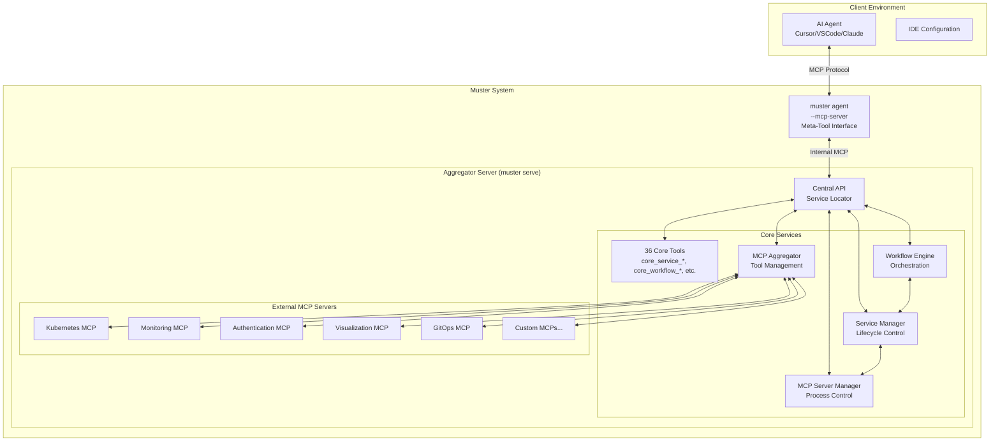
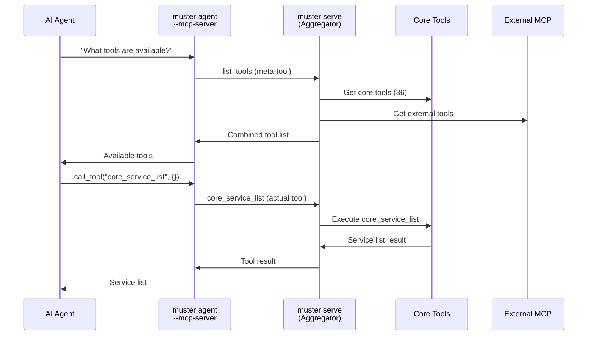
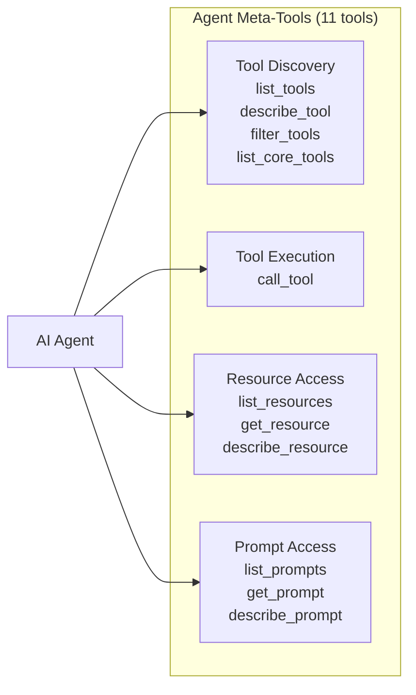
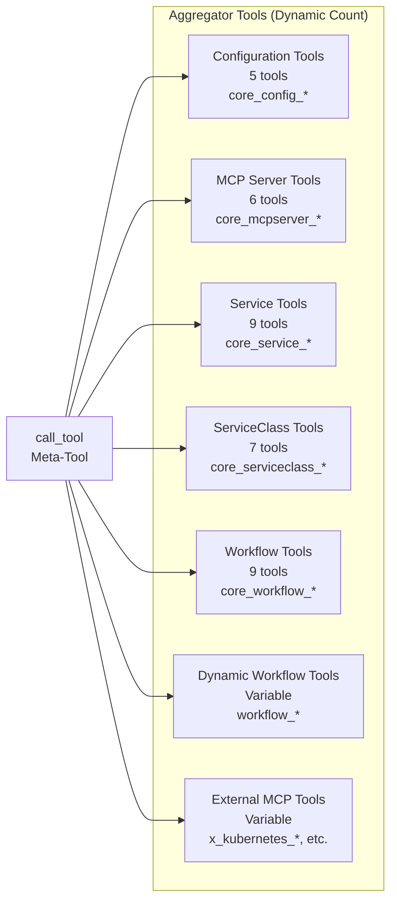
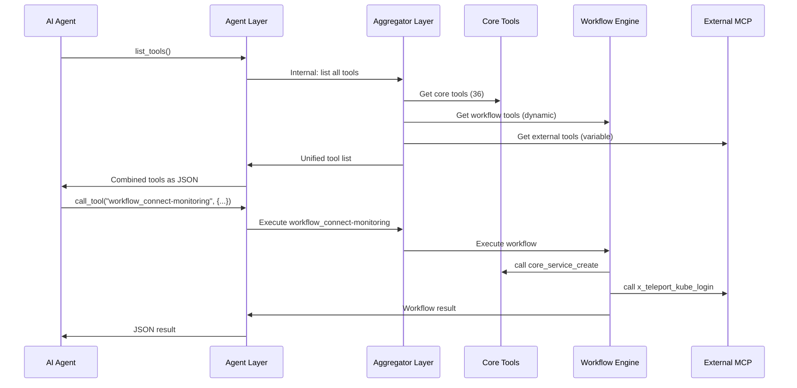

# Muster System Architecture

## Executive Summary

Muster implements a sophisticated **service locator pattern** centered around the `internal/api` package, enabling loose coupling between components while providing a unified interface for AI agents. The system aggregates multiple MCP (Model Context Protocol) servers, manages service lifecycles, and orchestrates complex workflows through a clean, interface-driven architecture.

## High-Level Architecture



## Two-Layer Architecture: Server vs Agent

**This is the most important architectural concept to understand:** Muster operates in two distinct layers with different tool sets.

### Layer 1: Aggregator Server (`muster serve`)

The aggregator server provides **direct access** to all functionality:

**Tools Available at Aggregator Layer:**
- **36 Core Tools**: `core_service_list`, `core_workflow_create`, `core_config_get`, etc.
- **Dynamic Workflow Tools**: `workflow_connect-monitoring`, `workflow_auth-workflow`, etc.
- **External MCP Tools**: `x_kubernetes_*`, `x_teleport_*`, etc. (from configured MCP servers)

**Purpose**: 
- Hosts the actual business logic and tool implementations
- Aggregates external MCP servers
- Manages service lifecycles and workflows
- Provides unified tool registry

**Access**: Internal to Muster system or via direct MCP connection

### Layer 2: Agent (`muster agent --mcp-server`)

The agent provides **meta-tools** for accessing the aggregator:

**Tools Available at Agent Layer:**
- `list_tools` - Discover available tools from aggregator
- `describe_tool` - Get detailed tool information
- `call_tool` - Execute any aggregator tool
- `filter_tools` - Filter tools by name/description patterns
- `get_resource` - Retrieve resource content
- `get_prompt` - Execute prompt templates
- `list_resources` - List available resources
- `list_prompts` - List available prompts
- `list_core_tools` - List built-in Muster tools specifically
- `describe_resource` - Get resource details
- `describe_prompt` - Get prompt details

**Purpose**:
- Bridge between AI agents and aggregator
- Provide tool discovery and execution interface
- Handle MCP protocol for AI assistant integration
- Abstract aggregator complexity from clients

**Access**: Connected to by AI agents (Cursor, VSCode, Claude)

### Key Architectural Flow



**Critical Understanding:**
- AI agents **never** directly call `core_service_list` - they call `call_tool` with `"core_service_list"` as an argument
- The agent acts as a proxy, translating meta-tool calls into actual tool executions
- This separation enables unified access to all tool types (core, workflow, external) through a consistent interface

## Tool Architecture

Now that we understand the two layers, here's how tools are organized:

### **Agent Layer Tools (11 meta-tools)**
What AI agents actually see and use:



### **Aggregator Layer Tools (Accessed via call_tool)**
What the aggregator actually executes:



### **Usage Pattern for AI Agents**

When an AI agent wants to list services:

```bash
# What the AI agent actually calls:
call_tool(name="core_service_list", arguments={})

# NOT directly:
core_service_list()  # This doesn't exist at the agent layer
```

When an AI agent wants to discover tools:

```bash
# What the AI agent calls:
list_tools()           # Returns all available tools
filter_tools(pattern="core_service_*")  # Filter for service tools
describe_tool(name="core_service_create")  # Get tool details
```

### **Tool Integration Pattern**
All tool types integrate seamlessly through the agent layer:



### **Configuration Integration**
Tools are backed by persistent configuration in `.muster/`:

```
.muster/
├── config.yaml              # Core configuration (aggregator settings)
├── mcpservers/              # External MCP server definitions (8 servers)
│   ├── kubernetes.yaml      # → Provides x_kubernetes_* tools
│   ├── teleport.yaml        # → Provides x_teleport_* tools
│   └── ...
├── serviceclasses/          # Service templates (4 templates)
│   ├── k8s-connection.yaml  # → Used by core_service_create
│   ├── mimir-port-forward.yaml
│   └── ...
├── workflows/               # Workflow definitions (8 workflows)
│   ├── connect-monitoring.yaml  # → Creates workflow_connect-monitoring
│   ├── check-cilium-health.yaml # → Creates workflow_check-cilium-health
│   └── ...
└── workflow_executions/    # Execution history
```

This three-tier architecture enables:
- **Immediate availability** of core tools (no dependencies)
- **Dynamic capability expansion** through workflows
- **External system integration** through MCP servers
- **Consistent interface** across all tool types
- **Configuration persistence** for reliable operations

## Core Design Principles

### 1. Central API Service Locator Pattern

**All inter-package communication MUST go through the central API layer.** This is the foundational architectural principle that enables:

- **Loose Coupling**: Packages develop independently without direct dependencies
- **Interface-Driven Design**: Communication through well-defined contracts
- **Testability**: Easy mocking and dependency injection
- **Scalability**: Clean separation enables independent scaling and deployment

**Implementation Pattern:**
```go
// 1. Interface Definition (internal/api/handlers.go)
type ServiceHandler interface {
    CreateService(ctx context.Context, req CreateServiceRequest) (*Service, error)
    GetService(ctx context.Context, name string) (*Service, error)
}

// 2. Service Registration (internal/api/service.go)
func RegisterServiceHandler(handler ServiceHandler) {
    serviceHandler = handler
}

func GetServiceHandler() ServiceHandler {
    return serviceHandler
}

// 3. Implementation (internal/services/api_adapter.go)
type Adapter struct {
    registry *Registry
}

func (a *Adapter) CreateService(ctx context.Context, req CreateServiceRequest) (*Service, error) {
    return a.registry.CreateService(ctx, req)
}

func (a *Adapter) Register() {
    api.RegisterServiceHandler(a)
}

// 4. Consumption (internal/workflow/executor.go)
func (e *Executor) startService(name string) error {
    handler := api.GetServiceHandler()
    return handler.StartService(context.Background(), name)
}
```

### 2. One-Way Dependency Rule

- **All packages can depend on `internal/api`**
- **`internal/api` depends on NO other internal package**
- **Prevents circular dependencies**
- **Enables clean layered architecture**

### 3. Progressive Enhancement Architecture

Muster follows a philosophy of progressive enhancement:
- Start with simple, working solutions
- Add sophistication incrementally
- Maintain backward compatibility
- Enable graceful degradation

## Component Architecture

### API Layer (`internal/api`)

**Purpose**: Central service registry and interface definitions  
**Key Responsibility**: Service locator pattern implementation

**Key Components:**
- `handlers.go`: Interface definitions for all cross-component communication
- `types.go`: Shared data structures and request/response types
- `requests.go`: Request validation and processing
- `*.go`: Service-specific registration and retrieval functions

**Architectural Constraints:**
- MUST NOT import any other internal package
- MUST define interfaces before implementations exist
- MUST provide both registration and retrieval functions

### Application Bootstrap (`internal/app`)

**Purpose**: Application initialization and service wiring

**Key Components:**
- `bootstrap.go`: Service initialization orchestration
- `services.go`: Service dependency resolution and startup
- `config.go`: Configuration loading and validation
- `modes.go`: Operating mode selection (standalone, agent, serve)

**Initialization Flow:**
1. Load and validate configuration
2. Initialize services in dependency order
3. Register all services with API layer
4. Start application in selected mode

### MCP Aggregator (`internal/aggregator`)

**Purpose**: Unified tool interface across multiple MCP servers

**Key Components:**
- `registry.go`: Tool registration and discovery
- `server.go`: MCP protocol implementation
- `tool_factory.go`: Dynamic tool creation and proxying
- `event_handler.go`: Server lifecycle event processing
- `denylist.go`: Tool filtering and access control

**Tool Aggregation Flow:**
1. Discover available MCP servers
2. Connect and enumerate tools from each server
3. Create unified tool registry with conflict resolution
4. Provide meta-tools for dynamic discovery
5. Proxy tool calls to appropriate underlying servers

### Service Management (`internal/services`)

**Purpose**: Service instance lifecycle management

**Key Components:**
- `registry.go`: Service instance tracking
- `instance.go`: Service lifecycle management
- `interfaces.go`: Service capability interfaces
- `response_processor.go`: Service response handling

**Service Lifecycle:**
1. **Definition**: ServiceClass templates define service capabilities
2. **Instantiation**: Create service instances from templates
3. **Dependency Resolution**: Resolve and start dependent services
4. **Monitoring**: Track service health and status
5. **Cleanup**: Graceful shutdown and resource cleanup

### Workflow Orchestration (`internal/workflow`)

**Purpose**: Multi-step workflow execution and coordination

**Key Components:**
- `executor.go`: Workflow execution engine
- `execution_tracker.go`: Execution state management
- `execution_storage.go`: Persistent execution state

**Workflow Execution:**
1. **Planning**: Parse workflow definition and plan execution
2. **Dependency Resolution**: Ensure required services are available
3. **Step Execution**: Execute workflow steps with error handling
4. **State Management**: Track execution progress and intermediate results
5. **Cleanup**: Clean up temporary resources and report results

### MCP Server Manager (`internal/mcpserver`)

**Purpose**: External MCP server process management

**Key Components:**
- `client.go`: MCP protocol client implementation
- `process_test.go`: Process lifecycle management
- `types.go`: MCP server configuration types

**Process Management:**
1. **Configuration**: Load MCP server definitions
2. **Process Control**: Start/stop/restart MCP server processes
3. **Health Monitoring**: Monitor server health and connectivity
4. **Tool Discovery**: Enumerate available tools from each server
5. **Communication**: Proxy tool calls to appropriate servers

## Communication Patterns

### Service Registration Pattern

Services implement the adapter pattern to integrate with the central API:

```go
// Service implements business logic
type ServiceLogic struct {
    // Internal state and dependencies
}

// Adapter implements API interface
type Adapter struct {
    logic *ServiceLogic
}

func (a *Adapter) HandleRequest(ctx context.Context, req Request) Response {
    return a.logic.processRequest(ctx, req)
}

// Registration with API
func (a *Adapter) Register() {
    api.RegisterServiceHandler(a)
}
```

### Request Flow Pattern

All requests follow a consistent flow through the system:

1. **Entry**: Request received by `muster agent` MCP server
2. **Routing**: API layer routes to appropriate service handler
3. **Processing**: Service processes request through business logic
4. **Integration**: Service may call other services via API layer
5. **Response**: Result returned through API layer to client

### Event Handling Pattern

Components communicate state changes through event patterns:

```go
type EventHandler interface {
    HandleServiceStarted(service *Service) error
    HandleServiceStopped(service *Service) error
    HandleToolRegistered(tool *Tool) error
}
```

## Data Flow Architecture

### Configuration Flow
1. **Loading**: Configuration loaded from files or Kubernetes CRDs
2. **Validation**: Schema validation and dependency checking
3. **Distribution**: Configuration distributed to relevant services
4. **Updates**: Dynamic configuration updates through API

### Tool Discovery Flow
1. **Server Enumeration**: Discover available MCP servers
2. **Tool Collection**: Gather tool definitions from each server
3. **Aggregation**: Merge tools into unified registry
4. **Filtering**: Apply access controls and denylists
5. **Publication**: Make tools available through meta-tools

### Execution Flow
1. **Request Parsing**: Parse and validate incoming requests
2. **Context Building**: Build execution context with required data
3. **Service Resolution**: Identify and prepare required services
4. **Execution**: Execute operations with error handling
5. **Result Processing**: Format and return results

## Extension Points

### Adding New MCP Servers

1. **Define Configuration**: Create MCPServer resource definition
2. **Register with Manager**: MCPServer manager handles process lifecycle
3. **Tool Integration**: Aggregator automatically discovers and integrates tools
4. **Access Control**: Configure tool filtering and access policies

### Custom Service Types

1. **Define ServiceClass**: Create template defining service capabilities
2. **Implement Service Logic**: Create service implementation
3. **Register with API**: Implement adapter pattern for API integration
4. **Configure Dependencies**: Define service dependencies and startup order

### Workflow Extensions

1. **Custom Steps**: Implement workflow step interfaces
2. **Tool Integration**: Leverage aggregated tools in workflow steps
3. **State Management**: Use execution tracker for complex state
4. **Error Handling**: Implement error handling and recovery strategies

## Security Architecture

### Access Control
- **Tool-level filtering**: Fine-grained control over tool availability
- **Service isolation**: Services operate in isolated execution contexts
- **Configuration validation**: Strict schema validation for all configurations

### Communication Security
- **Local communication**: All communication over local unix sockets or loopback
- **Process isolation**: External MCP servers run in separate processes
- **Resource limits**: Configurable resource limits for spawned processes

## Scalability Considerations

### Horizontal Scaling
- **Stateless design**: Core services maintain minimal state
- **Event-driven architecture**: Loose coupling enables distributed deployment
- **API abstraction**: Clean interfaces support service distribution

### Performance Optimization
- **Tool caching**: Intelligent caching of tool definitions and metadata
- **Connection pooling**: Efficient management of MCP server connections
- **Lazy loading**: Services and tools loaded on demand

### Resource Management
- **Service lifecycle**: Automatic cleanup of unused services
- **Process management**: Efficient management of external MCP server processes
- **Memory management**: Configurable limits and garbage collection

## Deployment Architecture

### Local Development
- **Filesystem configuration**: Simple file-based configuration
- **Process management**: Direct process spawning for MCP servers
- **Development tools**: Hot reloading and debugging support

### Production Deployment
- **Kubernetes CRDs**: Production configuration through Kubernetes resources
- **Container orchestration**: Containerized MCP server management
- **Observability**: Comprehensive monitoring and logging

### Hybrid Environments
- **Configuration detection**: Automatic detection of available platforms
- **Graceful degradation**: Fallback to simpler modes when Kubernetes unavailable
- **Migration paths**: Support for evolving deployment models

## Testing Architecture

### Unit Testing
- **Interface mocking**: Easy mocking through API layer interfaces
- **Dependency injection**: Clean dependency injection for testability
- **Isolated testing**: Each component testable in isolation

### Integration Testing
- **Scenario-based testing**: BDD scenarios test real user workflows
- **End-to-end validation**: Complete workflow validation
- **Mock services**: Configurable mock services for testing

### Performance Testing
- **Load testing**: Scalability testing under load
- **Resource monitoring**: Resource usage validation
- **Benchmarking**: Performance regression detection

This architecture provides a solid foundation for building a scalable, maintainable system that can evolve with changing requirements while maintaining clean separation of concerns and excellent testability. 