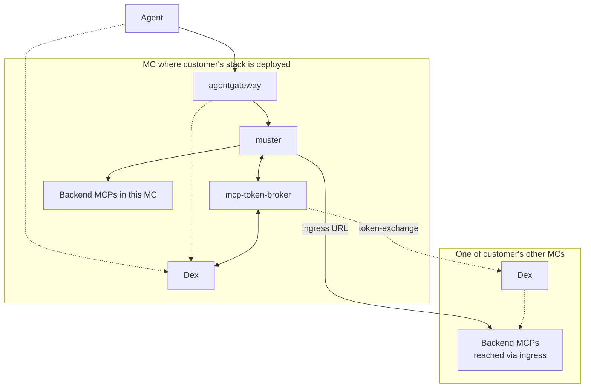
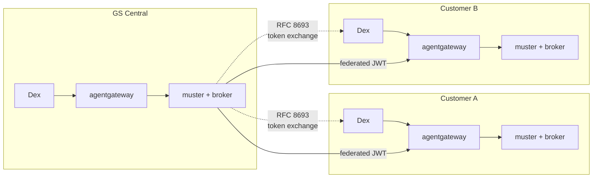

# 012 — agentgateway in front, muster behind, OAuth broker extracted

**Status**: Proposed
**Date**: 2026-05-05 (updated 2026-05-11 with implementation-validated phasing, per-customer-default scoping, Teleport operator integration, AgentCore customer-gateway scenario, and Envoy AI Gateway comparison)
**Supersedes**: parts of ADR-005 (muster-auth), ADR-008 (unified-authentication), ADR-010 (server-side-meta-tools)
**Relates to**: ADR-006 (session-scoped tool visibility — kept; migration to gateway policies is opt-in Phase 7 work), ADR-009 (SSO token forwarding — encoded in MCPServer.Auth, then moves to broker), ADR-011 (session connection pool — partially affected)

## Status summary

Introduce **agentgateway** as the MCP-aware data plane around muster. Extract muster's per-backend OAuth machinery into a separate broker bounded context (`internal/broker/` in-process initially; standalone pod when triggered by compliance / scale / multi-tenancy). Default deployment shape: **one stack per customer** — `agentgateway + muster + broker` on the customer's central MC; other customer MCs host backend pods only, reached from the central muster via a GS-built cross-cluster transport.

agentgateway adoption is **phased**: agentgateway-behind-muster first (per-backend observability, validated end-to-end on glean), agentgateway-in-front-of-muster second (when JWT-at-edge auth lands). Broker extraction to a standalone pod is **trigger-driven**, not a default step. Cross-tenant access (GS staff into customer MCs) is provided by **broker federation via RFC 8693 token exchange** + cross-Dex trust, **not** A2A peering (which is a complementary capability for agent-to-agent workflows, not the cross-tenant auth primitive).

muster stays behind the gateway as the MCP-aggregation control plane: aggregator + workflows + MCPServer registry + filter_tools + admin shim. Auth dispatch lives behind the broker interface; agent-facing concerns (RFC 8707 audience binding, CEL policy, audit, OTel) move to the gateway.

## Context

muster currently plays multiple roles: agent-facing OAuth resource server, MCP aggregator, workflow engine, ServiceClass executor, MCPServer process supervisor, per-backend OAuth dispatcher, meta-tool provider. Several of these — agent identity, agent-side rate limiting, denylist, agent-side audit — duplicate work that a dedicated MCP gateway does better, and they couple muster to concerns that should live elsewhere.

### What changed in the ecosystem

- **MCP spec 2025-11-25** mandates RFC 8707 Resource Indicators (audience-locked tokens). muster's current agent-facing OAuth doesn't audience-lock per backend.
- **agentgateway** (CNCF Sandbox via Solo donation) is the only OSS gateway with native MCP **and** A2A protocol support, with CEL-based policy and OTel-native observability.
- **A2A protocol** has reached production traction (Linux Foundation hosted) and is the natural protocol for agent-to-agent workflows. Note: it is **not** the primary cross-tenant auth primitive — that is broker federation via RFC 8693. A2A and broker federation are complementary; A2A handles agent-to-agent data plane, broker federation handles cross-MC identity propagation.
- **GS-built Teleport operator** (in-flight, separate workstream) creates Teleport Apps via CRs. Once it lands, muster's `internal/teleport/` and `MCPServer.spec.auth.teleport` are replaced by URL-only references — muster becomes Teleport-agnostic; the operator handles tunneling and identity rotation.

### Why agentgateway and not Envoy AI Gateway

Envoy AI Gateway and agentgateway look similar at a glance (both Envoy-adjacent, both target AI workloads) but solve **different layers** of the agent stack. The choice is not "agentgateway is better" — it's "they're complementary; agentgateway covers the layer where muster sits".

| Concern | Envoy AI Gateway | agentgateway |
|---|---|---|
| **Primary use case** | LLM API egress (Claude Code → Envoy AI GW → Anthropic/Bedrock/OpenAI) | MCP/A2A control plane (Claude Code → agentgateway → MCP backends + agent-to-agent calls) |
| **Protocols** | OpenAI-compatible HTTP/streaming for LLM completions | MCP (streamable-HTTP, SSE, stdio) + A2A protocol natively |
| **Routing decisions** | Which LLM provider; cost-aware; provider abstraction | Which MCP backend; per-tool authorization; tool catalog merge |
| **Per-call attributes** | Token usage, model name, cost | MCP method name, tool name, session ID |
| **Policy granularity** | Per-model / per-provider / per-cost-budget | Per-tool name, per-agent identity, per-MCP session |
| **Audit shape** | LLM prompt/response logging, cost attribution | MCP tool calls, tool arguments, session correlation |
| **Native backend types** | LLM providers (OpenAI, Anthropic, Bedrock, Azure OpenAI, …) | MCP servers (streamable-HTTP, SSE, stdio, AgentCore-hosted), A2A peers |

For muster specifically:

1. **Envoy AI Gateway has no MCP awareness** — no `mcp.method.name` in logs, no `mcp.tool.name` in policies, no MCP tool catalog merge. The whole observability and policy story Phase 1 demonstrated on glean (per-backend audit rows, MCP-method counters, tool-name CEL evaluation) is not available in Envoy AI GW.
2. **Envoy AI Gateway doesn't speak A2A** — agent-to-agent workflows are out of scope. agentgateway has A2A as a first-class protocol.
3. **Envoy AI Gateway's policy model is cost/model-shape oriented** — "this user can spend $X/month on GPT-4". agentgateway's policy model is identity-and-tool oriented — "this user can call `pod_delete` on cluster Y". Different decisions; different inputs.
4. **A complete AI platform deployment uses both layers**. Envoy AI GW (or a similar LLM-routing layer) at the outbound LLM proxy; agentgateway at the MCP/tool/A2A layer where muster fits. They could converge in the future as the AI gateway space matures, but they're distinct concerns today.

For the GS managed-platform model, muster + agentgateway covers the MCP/agent layer; Envoy AI GW is a customer choice (or future addition) for the LLM-egress layer, not a substitute for agentgateway.

### Forcing functions

1. **MCP spec compliance** — current spec requires RFC 8707; muster's agent OAuth doesn't audience-lock per backend.
2. **Multi-customer tenancy** — customers need their own identity/audit boundaries; centralizing all of this in muster doesn't scale to per-tenant policy.
3. **Cross-tenant audit** — GS support model requires the customer's stack to see GS staff access (visibility). Provided by **broker federation** (RFC 8693 token exchange + cross-Dex trust): GS-Central's broker exchanges its staff's token against the customer's Dex; the customer's gateway/audit sees the federated JWT and attributes the call to the GS engineer. A2A peering is **not** required for this; it is a complementary capability for the agent-to-agent use case.

## Decision

### Per-customer stack (default deployment shape)

One stack per customer regardless of how many MCs the customer has: `agentgateway + muster + broker`. These components are deployed in one of the customer's MCs — there's no formal "primary" designation, the stack just runs somewhere. The customer's other MCs host backend MCPs only (no local muster, no local agentgateway, no local broker), reached from the central muster via the GS-built cross-cluster transport (Teleport-app-based; superseded by the in-flight Teleport operator that creates Teleport Apps via CRs).

The broker is **in-process** inside the muster operator pod by default. It is extracted to its own pod only when triggered by compliance / scale / multi-tenancy isolation requirements — the architectural seam (`internal/broker/` as a bounded context with HTTP and gRPC adapters) makes extraction a deployment topology change, not architectural surgery.

**Each MC has its own Dex** (for kube-apiserver OIDC and cluster-level identity). For the agent-platform layer, the agentgateway uses the Dex of whichever MC the stack is deployed in as its issuer; the broker calls that Dex for token issuance and cross-Dex exchange.

### Opt-in per-MC variant (trigger-driven)

Some customers will need per-MC isolation, with full stacks on multiple of their MCs rather than just the central one. Drivers include:

- Regulatory per-environment isolation (prod auth boundary distinct from dev)
- Hard failure isolation (one MC's outage must not affect another MC's local users)
- Cross-MC latency (multi-region customers; local-to-local matters)
- Per-MC RBAC variation (markedly different policies per environment)
- Throughput scale (central stack becomes the bottleneck)
- Per-tenant operations within a customer (strict team isolation)

For these customers, individual MCs are upgraded from backend-only to the full stack. The upgrade is per-MC, per-customer, additive: same Helm chart, same translator, same agentgateway config; the central muster's `MCPServer` entry for that backend swaps `auth.teleport` for `auth.tokenExchange` (RFC 8693 broker federation); the upgraded MC's Dex registers the central broker as a trusted peer.

The per-MC variant is **not the default upgrade path** — most customers stay on the per-customer-stack model.

### Customer-provided gateways (e.g., AWS AgentCore)

Some customers may already operate a gateway in front of their agent infrastructure — Amazon Bedrock AgentCore is the immediate example. muster is **gateway-agnostic**: the customer chooses the gateway; muster sits behind whatever the customer picks.

Two scenarios:

- **Customer adopts agentgateway** (the default GS-recommended path): muster + agentgateway + broker deployed as one stack per customer. AgentCore-hosted MCPs can still be reached as a backend via agentgateway's native AgentCore backend type.
- **Customer mandates AgentCore as their gateway**: AgentCore plays the edge role; muster sits behind it via streamable-HTTP MCP transport. The broker still lives alongside muster; AgentCore replaces agentgateway's user-facing position. Per-tool authorization, MCP audit, and tool catalog behavior in this shape depend on what AgentCore exposes — verify per customer before committing.

In both scenarios muster's role and shape are unchanged. The choice of gateway is a per-customer deployment decision, not an architectural break.



The broker can call any IdP it has client credentials for — Dex-Deployment for local-MC backends, Dex-Other for cross-MC backends within the same customer, and (in the multi-customer case below) other customers' Dexes for GS staff cross-tenant access.

### Initial SSO flow

The user configures their IDE (Claude Code, Cursor) with **one URL** — the customer's agentgateway:

```json
{
  "mcpServers": {
    "giantswarm": {
      "url": "https://agents.<customer>.example.com/mcp"
    }
  }
}
```

First-time sign-in:

1. IDE connects to the gateway URL with no credentials
2. Gateway responds with `401 Unauthorized` + `/.well-known/oauth-protected-resource` discovery payload pointing at the customer's Dex
3. IDE drives an OIDC authorization-code flow with Dex (opens browser; PKCE enforced)
4. User authenticates against Dex's federated upstream (e.g., GitHub-for-staff, customer's IdP)
5. Browser callback delivers the authorization code to the IDE; IDE exchanges it for a Dex JWT (audience-locked to the gateway, RFC 8707)
6. IDE retries the original request with `Authorization: Bearer <jwt>`; gateway validates and forwards

From that point on, the IDE caches the token and all subsequent requests are silent. Per-backend credentials are handled invisibly by the broker:

- For backends in the deployment MC: token passes through unchanged
- For backends in the customer's other MCs: broker exchanges the token for the target MC's Dex audience (RFC 8693)
- For backends with their own OAuth (rare): broker drives the OAuth flow on first use, caches the resulting token

The user signs in **once** to Dex; nothing else surfaces unless a backend explicitly requires a second OAuth flow it brokers itself.

### Giant Swarm multi-customer topology

Each customer runs their own stack on their own MC. GS-Central runs its own stack on a GS-managed MC for GS staff access. Cross-tenant access (GS staff into customer MCs) uses **broker federation**: GS-Central's broker holds client credentials for each customer's Dex; for GS-staff calls into a customer's backend, the broker performs RFC 8693 token exchange to mint a customer-Dex-issued JWT (sub preserved as the GS engineer), forwards it to the customer's stack URL. The customer's agentgateway validates the JWT against the customer's Dex/broker JWKS — visibility and audit fall out naturally because the call carries the GS engineer's identity end-to-end.



**A2A peering** is a complementary capability for agent-to-agent workflows (one customer's agent invoking another's, with consent and policy). It is **not** the cross-tenant auth primitive — broker federation handles that. Whether to enable A2A peering between specific customer pairs is a separate, opt-in decision driven by use cases (multi-customer agent collaboration), not by GS-support visibility (which broker federation already provides).

Customer's stack sees and audits GS staff access via the federated JWT carrying `sub=<gs-engineer>`. Customer can deny via CEL policy on the gateway; operationally maintains GS-allow as part of the support relationship (managed-platform trust model — same as cloud providers' control-plane access).

### Three-layer auth model

| Layer | Decision point | Configuration |
|---|---|---|
| Agent → gateway | Is the agent allowed to call this tool with these arguments? | agentgateway CRDs + CEL policy |
| Gateway/muster → broker → backend | What credential does muster present to this backend? | broker per-call, mode hint from `MCPServer.spec.auth` |
| Backend internals | Does the backend trust what it received? | backend pod config (kube-OIDC, Dex trust, mTLS, SaaS validation) |

### Broker credential modes

| Mode | Use case |
|---|---|
| `passthrough` | Backend trusts the inbound issuer; forward the token unchanged |
| `token-exchange` | Backend trusts a different IdP; RFC 8693 exchange to that IdP. Used for cross-MC scenarios within a customer (different MC Dexes) and for cross-tenant (GS-Central staff → customer Dex). The broker can call any IdP it has client credentials for. |
| `oauth` | Backend brokers its own OAuth flow with a third party (full OAuth code flow with browser redirect; cached token per user) |

The broker is **architecture-agnostic**: gRPC API for muster, ext_authz API reserved for future gateway-direct use.

### What stays in muster

- MCP aggregator (prefix-based federation) — bypassed in cluster mode once agentgateway is in front (Phase 4+); preserved for filesystem mode forever
- Workflow CRD + executor
- MCPServer registry / process supervision
- `filter_tools` meta-tool (agent-driven runtime exploration)
- Admin shim consuming broker lifecycle events
- Per-backend connection lifecycle (reconnect, health, backoff)
- ADR-006 session-scoped tool visibility (kept; cluster-mode migration to agentgateway `traffic.authorization` policies is opt-in, not mandatory)
- Broker domain (`internal/broker/`) — in-process initially; extraction to standalone pod is trigger-driven

ServiceClass executor is **being removed entirely** (separate workstream on `remove-sc-*` branches, in flight) — not migrated to the gateway, just deleted, because there is no remaining product use case.

### What moves out (Step 1 — to agentgateway)

Only the truly agent-facing concerns:

- `denylist.go` (gateway CEL replaces)
- Code paths in `server.go` and `auth_resource.go` where muster acts as agent-facing OAuth RS
- Most of `internal/metatools/` (keep `filter_tools` only) — standard MCP wire ops cover the rest

### What moves out (Step 2 — to mcp-token-broker)

Per-backend OAuth machinery (this is the bulk of the auth surface):

- `internal/oauth/`, `internal/agent/oauth/`, `pkg/oauth/`
- `internal/aggregator/auth_metrics.go` (per-server OAuth metrics)
- `internal/aggregator/auth_rate_limiter.go` (per-user OAuth-flow rate limiting — anti-abuse on backend OAuth attempts; **distinct from gateway's general agent-call rate limiting which stays at the gateway**)
- `internal/aggregator/sso_tracker*.go` (per-backend SSO connection state)
- `internal/aggregator/session_auth_store*.go` (per-user-per-backend token storage)
- `auth_resource.go` resource handler and `auth_tools.go` tool implementations are **rewired to call broker via gRPC**, not removed (the MCP surfaces stay)

Estimated total removal: ~2000-2500 LOC plus tests across both steps. Replaced by ~100 LOC of broker-client code in muster.

### Migration phases (revised based on implementation findings)

The original ADR draft assumed agentgateway-in-front-of-muster from Step 1 and broker extraction to a standalone gRPC service in Step 2. Implementation on glean validated a different phasing that staggers the architectural breaks. The detailed phase plan lives in `docs/explanation/architecture-review-plan.md`; the summary:

**Phase 1 — agentgateway behind muster (per-backend observability)**: Apply per-backend `AgentgatewayBackend` + `HTTPRoute` on the customer's central MC. muster's outbound calls to local MCP backends traverse agentgateway, gaining per-backend audit logs, metrics, and trace spans. No code change in muster. Validated end-to-end on glean.

**Phase 2 — TokenBroker interface boundary**: Refactor muster code to consume auth through a `TokenBroker` interface defined in `internal/aggregator/`. Move `internal/oauth/` and `internal/server/oauth_http.go` into `internal/broker/` bounded context with HTTP + gRPC adapters (gRPC dormant until pod extraction). Drop `internal/api/` service-locator + `internal/services/{aggregator,mcpserver}/` wrappers in favor of constructor DI. **No behavior change** — establishes the seam for everything that follows.

**Phase 3 — OTel SDK in muster + backends**: Wire `mcp-toolkit/tracing` (extracted from `mcp-observability-platform/internal/tracing`) into muster's startup. Tool-handler wrappers (`Trace`, `Metrics`, `Log`) live in-tree, kept transitional for `Trace` (deleted when upstream `mark3labs/mcp-go` PR lands). Parallel-safe with other phases.

**Phase 4 — Edge auth (agentgateway moves in front of muster)**: agentgateway gains `traffic.jwtAuthentication` (or `traffic.extAuth` → broker `/oauth/introspect`) at the edge. muster operator drops bearer validation; trusts httpsig-signed identity headers (RFC 9421) injected by agentgateway. Public Envoy `HTTPRoute` re-splits `/mcp/*` → agentgateway, `/oauth/*` + `/.well-known/*` → muster directly. Requires `mcp-oauth` library JWT-mode PR (separate parallel track in `giantswarm/mcp-oauth`).

**Phase 5 — Translator MVP**: Extend `internal/reconciler/mcpserver_reconciler.go` to emit `AgentgatewayBackend` + `HTTPRoute` + `AgentgatewayPolicy` per `MCPServer` CRD. Customers author single `MCPServer` CRDs; everything underneath is operator-emitted. Same-cluster emit only (no cross-cluster K8s API access).

**Phase 6 — ADR-006 → traffic.authorization**: Per-session tool filter expressed as CEL on `mcp.method.name == "tools/call"` + `mcp.tool.name` + `jwt.groups`. Cluster-mode `capability_store` deletion; filesystem mode keeps the server-side store.

**Phase 7 — Cross-cluster broker federation (trigger-driven, opt-in per customer)**: Wire `auth.tokenExchange` schema — broker dispatches RFC 8693 against peer Dexes; cross-Dex JWKS cache for peer-broker JWT validation. **Not on the critical path**: applies only to customers who upgrade specific MCs to the per-MC variant for compliance / failure-isolation / latency / per-MC RBAC drivers.

**Phase 8 — Bypass aggregator HTTP server in cluster mode**: muster operator no longer serves `/mcp` directly in cluster mode; agentgateway handles the user-facing entry. Aggregator code stays in the binary (filesystem mode uses it forever). `cmd/serve.go` → `cmd/operator.go` rename for cluster role; `serve` stays for filesystem mode.

**Per-customer rollout is the deployment unit**, not a phase. Every customer that gets muster gets the per-customer stack (Phase 1 onward). GS-Central is its own customer stack. Cross-tenant access uses broker federation (Phase 7-enabled subset of customers, when GS staff need user-attributed audit cross-MC; for the bulk of customers, Teleport-app transport is sufficient).

Trigger-driven items (not on critical path): broker pod extraction, `MCPServerClass` for hub-scale defaults, Phase 7 federation for specific customers, Phase 9 cross-cluster federation expansion.

Detailed phase sub-steps, risks, configuration YAML, file-level LOC budgets, and verification checks are in `docs/explanation/architecture-review-plan.md`.

## Constraints

- **Backend ownership**: GS doesn't own community/third-party SaaS MCP backends. Backend-embedded mcp-oauth isn't viable for those. The broker is the only realistic place for SaaS OAuth orchestration.
- **Dex per MC**: Each MC has its own Dex (used for cluster-level OIDC, kube-apiserver, etc.). The agentgateway uses the Dex of whichever MC its stack is deployed in as its issuer. GS-Central registers as a client on each customer's stack-deployment Dex for cross-tenant token exchange.
- **Teleport operator (in flight, separate workstream)**: A GS-built operator creates Teleport Apps via CRs and handles tunnel/identity lifecycle. Once it lands, `internal/teleport/` and `MCPServer.spec.auth.teleport` are removed from muster — `MCPServer` references the operator-provided URL only; tunneling is the operator's concern. Until then, muster's existing `auth.teleport` field handles cross-MC reach.
- **agentgateway CRD shapes**: Verified against agentgateway v1.1.0 during Phase 1 implementation on glean (`AgentgatewayParameters`, `AgentgatewayBackend`, `AgentgatewayPolicy` covered). One known limitation: `AgentgatewayBackend.spec.mcp.targets[].static.backendRef` does not accept a `namespace` field — cross-namespace references use `static.host` with the service FQDN. Documented in the runbook.
- **mcp-oauth library JWT issuance mode**: Required for Phase 4 edge-auth in JWT mode. PR draft in `giantswarm/mcp-oauth` (separate repo) — keeps the existing opaque-token mode as default; adds JWT mode as an opt-in `AccessTokenFormat=jwt` config. mcp-oauth validates both formats regardless of which it issues; only issuance toggles per server instance.
- **Tempo multi-tenancy**: GS observability stack runs Tempo in multi-tenant mode requiring `X-Scope-OrgID` header on OTLP writes. agentgateway's `AgentgatewayPolicy.frontend.tracing` doesn't expose a header field; set `OTEL_EXPORTER_OTLP_TRACES_HEADERS` env var on agentgateway via `AgentgatewayParameters.spec.env` instead. Documented in the runbook.

## Consequences

### Positive

- muster's agent-facing security surface goes away (~1500 LOC removed in Step 1)
- muster's per-backend OAuth surface extracts to broker (~500-1000 LOC additional removal in Step 2)
- Every agent-originated tool call has stable auditable identity + decision at the gateway
- MCP-spec compliance with current spec (RFC 8707)
- A2A protocol available without bolting it onto muster
- Customer tenancy with cross-tenant audit (customer sees GS staff access)
- New OSS contribution: mcp-token-broker fills a real OSS gap
- muster's role becomes clearer: aggregation + workflows + ServiceClasses, not "muster does everything"

### Negative

- Two new components to operate per customer (agentgateway + broker), deployed alongside muster in one of the customer's MCs
- Multi-customer operational complexity (per-customer stacks)
- Brand-new dependency on agentgateway (CNCF Sandbox, ~1 year project)
- Broker becomes critical-path component (every per-backend call goes through it)
- `muster agent` CLI keeps working for local development; production agents talk to the gateway URL instead

### Neutral

- Layered architecture is more explicit but better documented
- Per-backend auth dispatch (`MCPServer.spec.auth` mode hint) stays in muster's CRD; broker reads mode from caller's request, not from CRDs

## Decisions to resolve

- **Audit retention/sampling at gateway**: TBD with security team
- **`muster agent` positioning**: kept as a local-dev convenience (direct stdio to muster with `--local-dev`); production agents talk to the gateway. Decision: keep `muster agent` working; document that production usage is via the gateway URL. Not deprecated.

### Decisions already made (resolved)

- **ADR-006**: kept as-is. Per-user-per-backend catalog correctness matters for backends that differentiate tools by user permissions. Cluster-mode migration to agentgateway `traffic.authorization` policies is opt-in (Phase 6 of the architecture-review plan); filesystem mode keeps the server-side capability store forever.
- **Defense-in-depth (muster denylist)**: dropped. Gateway CEL policy is the single enforcement point in cluster mode.
- **Broker form**: in-process inside muster operator pod initially; extraction to standalone pod is trigger-driven (compliance / scale / multi-tenant-isolation). The boundary is the `TokenBroker` interface in `internal/aggregator/token_broker.go`; extraction is a deployment topology change, not architectural surgery. This is a revision from the original ADR-012 draft which proposed extraction as Step 2.
- **agentgateway phasing**: agentgateway-behind-muster first (Phase 1, validated on glean), agentgateway-in-front second (Phase 4, when JWT-at-edge auth lands). This is a revision from the original ADR-012 draft which assumed agentgateway-in-front immediately. The phased approach has better blast-radius properties and lets Phases 2–3 land without coordinated frontend changes.
- **A2A peering vs broker federation**: broker federation (RFC 8693 token exchange + cross-Dex trust) is the cross-tenant auth primitive. A2A peering is **complementary**, for agent-to-agent workflows, **not** required for the GS-support visibility/audit story. This is a revision from the original ADR-012 draft which framed A2A peering as the standard cross-tenant mechanism.
- **Per-MC variant**: opt-in, trigger-driven (compliance / failure-isolation / latency / per-MC RBAC / scale / team-tenancy). Most customers stay on the per-customer-stack default forever. Not all customers evolve toward per-MC.

## References

- [agentgateway docs](https://agentgateway.dev/)
- [Envoy AI Gateway](https://aigateway.envoyproxy.io/) — distinct concern (LLM API routing), complementary to agentgateway (MCP/A2A control plane). See "Why agentgateway and not Envoy AI Gateway" subsection above.
- [MCP Authorization spec 2025-11-25](https://modelcontextprotocol.io/specification/2025-11-25/basic/authorization)
- [RFC 8707 — Resource Indicators for OAuth 2.0](https://www.rfc-editor.org/rfc/rfc8707.html)
- [RFC 8693 — OAuth 2.0 Token Exchange](https://datatracker.ietf.org/doc/html/rfc8693)
- [RFC 9421 — HTTP Message Signatures (httpsig)](https://datatracker.ietf.org/doc/html/rfc9421) — used for identity propagation from agentgateway to muster
- [Dex token exchange documentation](https://dexidp.io/docs/guides/token-exchange/)
- [A2A protocol](https://a2a-protocol.org/latest/)
- [AWS Bedrock AgentCore](https://aws.amazon.com/bedrock/agentcore/) — agentgateway has a native backend type for AgentCore-hosted MCPs; customer-deployed AgentCore-as-gateway scenario covered in "Customer-provided gateways" subsection above.
- ADR-005 muster-auth (parts superseded)
- ADR-006 session-scoped tool visibility (kept; cluster-mode migration to agentgateway policies is opt-in)
- ADR-008 unified-authentication (parts superseded)
- ADR-009 SSO token forwarding (kept; encoded in MCPServer.Auth, then moves to broker)
- ADR-010 server-side meta-tools (mostly superseded — `filter_tools` retained)
- `docs/explanation/architecture-review-plan.md` — detailed phase plan, LOC budgets, package layout, critical path, decision gates
- `docs/runbooks/deploy-muster-with-agentgateway.md` — concrete deployment runbook for the per-customer stack, validated on glean
