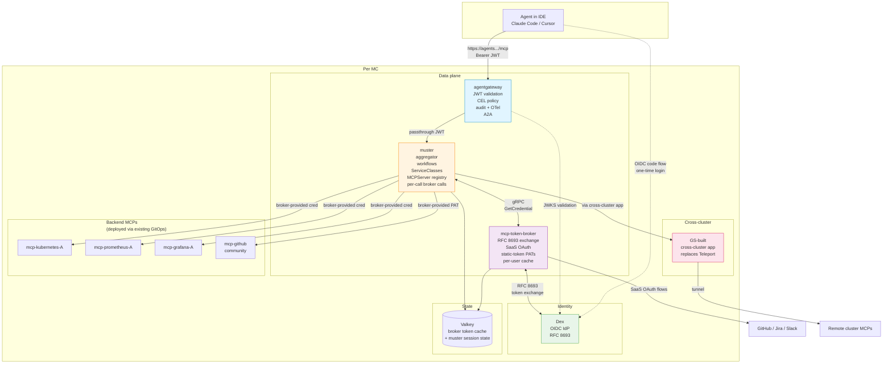
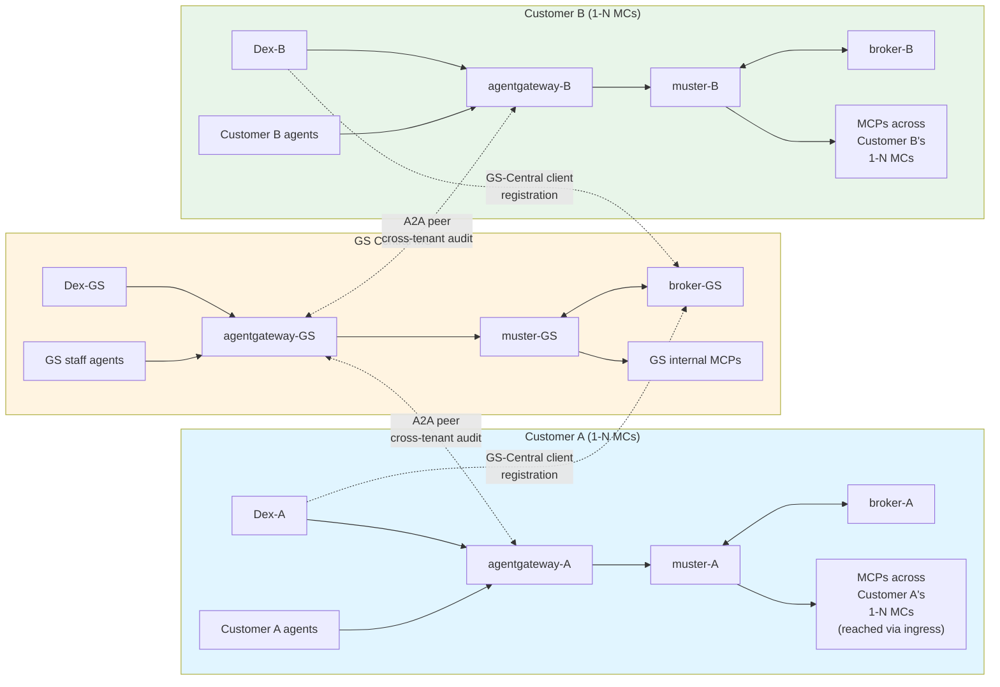
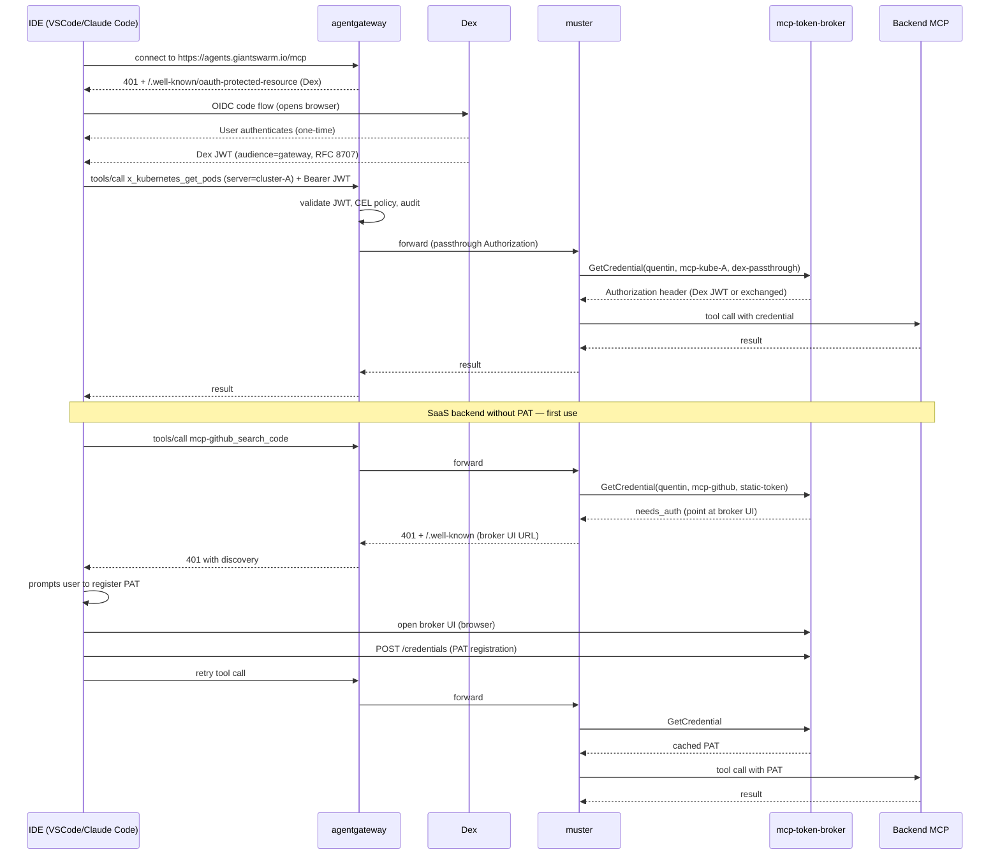
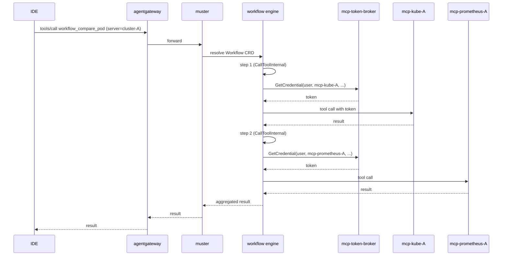

# 012 — agentgateway in front, muster behind, OAuth broker extracted

**Status**: Proposed
**Date**: 2026-05-05
**Scope**: Architecture transition for muster's role in the AI platform — agentgateway adoption (Step 1) + mcp-token-broker extraction (Step 2). Multi-customer rollout with A2A peering is deferred to a future ADR (proposed: ADR-013).
**Supersedes**: parts of ADR-005 (muster-auth), ADR-008 (unified-authentication), ADR-010 (server-side-meta-tools)
**Relates to**: ADR-006 (session-scoped tool visibility — disposition decided in Step 2), ADR-009 (SSO token forwarding — encoded in MCPServer.Auth, then moves to broker), ADR-011 (session connection pool — partially affected)

## Status summary

Introduce **agentgateway** as the agent-facing MCP resource server. Slim muster's agent-facing auth surface (rate limiting, denylist, agent-session, audit metrics) — these capabilities move to the gateway. Then extract muster's per-backend OAuth dispatch (`internal/oauth/`) into a standalone OSS service **mcp-token-broker** with four credential modes (Dex passthrough, RFC 8693 exchange, SaaS OAuth, static-token).

muster stays as the MCP-aggregation control plane: aggregator + workflow + ServiceClass + MCPServer registry + filter_tools + admin shim. The gateway is in front (agent identity, audit, CEL policy, A2A); the broker is alongside (auth-as-a-service); muster handles the platform-engineering value-adds.

## Context

### What muster does today

muster currently plays multiple roles:

1. Agent-facing MCP resource server (terminates OAuth flows for agents, validates sessions)
2. Multi-backend MCP aggregator (prefix-based federation)
3. Workflow engine (CRD-driven multi-step tool composition)
4. ServiceClass executor (prereq orchestration)
5. MCP server lifecycle supervisor (stdio process management, health, autoStart)
6. Per-backend auth dispatcher (forward token, RFC 8693 token exchange, Teleport mTLS via tbot)
7. Meta-tool provider (`list_tools`, `filter_tools`, `describe_tool`, `call_tool`)

Some of these — agent identity, agent-side rate limiting, denylist, agent-side audit — duplicate work that a dedicated MCP gateway does better. They couple muster to concerns that should live elsewhere.

The other muster responsibilities (aggregation, workflows, ServiceClasses, MCPServer lifecycle) are not affected by this ADR. They stay where they are. Per-backend auth dispatch (`internal/oauth/`) moves out — to a dedicated broker service rather than being absorbed by the gateway, because:

- Backend ownership: community/third-party MCPs (mcp-github, mcp-jira) can't be modified to embed mcp-oauth themselves; a centralized broker is the only realistic place for SaaS OAuth orchestration
- Architecture-agnostic property: a standalone broker is reusable across MCP gateways and aggregators, not tied to muster

### What changed in the ecosystem

- **MCP spec 2025-11-25** mandates RFC 8707 Resource Indicators (audience-locked tokens). muster's current agent-facing OAuth doesn't audience-lock per backend.
- **agentgateway** (CNCF Sandbox via Solo donation) is the only OSS gateway with native MCP **and** A2A protocol support, with CEL-based policy and OTel-native observability.
- **A2A protocol** has reached production traction (150+ orgs, Linux Foundation hosted) and is the natural protocol for cross-tenant agent invocation.

### Why now

Three forcing functions:

1. **MCP spec compliance** — current spec requires RFC 8707 audience-locked tokens; muster's agent OAuth doesn't audience-lock per backend. Cleanest fix: delegate to a spec-compliant gateway.
2. **Multi-MC tenancy** — customers need their own identity/audit boundaries; centralizing all of this in muster doesn't scale to per-tenant policy.
3. **A2A on the roadmap** — building it into muster would conflict with muster's other concerns and rebuild what agentgateway already provides.

## Decision

### End-state architecture

```
agent ──[Dex JWT, RFC 8707]──▶ agentgateway ──[passthrough Authorization]──▶ muster ──gRPC──▶ mcp-token-broker
                                                                                │                  │
                                                                                │                  ├─▶ Dex (RFC 8693)
                                                                                │                  ├─▶ SaaS providers (OAuth)
                                                                                │                  └─▶ Valkey (token store)
                                                                                │
                                                                                ▼
                                                                        backend MCPs
                                                                  (with broker-provided credential)
```

Each MC runs the stack `Dex + agentgateway + muster + mcp-token-broker + backend MCPs`. The customer-facing gateway boundary is at the customer level (1 gateway per customer), not per MC.

### Per-MC architecture (Mermaid)



### Multi-customer topology (Mermaid)

Multi-MC scope is deferred to ADR-013. Diagram included here for reference — shows how the per-MC architecture replicates per customer with A2A peering between gateways for cross-tenant operations.



**Per customer**: 1 Dex + 1 agentgateway + 1 muster + 1 broker, regardless of how many MCs the customer has. These four components live in the customer's primary MC. Other MCs just run MCPs deployed via existing GitOps, exposed via ingress.

A2A peering provides cross-tenant audit (customer's gateway sees GS staff calls). Detailed topology and customer rollout sequencing are in ADR-013.

### Three-layer auth model

| Layer | Decision point | Configuration |
|---|---|---|
| Agent → gateway | Is the agent allowed to call this tool with these arguments? | agentgateway CRDs + CEL policy |
| Gateway/muster → broker → backend | What credential does muster present to this backend? | broker per-call decision based on `MCPServer.spec.auth` mode hint |
| Backend internals | Does the backend trust what it received? | backend pod config (kube-OIDC, Dex trust, mTLS, SaaS validation) |

### Components

| Layer | Type | Responsibility |
|---|---|---|
| **Dex** | Existing CNCF | Per-MC OIDC IdP; RFC 8693 token exchange via OIDC connector |
| **agentgateway** | New deployment (CNCF Sandbox) | Agent identity, CEL policy, audit, OTel root, A2A in/out |
| **muster** (slimmed) | Existing | MCP-aggregation control plane: prefix-based aggregator, workflows, ServiceClasses, MCPServer registry, filter_tools, cross-cluster app integration, admin shim |
| **mcp-token-broker** | New OSS service (extracted from muster's `internal/oauth/`) | Generic OAuth broker: RFC 8693 exchange, SaaS OAuth flows, static-token mode, per-user token cache. gRPC API for muster. |
| Backend MCPs | Existing | Tool implementations, deployed via existing GitOps |

### What stays in muster

- **Aggregator** (prefix-based federation)
- **Workflow CRD + executor** (deterministic multi-step execution)
- **ServiceClass CRD + executor** (prereq orchestration)
- **MCPServer registry / process supervision** (until kmcp adopted, deferred)
- **Cross-cluster app integration** (muster's internal concern; standard upstream HTTP/mTLS to GS-built cross-cluster app)
- **filter_tools meta-tool** (agent-driven runtime exploration of large catalogs)
- **Admin shim** (consumes broker's lifecycle events for unified session view)
- **Per-backend connection lifecycle** (reconnect, health, backoff)
- **ADR-006** (or ADR-006 Lite — disposition decided in Step 2)

### What moves out of muster (Step 1 — to agentgateway)

| Path | Reason |
|---|---|
| `internal/aggregator/auth_metrics.go` | Gateway emits agent login/logout metrics with stable schema |
| `internal/aggregator/auth_rate_limiter.go` | Gateway rate-limits agent calls |
| `internal/aggregator/denylist.go` | Gateway CEL replaces with richer policy |
| `internal/aggregator/sso_tracker*.go` (agent-session parts) | Agent session lives at the gateway |
| `internal/aggregator/session_auth_store*.go` (agent-session parts) | Same — per-backend storage stays for backend-OAuth state |
| `internal/aggregator/auth_resource.go` (agent-facing parts) | Agent doesn't authenticate to muster directly |
| `internal/aggregator/auth_tools.go` (agent-session login tools) | Agent session is at gateway |
| Most of `internal/metatools/` (keep `filter_tools` only) | Standard MCP `tools/list` + direct `tools/call` cover the rest |

### What moves out of muster (Step 2 — to mcp-token-broker)

| Path | Reason |
|---|---|
| `internal/oauth/` | Extracted to broker as RFC 8693 client + token store + OAuth flows |
| `internal/agent/oauth/` | Same |
| `pkg/oauth/` | Same |
| Per-backend OAuth flow handlers | Broker handles |
| Per-user-per-backend token store | Broker holds (Valkey-backed) |

Estimated total removal across both steps: ~2000-2500 LOC plus tests. Replaced by ~100 LOC of broker-client code in muster.

### What stays modified (not removed)

| File | Change |
|---|---|
| `internal/aggregator/server.go` (`BeforeCallTool`/`AfterCallTool` hooks ~lines 695–722) | Demote audit-shaped slog to OTel spans only. Extract `traceparent` from incoming request as parent context. |
| `internal/aggregator/server.go` (auth termination point) | Stop acting as agent-facing OAuth RS. Trust gateway-validated JWT in incoming Authorization header. Optionally validate via Dex JWKS for defense in depth. |
| `internal/teleport/` | Stays for now; subject to change as the GS-built cross-cluster app rolls out (separate workstream, out of scope here) |
| `cmd/serve.go` and entry points | Initialize OTel SDK with W3C Trace Context propagator. Add `--local-dev` flag for in-process simple auth handler that skips broker. |
| `cmd/agent.go` | Document as local-dev only; production agents talk to gateway URL. |

## mcp-token-broker design

Standalone Go service. gRPC primary API. Per-MC deployment.

### Three config layers (decoupled — broker doesn't read muster's CRDs)

| Config | Where | Owner |
|---|---|---|
| Per-backend auth mode (Dex passthrough / RFC 8693 / SaaS / static-token) | `MCPServer.spec.auth` | muster — passes per-call to broker |
| Per-SaaS-provider credentials (client ID, callback URL, scopes) | Broker's ConfigMap + Secrets | Broker — one entry per SaaS provider |
| Per-user-per-backend tokens | Broker's Valkey store | Broker |

### Four credential modes

| Mode | What broker does | Use case |
|---|---|---|
| `dex-passthrough` | Returns "use inbound Dex JWT unchanged" | Internal Dex-trusting backends in same MC |
| `dex-exchange` | Calls Dex `/token` via RFC 8693, returns exchanged token | Cross-cluster Dex-trusting backends |
| `saas-oauth` | Brokers full OAuth flow with SaaS provider, caches token per user | Backends that speak full OAuth (rare in MCP today) |
| `static-token` | Returns user-pre-registered static credential (PAT, API key) | **Most community/SaaS MCPs** (mcp-github with PAT, mcp-slack with bot token, mcp-jira with API token) |

### API shape

```protobuf
service TokenBroker {
  rpc GetCredential(GetCredentialRequest) returns (GetCredentialResponse);
  rpc InitiateAuth(InitiateAuthRequest) returns (InitiateAuthResponse);
  rpc RevokeSession(RevokeSessionRequest) returns (RevokeSessionResponse);
  rpc StreamLifecycleEvents(...) returns (stream LifecycleEvent);  // for muster's admin shim
}

message GetCredentialRequest {
  string subject = 1;          // user identifier from validated JWT
  string target_backend = 2;   // logical backend ID
  string mode = 3;             // dex-passthrough | dex-exchange | saas-oauth | static-token
  string target_audience = 4;  // for exchange modes
  string saas_provider = 5;    // for saas-oauth mode
  string credential_label = 6; // for static-token mode (e.g., github-pat)
}

message GetCredentialResponse {
  oneof result {
    string authorization_header = 1;     // ready-to-inject
    AuthChallenge needs_auth = 2;        // 401 response with /.well-known
  }
}
```

### Architecture-agnostic property

Broker exposes both gRPC (for muster) and ext_authz (reserved for future gateway-direct use). Same code, two API surfaces. Future-proof against architecture decisions that haven't been made yet.

### ext_authz NOT enabled today

In the current architecture, the gateway just passes through Authorization. muster handles auth dispatch by calling broker via gRPC. **No ext_authz needed at the gateway today.** Adding it would be premature: extra latency, no current benefit. Reserved for future flexibility.

### Admin UI — stays in muster

Data lives in broker (sessions, tokens, OAuth state). UI/API stays in muster. muster's `internal/aggregator/admin_adapter.go` becomes a consumer of broker's lifecycle event stream:

```
broker ──[stream lifecycle events]──▶ muster admin shim ──▶ existing operator UX
```

Operators continue to interact with muster as the control-plane interface. Decouples broker (data plane) from operator UX.

### Estimated effort

~2000-2500 LOC for broker, mostly extracted from muster's existing `internal/oauth/` plus new `static-token` mode handling. ~2-3 months for service wrapping + Helm chart + integration. Not greenfield.

## Constraints

### Backend ownership

You don't own community/third-party SaaS MCP backends (mcp-github, mcp-jira, etc.). You cannot embed auth handling in them. **The broker is the only realistic place for SaaS OAuth orchestration.** This is permanent — adding new SaaS providers means adding broker config, not modifying backends.

### agentgateway can NOT do per-user static-token injection natively

agentgateway supports static upstream headers globally (one header for everyone), but **not per-user header substitution**. For per-user PATs/API-keys, the broker via gRPC is the cleanest path — same architecture as OAuth modes.

### Per-customer Dex (multi-MC consideration)

Each customer has their own Dex; GS-Central registers as a client on each customer Dex. Detailed multi-customer topology, A2A peering, and customer rollout sequencing are deferred to ADR-013. ADR-012 establishes the per-MC stack pattern that ADR-013 will replicate per customer.

### Cross-cluster app (replacing Teleport upstream)

muster talks to a GS-built cross-cluster app via standard upstream HTTP/mTLS. This is muster-internal — gateway and broker don't need to know about it. `internal/teleport/` and `MCPServer.spec.transport.teleport` are subject to change as the app rolls out — that workstream is out of scope here.

## Single sign-on flow

User signs in **once** to their MC's Dex via the agentgateway. Visible auth events:

- One Dex sign-in per session
- One per SaaS backend (first-use OAuth flow or PAT registration for each SaaS provider)

After first sign-in, all backend access is silent — broker handles audience exchange, SaaS token caching, etc.

### IDE configuration — one URL

```json
{
  "mcpServers": {
    "giantswarm": {
      "url": "https://agents.giantswarm.io/mcp"
    }
  }
}
```

That's the only URL the user configures. Everything else (Dex login, backend auth) follows from there via MCP-spec discovery.

### SSO sequence (Mermaid)



### Workflow execution (Mermaid)



### Per-flow identity propagation

| Flow | Identity propagation |
|---|---|
| Agent → gateway | Dex JWT (RFC 8707 audience-locked to gateway) |
| gateway → muster | Same JWT (passthrough) |
| muster → broker (per call) | gRPC with `subject` from JWT + target backend ID |
| muster → backend (Dex-trusting) | Broker-provided token (Dex JWT or audience-exchanged) |
| muster → backend (SaaS PAT) | Broker-provided user-registered PAT |
| muster → backend (SaaS OAuth) | Broker-provided cached SaaS OAuth token |
| Workflow steps | Same user identity carried via workflow context; per-step credential lookup via broker |

## Two-layer tool-list filtering

Agent-visible tool list is filtered by both layers:

| Filter | Who applies | Driver |
|---|---|---|
| **Session-state-based** (ADR-006) — "tools from backends the user is authenticated to" | muster | Per-backend session state (consumed from broker's lifecycle events) |
| **Claim-based** — "tools the user's role allows" | agentgateway | JWT claims via CEL |

agent calls `tools/list`:
1. Gateway forwards to muster
2. muster applies sessionToolFilter (ADR-006, TBD per Step 2.11) using broker session state, plus prefix-based federation
3. Gateway applies CEL claim filter on top
4. Filtered list returned to agent

Both filters serve different purposes. ADR-006 disposition is a Step 2 decision: drop entirely, keep ADR-006 Lite (per-user catalog cache), or keep full ADR-006.

## agentgateway configuration

Concrete YAML to wire up the per-MC stack. Uses Gateway API + agentgateway CRDs.

### 1. Gateway

```yaml
apiVersion: gateway.networking.k8s.io/v1
kind: Gateway
metadata:
  name: agentgateway
  namespace: agents
spec:
  gatewayClassName: agentgateway
  listeners:
  - name: mcp
    protocol: HTTPS
    port: 443
    hostname: agents.giantswarm.io
    tls:
      mode: Terminate
      certificateRefs:
      - kind: Secret
        name: agents-tls
```

### 2. AgentgatewayBackend (muster as upstream)

```yaml
apiVersion: gateway.agentgateway.dev/v1alpha1
kind: AgentgatewayBackend
metadata:
  name: muster
  namespace: agents
spec:
  mcp:
    targets:
    - name: muster
      mcp:
        host: http://muster.muster.svc.cluster.local:8080/mcp/
```

### 3. HTTPRoute

```yaml
apiVersion: gateway.networking.k8s.io/v1
kind: HTTPRoute
metadata:
  name: muster-mcp
  namespace: agents
spec:
  parentRefs:
  - name: agentgateway
    sectionName: mcp
  hostnames:
  - agents.giantswarm.io
  rules:
  - matches:
    - path:
        type: PathPrefix
        value: /mcp
    backendRefs:
    - group: gateway.agentgateway.dev
      kind: AgentgatewayBackend
      name: muster
      port: 80
```

### 4. JWT validation policy

```yaml
apiVersion: gateway.agentgateway.dev/v1alpha1
kind: AgentgatewayPolicy
metadata:
  name: jwt-validation
  namespace: agents
spec:
  targetRef:
    kind: HTTPRoute
    name: muster-mcp
  jwtAuthn:
    issuer: https://dex.giantswarm.io
    jwksUri: https://dex.giantswarm.io/keys
    audiences:
    - agents.giantswarm.io
    forwardAuthorization: true
```

### 5. mcpAuthorization with CEL

```yaml
apiVersion: gateway.agentgateway.dev/v1alpha1
kind: AgentgatewayPolicy
metadata:
  name: mcp-rbac
  namespace: agents
spec:
  targetRef:
    kind: HTTPRoute
    name: muster-mcp
  mcpAuthorization:
    rules:
    - cel: |
        request.tool.name.startsWith("x_kubernetes_") ||
        request.tool.name.startsWith("x_prometheus_") ||
        request.tool.name.startsWith("x_grafana_")
      requires:
        - cel: |
            "admin" in jwt.claims.groups ||
            request.tool.arguments.server in jwt.claims.allowed_clusters
    - cel: |
        request.tool.name.startsWith("mcp-github_")
      requires:
        - cel: |
            "github-users" in jwt.claims.groups
    - cel: |
        request.tool.name.startsWith("workflow_")
      requires:
        - cel: |
            "workflows-users" in jwt.claims.groups
```

### 6. Audit + OTel observability

```yaml
apiVersion: gateway.agentgateway.dev/v1alpha1
kind: AgentgatewayPolicy
metadata:
  name: observability
  namespace: agents
spec:
  targetRef:
    kind: Gateway
    name: agentgateway
  observability:
    audit:
      sink:
        type: loki
        endpoint: http://loki.observability.svc.cluster.local:3100
        labels:
          stream: agent-audit
    tracing:
      otlp:
        endpoint: http://tempo.observability.svc.cluster.local:4317
        sampling: 1.0
```

**Note**: Actual agentgateway CRD names and field shapes need verification against the current upstream OSS release. The shape above is conceptual based on agentgateway's stated capabilities (Gateway API integration, mcpAuthorization with CEL, JWT auth, OTel/audit observability). Spike against the current release before committing config syntax.

## Local development

`muster serve --local-dev` uses a simple in-process auth handler (env-var credentials, no exchange, no SaaS flows). Skips broker calls entirely.

```bash
# Contributor flow — no broker needed
muster serve --local-dev \
  --dex-jwt=$DEX_DEV_TOKEN \
  --github-pat=$GITHUB_PAT
```

Three local scenarios:

| Scenario | Local components | Broker? |
|---|---|---|
| Muster contributor (stdio to IDE) | `muster serve --local-dev` + mock backend | No — env-var creds |
| Local end-to-end testing | k3d cluster with full stack | Yes |
| Production-equivalent dev | stdio shim binary only | No (shim → remote gateway) |

## Migration plan

### Phase 0 — Foundation

| Sub-step | Action | Risk |
|---|---|---|
| 0.1 | Add OTel SDK to muster — initialize tracer, exporter, W3C propagator. No behavior change yet. | low |
| 0.2 | Demote audit-shaped slog lines in `BeforeCallTool`/`AfterCallTool` to OTel spans only | low |

### Step 1 — agentgateway adoption (in GS Central)

Deliver agent-facing audit, identity, policy. muster keeps per-backend OAuth dispatch.

| Sub-step | Action | Risk |
|---|---|---|
| 1.1 | Stand up Dex-GS in HA. Federate to existing staff IdP. | low |
| 1.2 | Configure all WCs' kube-apiserver to trust Dex (`--oidc-issuer-url`) | medium |
| 1.3 | Deploy agentgateway in GS Central. Single backend → muster. No policy yet — pure proxy. | medium |
| 1.4 | Wire JWT validation at gateway. Reject unauthenticated requests. | medium |
| 1.5 | Switch muster from agent-facing OAuth RS to gateway-trusted JWT mode. Validate via Dex JWKS. Remove agent-facing OAuth code paths. | medium |
| 1.6 | Add CEL policies at gateway: tool-list filtering, RBAC on tool name + `arguments.server`. Start permissive. | medium |
| 1.7 | Drop `auth_metrics.go`, `auth_rate_limiter.go`, `denylist.go` from muster | low |
| 1.8 | Drop SSO tracker and session auth store (agent-session parts only) | medium |
| 1.9 | Slim `internal/metatools/` to `filter_tools` only | low |
| 1.10 | Run 2 weeks with internal users; document operational runbook | medium |

**End of Step 1**: agentgateway is the agent-facing MCP RS. Audit, OTel, CEL policy, A2A capability all in place. muster still owns per-backend OAuth (`internal/oauth/`, `MCPServer.spec.auth`). System operationally stable.

### Step 2 — mcp-token-broker extraction

Extract per-backend OAuth from muster. Deliver clean auth-code reduction.

| Sub-step | Action | Risk |
|---|---|---|
| 2.1 | Extract muster's `internal/oauth/` into Go library | low |
| 2.2 | Wrap library as standalone gRPC service `mcp-token-broker`. Build Helm chart. | medium |
| 2.3 | Add four credential modes to broker: dex-passthrough, dex-exchange, saas-oauth, static-token | medium |
| 2.4 | Add per-SaaS-provider config support (ConfigMap + Secrets) | low |
| 2.5 | Build broker UI/CLI for static-token (PAT) registration | medium |
| 2.6 | Update muster to call broker via gRPC instead of in-process. Run alongside `internal/oauth/` via feature flag for transition. | medium |
| 2.7 | Validate end-to-end with each backend type (Dex passthrough, RFC 8693, SaaS OAuth, static-token PAT) | medium |
| 2.8 | Drop muster's `internal/oauth/` ForwardToken/TokenExchange logic | low |
| 2.9 | Simplify `MCPServer.spec.auth` schema to: mode + provider hint (broker holds the rest) | low |
| 2.10 | Wire broker lifecycle event stream into muster's admin shim for unified session view | low |
| 2.11 | Decide on ADR-006 disposition: drop entirely, keep ADR-006 Lite (per-user catalog cache), or keep full ADR-006 | medium |
| 2.12 | Run 2 weeks; document broker operational runbook | medium |

**End of Step 2**: muster's auth surface fully extracted. Broker reusable as standalone OSS service. muster shrunk to its essential platform-engineering value.

### Why this order (gateway first, broker second)

| Reason | Detail |
|---|---|
| Agentgateway adoption is additive | New component in front of muster; muster keeps working as-is on day 1 |
| Broker extraction is invasive | Touches `internal/oauth/`, per-call dispatch, MCPServer.spec.auth — better on stable foundation |
| Earlier value delivery | Agent identity, audit, CEL policy, A2A all arrive in step 1; cleanup follows |
| Reverse order has weaker value curve | Broker without gateway delivers internal cleanup but no user-facing improvements |

## Decisions to resolve before Phase 1

| Decision | Trigger | Default recommendation |
|---|---|---|
| `muster agent` command kept for local-dev | Developer ergonomics | Keep — production uses gateway, local-dev keeps direct mode |
| GitOps templating tool for MCPServer CRDs | Scale of WCs and MCP types | Helm + Flux Kustomization overlays with cluster-specific values |
| Audit retention/sampling at gateway | Compliance | TBD with security team |
| Defense-in-depth (keep muster's denylist) | Compliance regime requires layered enforcement | **Drop** unless compliance explicitly requires it |
| OTel exporter destination | Existing observability stack | Tempo for traces, Loki for audit logs |

## Decisions to resolve in Step 2

| Decision | Trigger | Default recommendation |
|---|---|---|
| ADR-006 disposition | Whether per-user permission-differentiated catalogs are common in your backends | ADR-006 Lite (catalog cache) if backends differentiate; drop entirely if they don't |
| Broker library + service split (Form C) | Architectural cleanliness | Library imported by muster + standalone service wrapper for gateway/external use |
| Naming: `giantswarm/mcp-token-broker` vs `giantswarm/mcp-token-exchange` vs other | Scope clarity | mcp-token-broker — covers all four modes, not just exchange |

## Out of scope

- **Multi-customer rollout** (per-customer Dex + agentgateway + muster + broker) — deferred to ADR-013
- **A2A peering for cross-tenant ops** — deferred to ADR-013
- **kmcp adoption** for MCPServer pod lifecycle (existing GitOps does the deployment)
- **Replacing workflows / ServiceClasses** with kagent or other (separate ADR if pursued)
- **Cross-cluster app design** (separate workstream owned by GS infra)

## Risks

| Risk | Likelihood | Impact | Mitigation |
|---|---|---|---|
| agentgateway maturity (CNCF Sandbox, ~1 year) | medium | medium | Pilot in GS Central first, 2-week soak, fall-back to direct muster path until validated |
| Dex SPOF | medium | high | HA deployment, postgres backing, monitoring/alerting |
| muster SPOF | medium | high | HA replicas, Valkey-backed state |
| OTel + audit log volume | medium | medium | Sampling policy; partition by cluster + agent; aggressive retention on read-mostly tools |
| Broker SPOF (after Step 2) | medium | high | HA replicas, Valkey-backed state, broker outage = no per-backend tokens flow → graceful degradation needed |
| Broker latency added to every backend call | medium | low | Broker-side cache; keep round-trip < 5ms; OTel surfaces slow paths |
| Muster auth refactor (Step 2) breaks per-backend OAuth | medium | high | Feature flag to keep `internal/oauth/` and broker call in parallel during transition |
| `muster agent` users not migrating | low | low | Document deprecation; keep working for local-dev; require IDE config update for production |

## Validation criteria

After Phase 0 + Step 1 + Step 2:

1. Agents authenticate only at agentgateway (Dex JWT, RFC 8707 audience-locked)
2. Every `tools/call` is audited at the gateway with stable schema
3. CEL policies gate tool RBAC and `server` argument access
4. muster has no agent-side rate limiting, denylist, audit metrics, or agent-session OAuth code
5. muster's `internal/oauth/` is fully extracted; per-backend auth dispatch happens in mcp-token-broker
6. Broker handles four credential modes: Dex passthrough, RFC 8693 exchange, SaaS OAuth, static-token PAT registration
7. OTel traces stitch: gateway root → muster spans → workflow step spans
8. Workflow + ServiceClass execution unchanged in behavior
9. Documentation reflects the new architecture; runbook for failures exists
10. Internal users for 2 weeks (Step 1) and broker validation 2 weeks (Step 2) report no regressions

## Consequences

### Positive

- muster's agent-facing security surface goes away; ~1500 LOC removed in Step 1
- muster's per-backend OAuth surface goes away; ~500-1000 LOC additional removal in Step 2
- Every agent-originated tool call has stable auditable identity + decision at the gateway
- MCP-spec compliance with current spec (RFC 8707)
- A2A protocol available without bolting it onto muster
- New OSS contribution: mcp-token-broker fills a real OSS gap (no equivalent today)
- muster's role becomes clearer: aggregation + workflows + ServiceClasses, not "muster does everything"
- Three coherent CNCF-track GS contributions: mcp-oauth (existing), mcp-token-broker (new), muster (slimmed)

### Negative

- Two new components to operate per MC (agentgateway + broker)
- Multi-MC operational complexity arrives in ADR-013 (not this ADR)
- Brand-new dependency on agentgateway (CNCF Sandbox, ~1 year project)
- Migration effort: 10+ phases, multi-week pilot in GS Central
- `muster agent` users must reconfigure for production gateway URL (local-dev unaffected)
- Broker becomes a critical-path component (every per-backend call goes through it)

### Neutral

- Layered architecture is more explicit but also more documented
- Per-backend auth dispatch (`MCPServer.spec.auth` mode hint) stays in muster's CRD — broker reads mode from caller's request, not from CRDs

## References

- [agentgateway docs](https://agentgateway.dev/)
- [agentgateway on GitHub](https://github.com/agentgateway/agentgateway)
- [MCP Authorization spec 2025-11-25](https://modelcontextprotocol.io/specification/2025-11-25/basic/authorization)
- [RFC 8707 — Resource Indicators for OAuth 2.0](https://www.rfc-editor.org/rfc/rfc8707.html)
- [RFC 8693 — OAuth 2.0 Token Exchange](https://datatracker.ietf.org/doc/html/rfc8693)
- [Dex token exchange documentation](https://dexidp.io/docs/guides/token-exchange/)
- [A2A protocol](https://a2a-protocol.org/latest/)
- ADR-005 muster-auth (parts superseded)
- ADR-006 session-scoped tool visibility (disposition decided in Step 2)
- ADR-008 unified-authentication (parts superseded)
- ADR-009 SSO token forwarding (kept; encoded in MCPServer.Auth, then moves to broker)
- ADR-010 server-side meta-tools (mostly superseded — `filter_tools` retained)
- ADR-013 (proposed) — multi-customer rollout with A2A peering
