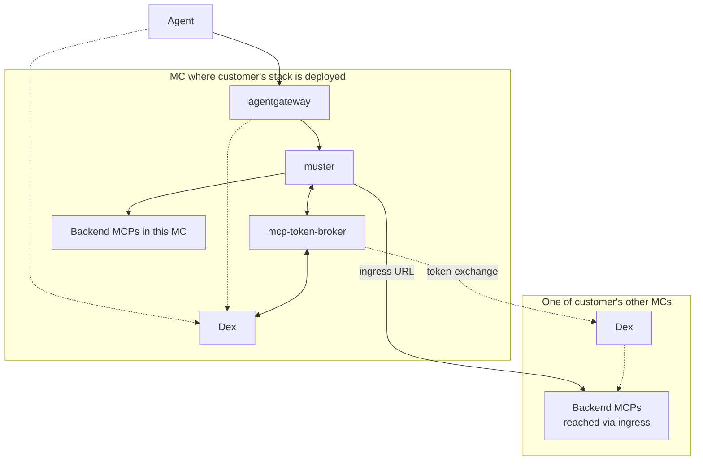
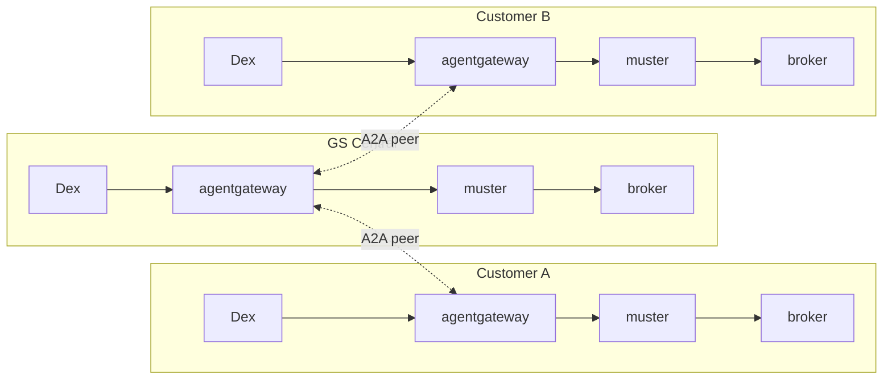

# 012 — agentgateway in front, muster behind, OAuth broker extracted

**Status**: Proposed
**Date**: 2026-05-05
**Supersedes**: parts of ADR-005 (muster-auth), ADR-008 (unified-authentication), ADR-010 (server-side-meta-tools)
**Relates to**: ADR-006 (session-scoped tool visibility — disposition deferred), ADR-009 (SSO token forwarding — encoded in MCPServer.Auth, then moves to broker), ADR-011 (session connection pool — partially affected)

## Status summary

Introduce **agentgateway** as the agent-facing MCP resource server in front of muster. Extract muster's per-backend OAuth machinery into a standalone OSS service **mcp-token-broker** with four credential modes (Dex passthrough, RFC 8693 exchange, SaaS OAuth, static-token PAT). Apply per-customer (1 stack per customer, 1-N MCs per customer); **A2A peering between gateways is the standard cross-tenant pattern** — customer's gateway sees and audits GS staff calls.

muster stays behind the gateway as the MCP-aggregation control plane: aggregator + workflows + ServiceClasses + MCPServer registry + filter_tools + admin shim. Auth dispatch moves to the broker; agent-facing concerns (RFC 8707 audience binding, CEL policy, audit, A2A) move to the gateway.

## Context

muster currently plays multiple roles: agent-facing OAuth resource server, MCP aggregator, workflow engine, ServiceClass executor, MCPServer process supervisor, per-backend OAuth dispatcher, meta-tool provider. Several of these — agent identity, agent-side rate limiting, denylist, agent-side audit — duplicate work that a dedicated MCP gateway does better, and they couple muster to concerns that should live elsewhere.

### What changed in the ecosystem

- **MCP spec 2025-11-25** mandates RFC 8707 Resource Indicators (audience-locked tokens). muster's current agent-facing OAuth doesn't audience-lock per backend.
- **agentgateway** (CNCF Sandbox via Solo donation) is the only OSS gateway with native MCP **and** A2A protocol support, with CEL-based policy and OTel-native observability.
- **A2A protocol** has reached production traction (150+ orgs, Linux Foundation hosted) and is the natural protocol for cross-tenant agent invocation.

### Forcing functions

1. **MCP spec compliance** — current spec requires RFC 8707; muster's agent OAuth doesn't audience-lock per backend
2. **Multi-customer tenancy** — customers need their own identity/audit boundaries; centralizing all of this in muster doesn't scale to per-tenant policy
3. **Cross-tenant audit** — GS support model requires customer's gateway to see GS staff access (visibility); A2A peering provides this

## Decision

### Per-customer stack

One stack per customer regardless of how many MCs the customer has: `agentgateway + muster + mcp-token-broker`. These three components are deployed in one of the customer's MCs — there's no formal "primary" designation, the stack just runs somewhere. The customer's other MCs run MCPs deployed via existing GitOps and exposed via ingress; muster reaches them via ingress URLs.

**Each MC has its own Dex** (for kube-apiserver OIDC and cluster-level identity). For the agent-platform layer, the agentgateway uses the Dex of whichever MC the stack is deployed in as its issuer; the broker calls that Dex for token exchange.

The broker can call any IdP it has client credentials for — Dex-Deployment for local-MC backends, Dex-Other for cross-MC backends within the same customer, and (in the multi-customer case below) other customers' Dexes for GS staff cross-tenant access.

### Giant Swarm multi-customer topology

A2A peering is **standard, not opt-in**, deployed via the GS support chart. Customer's gateway sees and audits all access including GS staff. Customer technically can deny GS via CEL policy but operationally maintains GS-allow as part of the support relationship (managed-platform trust model — same as cloud providers' control-plane access).

### Three-layer auth model

| Layer | Decision point | Configuration |
|---|---|---|
| Agent → gateway | Is the agent allowed to call this tool with these arguments? | agentgateway CRDs + CEL policy |
| Gateway/muster → broker → backend | What credential does muster present to this backend? | broker per-call, mode hint from `MCPServer.spec.auth` |
| Backend internals | Does the backend trust what it received? | backend pod config (kube-OIDC, Dex trust, mTLS, SaaS validation) |

### Broker credential modes

Three initial modes:

| Mode | Use case |
|---|---|
| `passthrough` | Backend trusts the inbound issuer; forward the token unchanged |
| `token-exchange` | Backend trusts a different IdP; RFC 8693 exchange to that IdP. Used for cross-cluster scenarios within a customer (different MC Dexes) and for cross-tenant (GS-Central staff → customer Dex). The broker can call any IdP it has client credentials for. |
| `oauth` | Backend brokers its own OAuth flow with a third party (full OAuth code flow with browser redirect; cached token per user) |

Future modes (not in initial scope, added when concrete need arises):

- `static-token` for backends that accept user-registered PATs/API-keys (mcp-github with PAT, mcp-slack with bot token). Add when first such backend is onboarded.

The broker is **architecture-agnostic**: gRPC API for muster, ext_authz API reserved for future gateway-direct use. Same code, two API surfaces.

### What stays in muster

- MCP aggregator (prefix-based federation)
- Workflow CRD + executor
- ServiceClass CRD + executor
- MCPServer registry / process supervision
- `filter_tools` meta-tool (agent-driven runtime exploration)
- Admin shim consuming broker lifecycle events
- Per-backend connection lifecycle (reconnect, health, backoff)
- ADR-006 disposition decided in Step 2 (drop, keep Lite, or keep full)

### What moves out (Step 1 — to agentgateway)

Only the truly agent-facing concerns:

- `denylist.go` (gateway CEL replaces)
- Code paths in `server.go` and `auth_resource.go` where muster acts as agent-facing OAuth RS
- Most of `internal/metatools/` (keep `filter_tools` only) — standard MCP wire ops cover the rest

### What moves out (Step 2 — to mcp-token-broker)

Per-backend OAuth machinery (this is the bulk of the auth surface):

- `internal/oauth/`, `internal/agent/oauth/`, `pkg/oauth/`
- `internal/aggregator/auth_metrics.go` (per-server OAuth metrics)
- `internal/aggregator/auth_rate_limiter.go` (per-user OAuth-flow rate limiting — anti-abuse on backend OAuth attempts; **distinct from gateway's general agent-call rate limiting which stays at the gateway**)
- `internal/aggregator/sso_tracker*.go` (per-backend SSO connection state)
- `internal/aggregator/session_auth_store*.go` (per-user-per-backend token storage)
- `auth_resource.go` resource handler and `auth_tools.go` tool implementations are **rewired to call broker via gRPC**, not removed (the MCP surfaces stay)

Estimated total removal: ~2000-2500 LOC plus tests across both steps. Replaced by ~100 LOC of broker-client code in muster.

### Migration phases

**Phase 0 — Foundation**: OTel SDK in muster; demote audit slog to OTel spans.

**Step 1 — agentgateway adoption (in GS Central)**: Stand up Dex-GS in HA; deploy agentgateway; switch muster to gateway-trusted JWT mode; remove agent-facing OAuth code paths; CEL policies; drop `denylist.go`; slim metatools to `filter_tools` only. Run 2 weeks.

**Step 2 — mcp-token-broker extraction**: Extract `internal/oauth/` to broker library + gRPC service; implement four credential modes including `static-token`; update muster to call broker via gRPC; drop per-backend metrics/rate-limit/sso-tracker/session-store from muster; rewire `auth://status` resource and `core_auth_*` tools to call broker; decide ADR-006 disposition. Run 2 weeks.

**Step 3 — Per-customer rollout (with A2A peering)**: For each customer, deploy the per-customer stack (Dex + agentgateway + muster + broker); register GS-Central as client in customer Dex; establish A2A peering with GS-allow CEL in support chart; verify dual audit (GS-Central logs egress, customer's MC logs inbound).

Why this order: agentgateway adoption is additive (low blast radius, high value); broker extraction is invasive (better on stable foundation); per-customer rollout requires both gateway and broker in place.

Detailed phase sub-steps, risks, configuration YAML, gRPC API specs, and verification checks are tracked in the implementation plan, not this ADR.

## Constraints

- **Backend ownership**: GS doesn't own community/third-party SaaS MCP backends. Backend-embedded mcp-oauth isn't viable for those. The broker is the only realistic place for SaaS OAuth orchestration.
- **Dex per MC**: Each MC has its own Dex (used for cluster-level OIDC, kube-apiserver, etc.). The agentgateway uses the Dex of whichever MC its stack is deployed in as its issuer. GS-Central registers as a client on each customer's stack-deployment Dex for cross-tenant token exchange.
- **Cross-cluster app**: muster talks to a GS-built cross-cluster app via standard upstream HTTP/mTLS. `internal/teleport/` and `MCPServer.spec.transport.teleport` are subject to change as the app rolls out (separate workstream).
- **agentgateway CRD shapes**: Need verification against current OSS release before committing config syntax.

## Consequences

### Positive

- muster's agent-facing security surface goes away (~1500 LOC removed in Step 1)
- muster's per-backend OAuth surface extracts to broker (~500-1000 LOC additional removal in Step 2)
- Every agent-originated tool call has stable auditable identity + decision at the gateway
- MCP-spec compliance with current spec (RFC 8707)
- A2A protocol available without bolting it onto muster
- Customer tenancy with cross-tenant audit (customer sees GS staff access)
- New OSS contribution: mcp-token-broker fills a real OSS gap
- muster's role becomes clearer: aggregation + workflows + ServiceClasses, not "muster does everything"

### Negative

- Two new components to operate per customer (agentgateway + broker), deployed alongside muster in one of the customer's MCs
- Multi-customer operational complexity (per-customer stacks)
- Brand-new dependency on agentgateway (CNCF Sandbox, ~1 year project)
- Broker becomes critical-path component (every per-backend call goes through it)
- `muster agent` CLI becomes local-dev only; production agents reconfigure for gateway URL

### Neutral

- Layered architecture is more explicit but better documented
- Per-backend auth dispatch (`MCPServer.spec.auth` mode hint) stays in muster's CRD; broker reads mode from caller's request, not from CRDs

## Decisions to resolve

- **ADR-006 disposition** (Step 2): drop entirely, keep ADR-006 Lite (per-user catalog cache only), or keep full ADR-006
- **`muster agent` deprecation timeline**: when is local-dev-only positioning communicated to users
- **Audit retention/sampling at gateway**: TBD with security team
- **Defense-in-depth**: keep muster's denylist as second layer? Default: drop unless compliance requires
- **Broker library + service split**: Form C (library imported by muster + standalone service wrapper) is the recommended path

## References

- [agentgateway docs](https://agentgateway.dev/)
- [MCP Authorization spec 2025-11-25](https://modelcontextprotocol.io/specification/2025-11-25/basic/authorization)
- [RFC 8707 — Resource Indicators for OAuth 2.0](https://www.rfc-editor.org/rfc/rfc8707.html)
- [RFC 8693 — OAuth 2.0 Token Exchange](https://datatracker.ietf.org/doc/html/rfc8693)
- [Dex token exchange documentation](https://dexidp.io/docs/guides/token-exchange/)
- [A2A protocol](https://a2a-protocol.org/latest/)
- ADR-005 muster-auth (parts superseded)
- ADR-006 session-scoped tool visibility (disposition decided in Step 2)
- ADR-008 unified-authentication (parts superseded)
- ADR-009 SSO token forwarding (kept; encoded in MCPServer.Auth, then moves to broker)
- ADR-010 server-side meta-tools (mostly superseded — `filter_tools` retained)
- Implementation plan with detailed phases, configuration YAML, sequence diagrams, gRPC API specs: tracked separately
