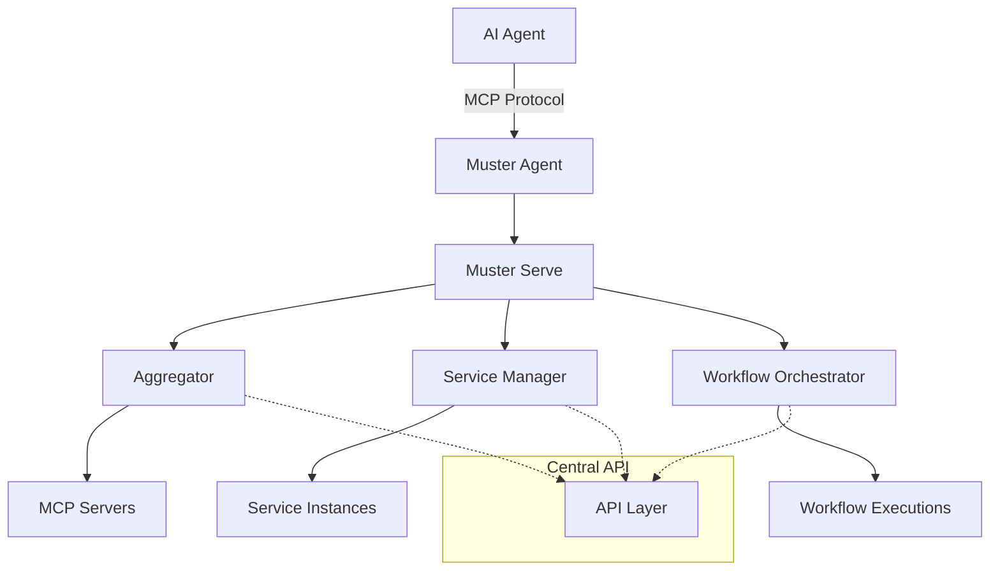

# System Overview Diagram

```mermaid
graph TD
    A[AI Agent] -->|MCP Protocol| B[Muster Agent]
    B --> C[Muster Serve]
    C --> D[Aggregator]
    D --> E[MCP Servers]
    C --> F[Service Manager]
    F --> G[Service Instances]
    C --> H[Workflow Orchestrator]
    H --> I[Workflow Executions]
    subgraph "Central API"
        J[API Layer]
    end
    D -.-> J
    F -.-> J
    H -.-> J
``` 