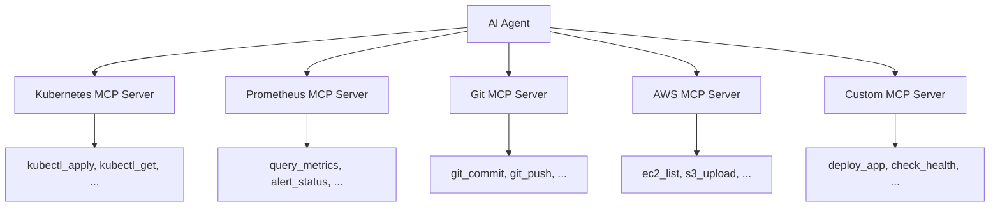
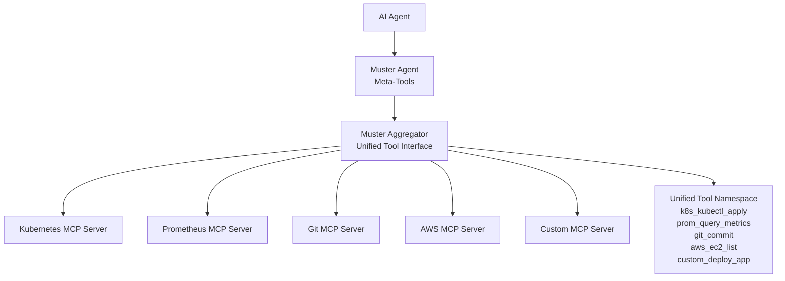
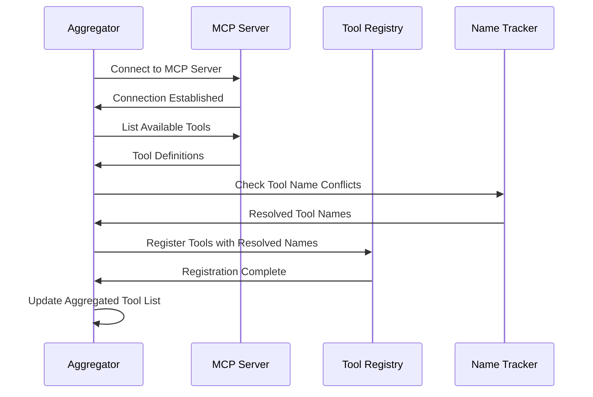
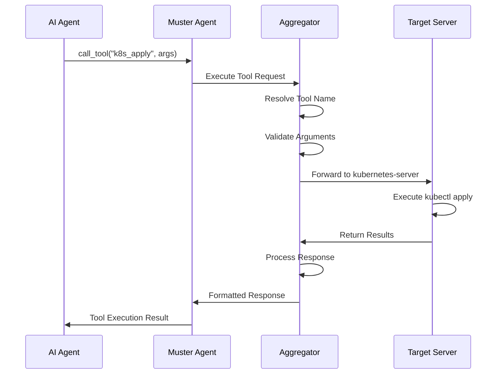

# MCP Aggregation

Deep dive into how Muster aggregates and unifies tools from multiple MCP servers.

## Overview

The Model Context Protocol (MCP) aggregation is one of Muster's core capabilities. It provides a unified interface for AI agents to access tools from multiple MCP servers without needing to know about the underlying complexity of managing multiple connections, tool conflicts, or server lifecycles.

## The Aggregation Challenge

### Without Aggregation

AI agents typically face these challenges when working with multiple MCP servers:



**Problems:**
- **Connection Management**: Agent must manage multiple MCP connections
- **Tool Discovery**: Agent must query each server separately for available tools
- **Name Conflicts**: Multiple servers might provide tools with the same name
- **Lifecycle Complexity**: Agent must handle server startup, failure, and recovery
- **Authentication**: Agent must manage credentials for each server
- **Protocol Variations**: Different servers might implement MCP protocol differently

### With Muster Aggregation

Muster solves these problems by providing a single aggregation layer:



**Benefits:**
- **Single Connection**: Agent connects only to Muster
- **Unified Discovery**: One `list_tools` call reveals all available tools
- **Conflict Resolution**: Automatic tool name prefixing prevents conflicts
- **Lifecycle Management**: Muster handles all server management
- **Centralized Auth**: Muster manages server credentials
- **Protocol Normalization**: Consistent MCP interface regardless of server implementation

## Aggregation Architecture

### Two-Layer Design

Muster implements a sophisticated two-layer aggregation architecture:

#### Layer 1: Agent Interface (Meta-Tools)

The agent layer provides 11 meta-tools that AI agents use to interact with the aggregation system:

| Meta-Tool | Purpose | Example |
|-----------|---------|---------|
| `list_tools` | Discover all available tools | Show tools from all connected servers |
| `call_tool` | Execute any aggregated tool | Execute tools from any connected server |
| `describe_tool` | Get detailed tool documentation | Show parameters and usage for any tool |
| `filter_tools` | Find tools matching patterns | Find all Kubernetes-related tools |
| `get_resource` | Access aggregated resources | Get files from any connected server |
| `list_resources` | Discover available resources | Show all available files and data |
| `get_prompt` | Access aggregated prompts | Get templates from any connected server |
| `list_prompts` | Discover available prompts | Show all available prompt templates |

#### Layer 2: Aggregator Engine

The aggregator engine manages the actual tool execution and server coordination:

```go
// Simplified aggregator architecture
type Aggregator struct {
    servers    map[string]*MCPServer
    tools      map[string]*AggregatedTool
    nameTracker *NameTracker
    registry   *ToolRegistry
}

type AggregatedTool struct {
    Name         string
    OriginalName string
    ServerName   string
    Description  string
    Schema       ToolSchema
}
```

### Tool Namespace Management

#### Automatic Prefixing

Muster automatically resolves tool name conflicts by prefixing tools with their server name:

```yaml
# Original tools from different servers
kubernetes-server:
  - name: apply
  - name: get
  - name: delete

prometheus-server:
  - name: query
  - name: alert

custom-server:
  - name: apply  # Conflict with kubernetes!
  - name: deploy

# Aggregated tools with automatic prefixing
aggregated-tools:
  - name: k8s_apply          # kubernetes-server apply
  - name: k8s_get            # kubernetes-server get  
  - name: k8s_delete         # kubernetes-server delete
  - name: prom_query         # prometheus-server query
  - name: prom_alert         # prometheus-server alert
  - name: custom_apply       # custom-server apply
  - name: custom_deploy      # custom-server deploy
```

#### Smart Conflict Resolution

The aggregator uses intelligent conflict resolution:

1. **No Conflict**: If tool name is unique, no prefix is added
2. **Server Prefix**: If conflict exists, add server name prefix
3. **Custom Mapping**: Allow manual tool name mapping for clarity
4. **Priority System**: Preferred servers can claim common tool names

```go
// Example conflict resolution configuration
type ConflictResolution struct {
    Strategy     string            // "prefix", "priority", "manual"
    Priorities   []string          // Server priority order
    CustomNames  map[string]string // Manual name mappings
    PreferUnique bool              // Prefer unprefixed names when possible
}
```

## Tool Discovery and Registration

### Dynamic Tool Registration

Tools are discovered and registered dynamically as MCP servers connect:



### Tool Metadata Aggregation

Each aggregated tool maintains rich metadata:

```go
type AggregatedTool struct {
    // Identity
    Name         string `json:"name"`
    OriginalName string `json:"originalName"`
    ServerName   string `json:"serverName"`
    
    // Documentation
    Description string     `json:"description"`
    Schema      ToolSchema `json:"schema"`
    Examples    []Example  `json:"examples"`
    
    // Runtime Information
    Available   bool      `json:"available"`
    LastSeen    time.Time `json:"lastSeen"`
    CallCount   int64     `json:"callCount"`
    ErrorCount  int64     `json:"errorCount"`
    
    // Server Information
    ServerVersion string            `json:"serverVersion"`
    ServerStatus  ServerStatus      `json:"serverStatus"`
    Capabilities  []string          `json:"capabilities"`
    Tags          map[string]string `json:"tags"`
}
```

## Execution Flow

### Tool Execution Through Aggregation

When an AI agent executes a tool through the aggregation layer:



### Error Handling and Resilience

The aggregator provides robust error handling:

```go
type ExecutionResult struct {
    Success    bool        `json:"success"`
    Result     interface{} `json:"result,omitempty"`
    Error      string      `json:"error,omitempty"`
    ServerInfo ServerInfo  `json:"serverInfo"`
    Duration   duration    `json:"duration"`
    Retries    int         `json:"retries"`
}

type ExecutionPolicy struct {
    RetryAttempts    int           `json:"retryAttempts"`
    RetryDelay       time.Duration `json:"retryDelay"`
    TimeoutDuration  time.Duration `json:"timeoutDuration"`
    FallbackServers  []string      `json:"fallbackServers"`
}
```

### Performance Optimization

#### Connection Pooling

```go
type ConnectionPool struct {
    servers     map[string]*ServerConnection
    maxIdle     int
    maxActive   int
    idleTimeout time.Duration
    healthCheck func(*ServerConnection) bool
}
```

#### Caching Strategy

```go
type ToolCache struct {
    toolDefinitions map[string]*CachedTool
    resultCache     map[string]*CachedResult
    ttl             time.Duration
    maxSize         int
}
```

## Advanced Aggregation Features

### Server Health Monitoring

The aggregator continuously monitors server health:

```yaml
# Server health configuration
health_monitoring:
  enabled: true
  check_interval: 30s
  failure_threshold: 3
  recovery_threshold: 2
  
  checks:
    - type: connection
      timeout: 5s
    - type: tool_list
      timeout: 10s
    - type: ping_tool
      tool_name: "_health_check"
      timeout: 5s
```

### Load Balancing

For servers that provide identical tools, the aggregator can load balance:

```yaml
# Load balancing configuration
load_balancing:
  enabled: true
  strategy: round_robin  # round_robin, least_connections, weighted
  
  server_weights:
    kubernetes-primary: 70
    kubernetes-backup: 30
    
  health_based: true
  failover_enabled: true
```

### Tool Filtering and Access Control

```yaml
# Access control configuration
access_control:
  enabled: true
  default_policy: allow
  
  rules:
    - pattern: "k8s_delete_*"
      policy: deny
      reason: "Deletion operations require manual approval"
      
    - pattern: "admin_*"
      policy: allow
      users: ["admin", "ops-team"]
      
    - pattern: "*"
      policy: allow
      rate_limit:
        requests_per_minute: 60
```

## Configuration and Management

### MCP Server Configuration

```yaml
# MCP server definition
apiVersion: muster.giantswarm.io/v1alpha1
kind: MCPServer
metadata:
  name: kubernetes-tools
spec:
  command: kubectl
  args: ["mcp-server"]
  env:
    KUBECONFIG: /etc/kubernetes/config
  
  aggregation:
    prefix: k8s
    priority: high
    conflict_resolution: prefix
    
  health_check:
    enabled: true
    interval: 30s
    
  capabilities:
    - tool_execution
    - resource_access
    - prompt_templates
```

### Aggregator Configuration

```yaml
# Aggregator configuration
apiVersion: muster.giantswarm.io/v1alpha1
kind: Configuration
metadata:
  name: aggregator-config
spec:
  aggregator:
    # Server management
    auto_discovery: true
    server_timeout: 30s
    max_servers: 50
    
    # Tool management
    tool_cache_ttl: 5m
    tool_timeout: 60s
    result_cache_size: 1000
    
    # Conflict resolution
    naming_strategy: prefix
    allow_conflicts: false
    prefer_unique_names: true
    
    # Performance
    connection_pool_size: 10
    max_concurrent_calls: 100
    enable_metrics: true
```

## Monitoring and Observability

### Aggregation Metrics

The aggregator exposes comprehensive metrics:

```prometheus
# Tool execution metrics
muster_aggregator_tool_calls_total{server, tool, status}
muster_aggregator_tool_duration_seconds{server, tool}
muster_aggregator_active_tools{server}

# Server health metrics
muster_aggregator_server_connected{server}
muster_aggregator_server_health{server, check_type}
muster_aggregator_server_tools_count{server}

# Aggregation performance
muster_aggregator_discovery_duration_seconds
muster_aggregator_conflict_resolutions_total{strategy}
muster_aggregator_cache_hits_total{cache_type}
```

### Debugging and Troubleshooting

```bash
# Check aggregator status
muster agent --repl
> describe aggregator

# List all servers and their tools
> list tools --group-by-server

# Check specific server health
> call core_mcpserver_check --name kubernetes-tools

# Debug tool execution
> call k8s_apply --args '{"manifest": "..."}' --debug
```

## Best Practices

### Server Design

- **Focused Responsibility**: Each MCP server should have a clear, focused purpose
- **Consistent Naming**: Use consistent tool naming patterns within servers
- **Health Checks**: Implement proper health check endpoints
- **Error Handling**: Provide clear, actionable error messages

### Tool Naming

- **Descriptive Names**: Use clear, descriptive tool names
- **Avoid Conflicts**: Choose unique names when possible
- **Consistent Patterns**: Use consistent naming patterns (verb_noun format)
- **Namespace Awareness**: Consider how names will look with prefixes

### Performance

- **Efficient Tools**: Design tools to be fast and efficient
- **Appropriate Timeouts**: Set reasonable timeout values
- **Resource Management**: Clean up resources properly
- **Caching**: Cache expensive operations when appropriate

## Future Enhancements

### Planned Features

1. **Cross-Server Workflows**: Execute workflows that span multiple servers
2. **Advanced Load Balancing**: More sophisticated load balancing algorithms
3. **Tool Composition**: Combine multiple tools into composite operations
4. **Dynamic Scaling**: Automatically scale server instances based on load
5. **Advanced Security**: Role-based access control and audit logging

### Integration Opportunities

- **Service Mesh Integration**: Deep integration with service mesh for networking
- **Container Orchestration**: Native Kubernetes operator for server management
- **Observability Platforms**: Integration with APM tools for deep monitoring
- **CI/CD Pipelines**: Native integration with popular CI/CD platforms

## Related Documentation

- [System Architecture](architecture.md) - Overall system design
- [MCP Server Management](../how-to/mcp-server-management.md) - Practical MCP server management
- [Core MCP Tools Reference](../reference/mcp-tools.md) - Complete tool documentation
- [AI Agent Integration](../getting-started/ai-agent-setup.md) - Setting up AI agents 