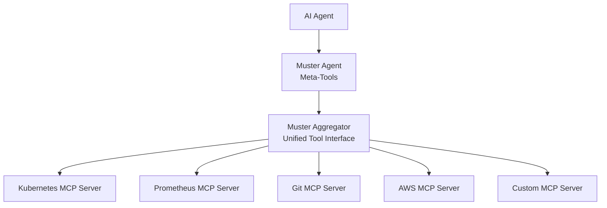
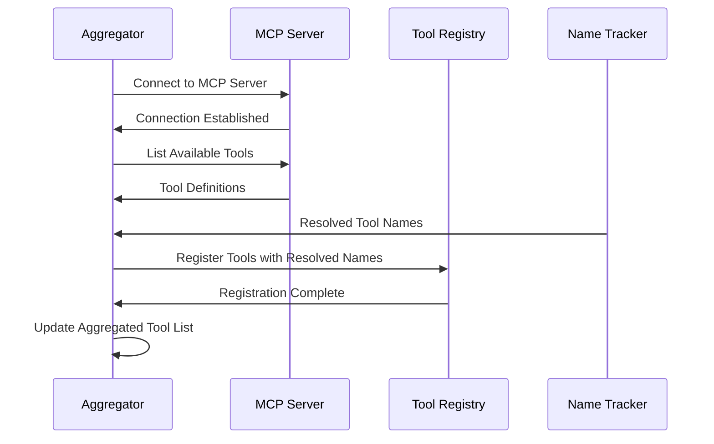

# MCP Aggregation

Deep dive into how Muster aggregates and unifies tools from multiple MCP servers.

## Overview

The Model Context Protocol (MCP) aggregation is one of Muster's core capabilities. It provides a unified interface for AI agents to access tools from multiple MCP servers without needing to know about the underlying complexity of managing multiple connections, tool conflicts, or server lifecycles.

## The Aggregation Challenge

### Without Aggregation

AI agents typically face these challenges when working with multiple MCP servers:


**Problems:**
- **Connection Management**: Agent must manage multiple MCP connections
- **Tool Discovery**: Agent must query each server separately for available tools
- **Name Conflicts**: Multiple servers might provide tools with the same name
- **Lifecycle Complexity**: Agent must handle server startup, failure, and recovery
- **Authentication**: Agent must manage credentials for each server
- **Protocol Variations**: Different servers might implement MCP protocol differently

### With Muster Aggregation

Muster solves these problems by providing a single aggregation layer:



**Benefits:**
- **Single Connection**: Agent connects only to Muster
- **Unified Discovery**: `list_tools` or `filter_tools` reveal all available tools
- **Conflict Resolution**: Automatic tool name prefixing prevents conflicts
- **Lifecycle Management**: Muster handles all server management and tools get updated automatically (without restart in eg Cursor)
- **Protocol Normalization**: Consistent MCP interface regardless of server implementation

## Aggregation Architecture

### Two-Layer Design

Muster implements a sophisticated two-layer aggregation architecture:

#### Layer 1: Agent Interface (Meta-Tools)

The agent layer provides 11 meta-tools that AI agents use to interact with the aggregation system:

| Meta-Tool | Purpose | Example |
|-----------|---------|---------|
| `list_tools` | Discover all available tools | Show tools from all connected servers |
| `call_tool` | Execute any aggregated tool | Execute tools from any connected server |
| `describe_tool` | Get detailed tool documentation | Show parameters and usage for any tool |
| `filter_tools` | Find tools matching patterns | Find all Kubernetes-related tools |
| `get_resource` | Access aggregated resources | Get files from any connected server |
| `list_resources` | Discover available resources | Show all available files and data |
| `get_prompt` | Access aggregated prompts | Get templates from any connected server |
| `list_prompts` | Discover available prompts | Show all available prompt templates |

#### Layer 2: Aggregator Engine

The aggregator engine manages the actual tool execution and server coordination:

```go
// Simplified aggregator architecture
type Aggregator struct {
    servers    map[string]*MCPServer
    tools      map[string]*AggregatedTool
    nameTracker *NameTracker
    registry   *ToolRegistry
}

type AggregatedTool struct {
    Name         string
    OriginalName string
    ServerName   string
    Description  string
    Schema       ToolSchema
}
```

### Tool Namespace Management

#### Automatic Prefixing

Muster automatically resolves tool name conflicts by prefixing tools with their server name and a muster prefix (default: 'x_'):

```yaml
# Original tools from different servers
k8s:
  - name: apply
  - name: get
  - name: delete

prometheus:
  - name: query
  - name: alert

custom:
  - name: apply  # Conflict with kubernetes!
  - name: deploy

# Aggregated tools with automatic prefixing
aggregator:
  - name: x_k8s_apply          # kubernetes-server apply
  - name: x_k8s_get            # kubernetes-server get  
  - name: x_k8s_delete         # kubernetes-server delete
  - name: x_prometheus_query         # prometheus-server query
  - name: x_prometheus_alert         # prometheus-server alert
  - name: x_custom_apply       # custom-server apply
  - name: x_custom_deploy      # custom-server deploy
```

## Tool Discovery and Registration

### Dynamic Tool Registration

Tools are discovered and registered dynamically as MCP servers connect:



### Tool Metadata Aggregation

Each aggregated tool maintains rich metadata:

```go
type AggregatedTool struct {
    // Identity
    Name         string `json:"name"`
    OriginalName string `json:"originalName"`
    ServerName   string `json:"serverName"`
    
    // Documentation
    Description string     `json:"description"`
    Schema      ToolSchema `json:"schema"`
    Examples    []Example  `json:"examples"`
    
    // Runtime Information
    Available   bool      `json:"available"`
    LastSeen    time.Time `json:"lastSeen"`
    CallCount   int64     `json:"callCount"`
    ErrorCount  int64     `json:"errorCount"`
    
    // Server Information
    ServerVersion string            `json:"serverVersion"`
    ServerStatus  ServerStatus      `json:"serverStatus"`
    Capabilities  []string          `json:"capabilities"`
    Tags          map[string]string `json:"tags"`
}
```

## Execution Flow

### Tool Execution Through Aggregation

When an AI agent executes a tool through the aggregation layer:


### Error Handling and Resilience

The aggregator provides robust error handling:

```go
type ExecutionResult struct {
    Success    bool        `json:"success"`
    Result     interface{} `json:"result,omitempty"`
    Error      string      `json:"error,omitempty"`
    ServerInfo ServerInfo  `json:"serverInfo"`
    Duration   duration    `json:"duration"`
    Retries    int         `json:"retries"`
}

type ExecutionPolicy struct {
    RetryAttempts    int           `json:"retryAttempts"`
    RetryDelay       time.Duration `json:"retryDelay"`
    TimeoutDuration  time.Duration `json:"timeoutDuration"`
    FallbackServers  []string      `json:"fallbackServers"`
}
```

### Performance Optimization

#### Connection Pooling

```go
type ConnectionPool struct {
    servers     map[string]*ServerConnection
    maxIdle     int
    maxActive   int
    idleTimeout time.Duration
    healthCheck func(*ServerConnection) bool
}
```

#### Caching Strategy

```go
type ToolCache struct {
    toolDefinitions map[string]*CachedTool
    resultCache     map[string]*CachedResult
    ttl             time.Duration
    maxSize         int
}
```

## Advanced Aggregation Features

### Server Health Monitoring

The aggregator continuously monitors server health:

```yaml
# Server health configuration
health_monitoring:
  enabled: true
  check_interval: 30s
  failure_threshold: 3
  recovery_threshold: 2
  
  checks:
    - type: connection
      timeout: 5s
    - type: tool_list
      timeout: 10s
    - type: ping_tool
      tool_name: "_health_check"
      timeout: 5s
```

## Configuration and Management

### MCP Server Configuration

```yaml
# MCP server definition
apiVersion: muster.giantswarm.io/v1alpha1
kind: MCPServer
metadata:
  name: kubernetes-tools
spec:
  command: kubectl
  args: ["mcp-server"]
  env:
    KUBECONFIG: /etc/kubernetes/config
```

### Aggregator Configuration

```yaml
# Aggregator configuration
aggregator:
    port: 8090
    host: localhost
    transport: streamable-http
    enabled: true
```

### Debugging and Troubleshooting

```bash
# Check aggregator status
muster agent --repl

# List all servers and their tools
> list tools

# Check specific server health
> call core_mcpserver_list

# Debug tool execution
> call x_k8s_apply '{"manifest": "..."}'
```

## Best Practices

### Server Design

- **Focused Responsibility**: Each MCP server should have a clear, focused purpose
- **Consistent Naming**: Use consistent tool naming patterns within servers
- **Error Handling**: Provide clear, actionable error messages
- **JSON Output**: Make sure your MCP server responds with JSON. Not only the MCP JSON-RPC responds but also the payload should be JSON to use all the features of Muster.

### Tool Naming

- **Descriptive Names**: Use clear, descriptive tool names
- **Avoid Conflicts**: Choose unique names when possible
- **Consistent Patterns**: Use consistent naming patterns (verb_noun format)
- **Namespace Awareness**: Consider how names will look with prefixes

### Performance

- **Efficient Tools**: Design tools to be fast and efficient
- **Appropriate Timeouts**: Set reasonable timeout values
- **Resource Management**: Clean up resources properly
- **Caching**: Cache expensive operations when appropriate

## Related Documentation

- [System Architecture](architecture.md) - Overall system design
- [MCP Server Management](../how-to/mcp-server-management.md) - Practical MCP server management
- [Core MCP Tools Reference](../reference/mcp-tools.md) - Complete tool documentation
- [AI Agent Integration](../getting-started/ai-agent-setup.md) - Setting up AI agents 