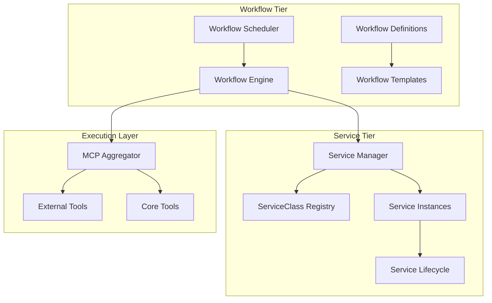
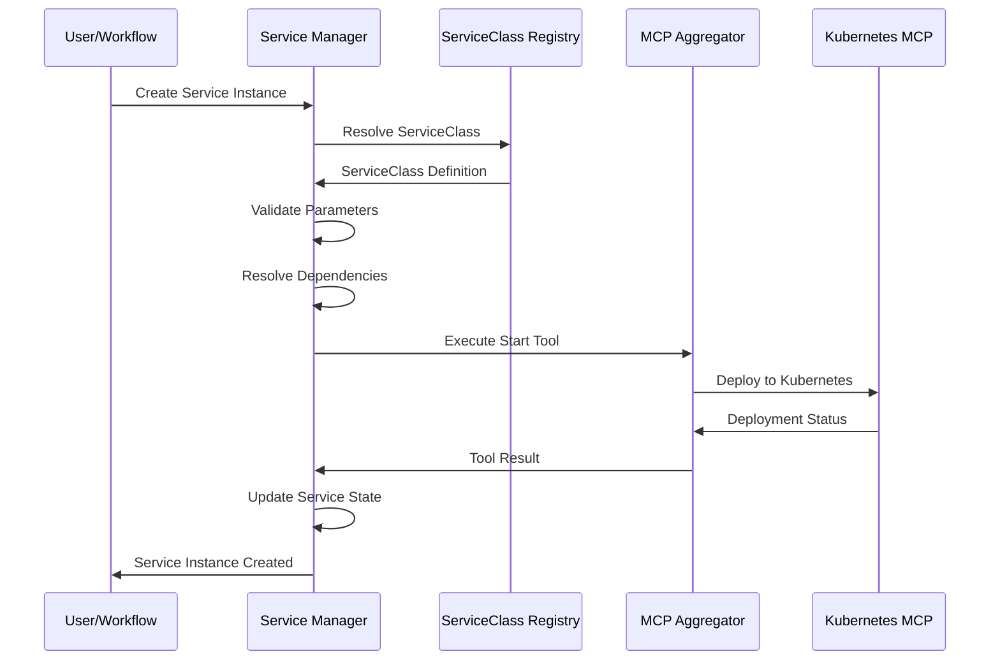

# Service Orchestration and Workflow Management

Deep dive into how Muster orchestrates services and manages complex workflows for platform automation.

## Overview

Muster's orchestration capabilities provide sophisticated automation for complex platform operations. The system combines service lifecycle management with workflow execution to create powerful automation patterns that can handle everything from simple deployments to complex multi-stage platform operations.

## Orchestration Architecture

### Two-Tier Orchestration Model

Muster implements a two-tier orchestration model that separates concerns between service management and workflow execution:



**Workflow Tier Benefits:**
- **Complex Logic**: Handle conditional execution, loops, and error recovery
- **Cross-Service Coordination**: Orchestrate multiple services and external systems
- **Template Reuse**: Create reusable workflow patterns
- **Event-Driven**: React to system events and triggers

**Service Tier Benefits:**
- **Lifecycle Management**: Handle start, stop, restart, and health monitoring
- **Resource Management**: Manage compute, storage, and network resources
- **Dependency Resolution**: Automatically handle service dependencies
- **State Persistence**: Maintain service state across restarts

## Service Orchestration

### ServiceClass Templates

ServiceClasses define reusable service templates that encapsulate deployment patterns:

```yaml
apiVersion: muster.giantswarm.io/v1alpha1
kind: ServiceClass
metadata:
  name: microservice-pattern
  annotations:
    description: "Standard microservice deployment pattern"
spec:
  name: microservice-pattern
  description: "Standardized microservice with monitoring, logging, and health checks"
  
  # Service lifecycle configuration
  lifecycle:
    startTool: x_kubernetes_deploy_service
    stopTool: x_kubernetes_delete_service
    healthCheckTool: x_kubernetes_check_health
    
  # Parameter template
  args:
    service_name:
      type: string
      required: true
      description: "Name of the microservice"
      
    image:
      type: string
      required: true
      description: "Container image to deploy"
      validation:
        pattern: "^[a-zA-Z0-9./:-]+$"
        
    replicas:
      type: integer
      default: 3
      description: "Number of service replicas"
      validation:
        min: 1
        max: 10
        
    environment:
      type: string
      default: "staging"
      enum: ["development", "staging", "production"]
      
    resources:
      type: object
      default:
        cpu: "500m"
        memory: "512Mi"
      description: "Resource requirements"
      
  # Service dependencies
  dependencies:
    - name: monitoring
      type: external
      healthCheck:
        url: "http://prometheus:9090/-/healthy"
        
    - name: logging
      type: external
      healthCheck:
        url: "http://elasticsearch:9200/_cluster/health"
        
  # Health check configuration
  healthCheck:
    enabled: true
    httpGet:
      path: "/health"
      port: 8080
    initialDelaySeconds: 30
    periodSeconds: 10
    timeoutSeconds: 5
    failureThreshold: 3
    
  # Resource management
  resources:
    requests:
      cpu: "{{.resources.cpu}}"
      memory: "{{.resources.memory}}"
    limits:
      cpu: "{{.resources.cpu}}"
      memory: "{{.resources.memory}}"
```

### Service Instance Management

Service instances are created from ServiceClass templates with specific parameters:



### Dependency Resolution

Muster automatically resolves and manages service dependencies:

```go
type DependencyResolver struct {
    graph      *DependencyGraph
    resolver   *ServiceResolver
    healthChecker *HealthChecker
}

func (r *DependencyResolver) ResolveDependencies(service *ServiceInstance) error {
    // Build dependency graph
    deps := r.graph.GetDependencies(service.Name)
    
    // Topological sort for startup order
    startupOrder := r.graph.TopologicalSort(deps)
    
    // Start dependencies in order
    for _, dep := range startupOrder {
        if err := r.startDependency(dep); err != nil {
            return fmt.Errorf("failed to start dependency %s: %w", dep.Name, err)
        }
        
        // Wait for health check
        if err := r.healthChecker.WaitForHealthy(dep, 5*time.Minute); err != nil {
            return fmt.Errorf("dependency %s failed health check: %w", dep.Name, err)
        }
    }
    
    return nil
}
```

## Workflow Management

### Workflow Definition Structure

Workflows define complex, multi-step automation procedures:

```yaml
apiVersion: muster.giantswarm.io/v1alpha1
kind: Workflow
metadata:
  name: full-application-deployment
  annotations:
    description: "Complete application deployment with database, cache, and monitoring"
spec:
  name: full-application-deployment
  description: "Deploy a complete application stack with all dependencies"
  
  # Workflow parameters
  args:
    app_name:
      type: string
      required: true
      description: "Application name"
      validation:
        pattern: "^[a-z][a-z0-9-]*$"
        
    version:
      type: string
      required: true
      description: "Application version to deploy"
      
    environment:
      type: string
      default: "staging"
      enum: ["development", "staging", "production"]
      
    database_enabled:
      type: boolean
      default: true
      description: "Whether to deploy database"
      
    cache_enabled:
      type: boolean
      default: true
      description: "Whether to deploy cache"
      
  # Workflow execution steps
  steps:
    # Step 1: Validate prerequisites
    - id: validate_prerequisites
      description: "Validate deployment prerequisites"
      tool: x_deployment_validate_prerequisites
      args:
        environment: "{{.environment}}"
        app_name: "{{.app_name}}"
      
    # Step 2: Create database (conditional)
    - id: create_database
      description: "Deploy application database"
      condition: "{{.database_enabled}}"
      tool: core_service_create
      args:
        name: "{{.app_name}}-database"
        serviceClassName: "postgres-database"
        parameters:
          database_name: "{{.app_name}}"
          environment: "{{.environment}}"
      
    # Step 3: Wait for database to be healthy
    - id: wait_database_healthy
      description: "Wait for database to become healthy"
      condition: "{{.database_enabled}}"
      tool: core_service_wait_healthy
      args:
        name: "{{.app_name}}-database"
        timeout: "300s"
      depends_on: ["create_database"]
      
    # Step 4: Create cache (conditional, parallel with database)
    - id: create_cache
      description: "Deploy application cache"
      condition: "{{.cache_enabled}}"
      tool: core_service_create
      args:
        name: "{{.app_name}}-cache"
        serviceClassName: "redis-cache"
        parameters:
          environment: "{{.environment}}"
      
    # Step 5: Wait for cache to be healthy
    - id: wait_cache_healthy
      description: "Wait for cache to become healthy"
      condition: "{{.cache_enabled}}"
      tool: core_service_wait_healthy
      args:
        name: "{{.app_name}}-cache"
        timeout: "180s"
      depends_on: ["create_cache"]
      
    # Step 6: Deploy application (depends on both database and cache)
    - id: deploy_application
      description: "Deploy the main application"
      tool: core_service_create
      args:
        name: "{{.app_name}}"
        serviceClassName: "microservice-pattern"
        parameters:
          service_name: "{{.app_name}}"
          image: "{{.app_name}}:{{.version}}"
          environment: "{{.environment}}"
          database_url: "postgres://{{.app_name}}-database:5432/{{.app_name}}"
          cache_url: "redis://{{.app_name}}-cache:6379"
      depends_on: ["wait_database_healthy", "wait_cache_healthy"]
      
    # Step 7: Configure monitoring
    - id: setup_monitoring
      description: "Configure application monitoring"
      tool: x_monitoring_setup_application
      args:
        app_name: "{{.app_name}}"
        environment: "{{.environment}}"
        endpoints:
          - "http://{{.app_name}}:8080/metrics"
          - "http://{{.app_name}}-database:5432"
          - "http://{{.app_name}}-cache:6379"
      depends_on: ["deploy_application"]
      
    # Step 8: Run smoke tests
    - id: run_smoke_tests
      description: "Execute smoke tests"
      tool: x_testing_smoke_tests
      args:
        app_name: "{{.app_name}}"
        environment: "{{.environment}}"
        base_url: "http://{{.app_name}}:8080"
      depends_on: ["setup_monitoring"]
      retry:
        attempts: 3
        delay: "30s"
        
    # Step 9: Configure load balancer
    - id: configure_load_balancer
      description: "Configure load balancer"
      condition: "{{eq .environment \"production\"}}"
      tool: x_networking_configure_lb
      args:
        app_name: "{{.app_name}}"
        backend_url: "http://{{.app_name}}:8080"
        health_check_path: "/health"
      depends_on: ["run_smoke_tests"]
      
  # Error handling configuration
  error_handling:
    strategy: "rollback"
    rollback_steps:
      - id: cleanup_application
        tool: core_service_delete
        args:
          name: "{{.app_name}}"
          
      - id: cleanup_cache
        condition: "{{.cache_enabled}}"
        tool: core_service_delete
        args:
          name: "{{.app_name}}-cache"
          
      - id: cleanup_database
        condition: "{{.database_enabled}}"
        tool: core_service_delete
        args:
          name: "{{.app_name}}-database"
          
  # Timeout configuration
  timeout: "30m"
  
  # Parallel execution configuration
  parallelism:
    max_parallel: 3
    allow_parallel_groups: true
```

### Workflow Execution Engine

The workflow execution engine handles complex orchestration logic:

```go
type WorkflowExecutor struct {
    stepExecutor    *StepExecutor
    dependencyGraph *DependencyGraph
    templateEngine  *TemplateEngine
    errorHandler    *ErrorHandler
    stateManager    *StateManager
}

func (e *WorkflowExecutor) ExecuteWorkflow(ctx context.Context, workflow *Workflow, args map[string]interface{}) (*ExecutionResult, error) {
    // Create execution context
    execCtx := &ExecutionContext{
        WorkflowID: workflow.Name,
        Args:       args,
        State:      make(map[string]interface{}),
        StartTime:  time.Now(),
    }
    
    // Build step dependency graph
    stepGraph, err := e.dependencyGraph.BuildStepGraph(workflow.Steps)
    if err != nil {
        return nil, fmt.Errorf("failed to build dependency graph: %w", err)
    }
    
    // Execute steps in topological order with parallelism
    execution := &WorkflowExecution{
        Context:   execCtx,
        Workflow:  workflow,
        StepGraph: stepGraph,
        Results:   make(map[string]*StepResult),
    }
    
    return e.executeStepsWithDependencies(ctx, execution)
}
```

### Advanced Execution Features

#### Conditional Execution

Steps can be conditionally executed based on parameters or previous step results:

```yaml
# Simple condition
- id: production_only_step
  condition: "{{eq .environment \"production\"}}"
  tool: production_specific_tool
  
# Complex condition with multiple checks
- id: complex_condition_step
  condition: |
    {{and 
      (eq .environment "production")
      (gt .replicas 1)
      (eq .previous_step_result.status "success")
    }}
  tool: conditional_tool
```

#### Parallel Execution

Steps can execute in parallel when dependencies allow:

```yaml
# These steps can run in parallel
- id: setup_database
  tool: core_service_create
  args: {name: "db", serviceClassName: "postgres"}
  
- id: setup_cache
  tool: core_service_create
  args: {name: "cache", serviceClassName: "redis"}
  
# This step waits for both to complete
- id: deploy_app
  tool: core_service_create
  depends_on: ["setup_database", "setup_cache"]
```

#### Error Handling and Recovery

```yaml
# Step-level error handling
- id: risky_operation
  tool: potentially_failing_tool
  retry:
    attempts: 3
    delay: "30s"
    backoff: "exponential"
  on_failure:
    action: "continue"  # or "stop", "rollback"
    
# Workflow-level error handling
error_handling:
  strategy: "rollback"
  notification:
    on_failure: true
    channels: ["slack", "email"]
```

## Template System

### Parameter Templating

Muster uses a powerful template system for dynamic parameter substitution:

```yaml
# Basic parameter substitution
args:
  app_name: "my-app"
  image: "{{.app_name}}:{{.version}}"
  
# Conditional logic
database_url: |
  {{if .database_enabled}}
  postgres://{{.app_name}}-db:5432/{{.app_name}}
  {{else}}
  sqlite:///tmp/{{.app_name}}.db
  {{end}}
  
# Loops and iteration
environments:
  {{range .target_environments}}
  - name: "{{.}}"
    replicas: {{if eq . "production"}}5{{else}}2{{end}}
  {{end}}
  
# Function helpers
current_time: "{{now.Format \"2006-01-02T15:04:05Z\"}}"
random_suffix: "{{.app_name}}-{{randomString 8}}"
```

### Advanced Template Functions

```go
// Custom template functions available in workflows
var TemplateFuncs = template.FuncMap{
    // String functions
    "upper":    strings.ToUpper,
    "lower":    strings.ToLower,
    "replace":  strings.ReplaceAll,
    "contains": strings.Contains,
    
    // Math functions
    "add": func(a, b int) int { return a + b },
    "sub": func(a, b int) int { return a - b },
    "mul": func(a, b int) int { return a * b },
    
    // Time functions
    "now":       time.Now,
    "timeAdd":   func(d time.Duration) time.Time { return time.Now().Add(d) },
    "timeFormat": func(t time.Time, layout string) string { return t.Format(layout) },
    
    // Random functions
    "randomString": generateRandomString,
    "randomInt":    rand.Intn,
    
    // Environment functions
    "env":     os.Getenv,
    "envWith": os.LookupEnv,
    
    // JSON functions
    "toJson":   toJSON,
    "fromJson": fromJSON,
    
    // Base64 functions
    "base64encode": base64.StdEncoding.EncodeToString,
    "base64decode": base64.StdEncoding.DecodeString,
}
```

## Event-Driven Orchestration

### Event System

Muster supports event-driven orchestration for reactive automation:

```yaml
# Event-triggered workflow
apiVersion: muster.giantswarm.io/v1alpha1
kind: Workflow
metadata:
  name: auto-scale-response
spec:
  triggers:
    - type: metric_threshold
      source: prometheus
      query: "avg(cpu_usage) > 80"
      duration: "5m"
      
    - type: service_event
      source: kubernetes
      event_type: "pod_oom_killed"
      
  steps:
    - id: analyze_load
      tool: x_monitoring_analyze_load
      
    - id: scale_service
      condition: "{{gt .load_analysis.recommended_replicas .current_replicas}}"
      tool: core_service_scale
      args:
        name: "{{.triggered_service}}"
        replicas: "{{.load_analysis.recommended_replicas}}"
```

### Service Lifecycle Events

Services emit lifecycle events that can trigger workflows:

```go
type ServiceEvent struct {
    Type        EventType `json:"type"`
    ServiceName string    `json:"serviceName"`
    Timestamp   time.Time `json:"timestamp"`
    Details     EventDetails `json:"details"`
}

type EventType string

const (
    ServiceCreated    EventType = "service.created"
    ServiceStarted    EventType = "service.started"
    ServiceStopped    EventType = "service.stopped"
    ServiceFailed     EventType = "service.failed"
    ServiceHealthy    EventType = "service.healthy"
    ServiceUnhealthy  EventType = "service.unhealthy"
    ServiceScaled     EventType = "service.scaled"
    ServiceUpdated    EventType = "service.updated"
)
```

## Monitoring and Observability

### Orchestration Metrics

Comprehensive metrics for monitoring orchestration performance:

```prometheus
# Workflow execution metrics
muster_workflow_executions_total{workflow_name, status}
muster_workflow_duration_seconds{workflow_name}
muster_workflow_step_duration_seconds{workflow_name, step_id}
muster_workflow_active_executions{workflow_name}

# Service orchestration metrics
muster_service_lifecycle_events_total{service_name, event_type}
muster_service_dependency_resolution_duration_seconds
muster_service_health_check_duration_seconds{service_name}
muster_service_startup_duration_seconds{service_name}

# Error and retry metrics
muster_workflow_step_retries_total{workflow_name, step_id}
muster_workflow_failures_total{workflow_name, failure_type}
muster_service_startup_failures_total{service_class}
```

### Execution Tracing

Distributed tracing for complex workflow executions:

```go
type ExecutionTrace struct {
    TraceID      string                 `json:"traceId"`
    WorkflowName string                 `json:"workflowName"`
    StartTime    time.Time              `json:"startTime"`
    Duration     time.Duration          `json:"duration"`
    Steps        []StepTrace            `json:"steps"`
    Services     []ServiceTrace         `json:"services"`
    Events       []Event                `json:"events"`
}

type StepTrace struct {
    StepID       string               `json:"stepId"`
    StartTime    time.Time            `json:"startTime"`
    Duration     time.Duration        `json:"duration"`
    Tool         string               `json:"tool"`
    Status       ExecutionStatus      `json:"status"`
    Dependencies []string             `json:"dependencies"`
    Retries      int                  `json:"retries"`
    Error        string               `json:"error,omitempty"`
}
```

## Best Practices

### Service Design

1. **Single Responsibility**: Each service should have a clear, focused purpose
2. **Stateless Design**: Prefer stateless services with external state storage
3. **Health Checks**: Implement comprehensive health checks
4. **Graceful Shutdown**: Handle shutdown signals properly
5. **Resource Limits**: Define appropriate resource requests and limits

### Workflow Design

1. **Idempotent Steps**: Design steps to be safely retryable
2. **Clear Dependencies**: Explicitly define step dependencies
3. **Error Handling**: Plan for failure scenarios and recovery
4. **Parameterization**: Use parameters for reusability
5. **Documentation**: Document workflow purpose and usage

### Orchestration Patterns

#### Blue-Green Deployment

```yaml
# Blue-green deployment workflow
steps:
  - id: deploy_green
    tool: core_service_create
    args:
      name: "{{.app_name}}-green"
      serviceClassName: "microservice-pattern"
      
  - id: test_green
    tool: x_testing_integration_tests
    args:
      target: "{{.app_name}}-green"
      
  - id: switch_traffic
    tool: x_networking_switch_traffic
    args:
      from: "{{.app_name}}-blue"
      to: "{{.app_name}}-green"
      
  - id: cleanup_blue
    tool: core_service_delete
    args:
      name: "{{.app_name}}-blue"
```

#### Canary Deployment

```yaml
# Canary deployment with gradual traffic shift
steps:
  - id: deploy_canary
    tool: core_service_create
    args:
      name: "{{.app_name}}-canary"
      replicas: 1
      
  - id: route_5_percent
    tool: x_networking_route_traffic
    args:
      canary: "{{.app_name}}-canary"
      stable: "{{.app_name}}-stable"
      canary_percent: 5
      
  - id: monitor_metrics
    tool: x_monitoring_watch_metrics
    args:
      duration: "10m"
      thresholds:
        error_rate: 0.01
        latency_p99: 500
        
  - id: route_50_percent
    condition: "{{.metrics.error_rate < 0.01}}"
    tool: x_networking_route_traffic
    args:
      canary_percent: 50
```

## Related Documentation

- [System Architecture](architecture.md) - Overall system design
- [MCP Aggregation](mcp-aggregation.md) - Tool aggregation details
- [Workflow Creation](../how-to/workflow-creation.md) - Practical workflow creation
- [Service Configuration](../how-to/service-configuration.md) - Service management guide
- [Monitoring](../operations/monitoring.md) - Observability setup 