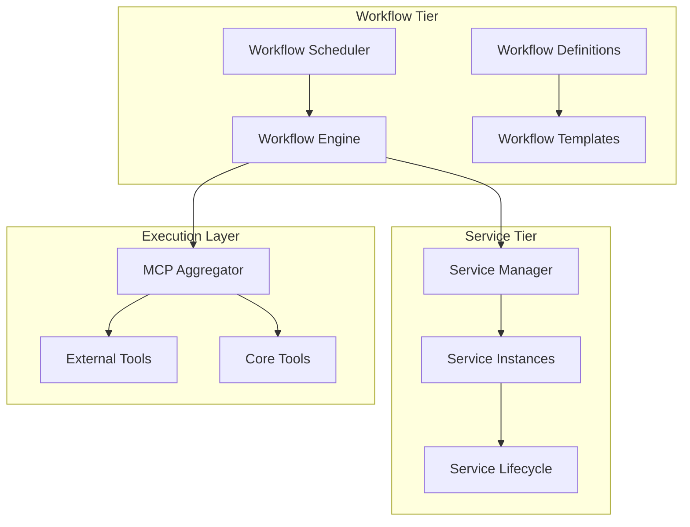
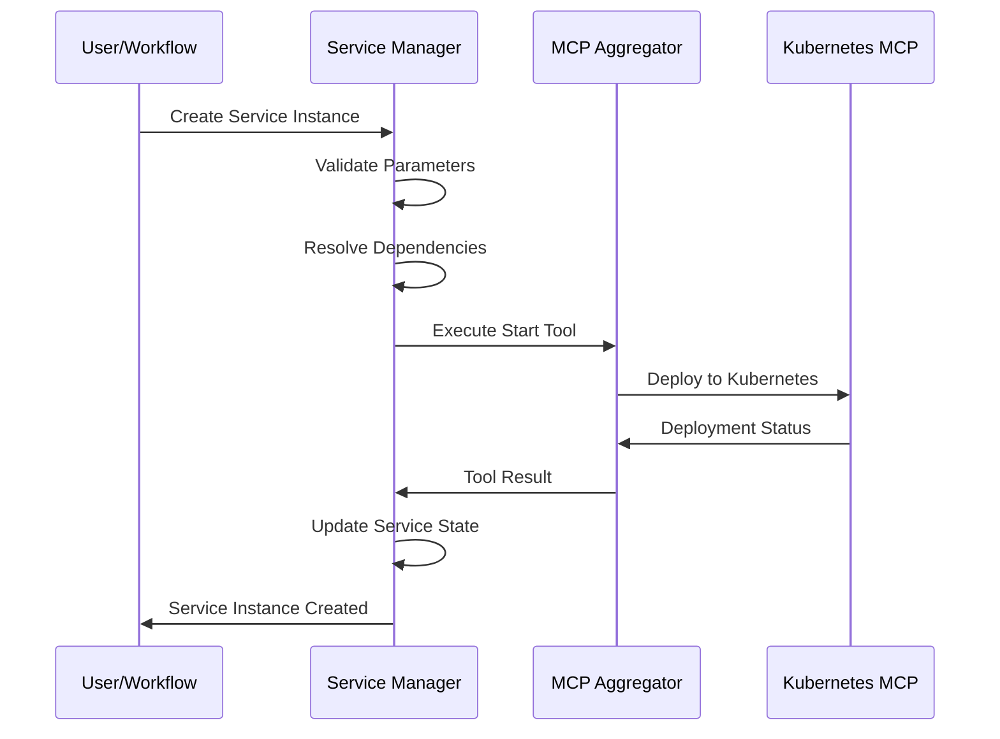

# Service Orchestration and Workflow Management

Deep dive into how Muster orchestrates services and manages complex workflows for platform automation.

## Overview

Muster's orchestration capabilities provide sophisticated automation for complex platform operations. The system combines service lifecycle management with workflow execution to create powerful automation patterns that can handle everything from simple deployments to complex multi-stage platform operations.

## Orchestration Architecture

### Two-Tier Orchestration Model

Muster implements a two-tier orchestration model that separates concerns between service management and workflow execution:


```mermaid
graph TB
    subgraph "Workflow Tier"
        WE[Workflow Engine]
        WD[Workflow Definitions]
        WT[Workflow Templates]
        WS[Workflow Scheduler]
    end

    subgraph "Service Tier"
        SM[Service Manager]
        SI[Service Instances]
        SL[Service Lifecycle]
    end

    subgraph "Execution Layer"
        MCPAgg[MCP Aggregator]
        ExtTools[External Tools]
        CoreTools[Core Tools]
    end

    WE --> SM
    WE --> MCPAgg
    SM --> SI
    WS --> WE
    WD --> WT

    MCPAgg --> ExtTools
    MCPAgg --> CoreTools

    SI --> SL
```

**Workflow Tier Benefits:**
- **Complex Logic**: Handle conditional execution, loops, and error recovery
- **Cross-Service Coordination**: Orchestrate multiple services and external systems
- **Template Reuse**: Create reusable workflow patterns
- **Event-Driven**: React to system events and triggers

**Service Tier Benefits:**
- **Lifecycle Management**: Handle start, stop, restart, and health monitoring
- **Resource Management**: Manage compute, storage, and network resources
- **Dependency Resolution**: Automatically handle service dependencies
- **State Persistence**: Maintain service state across restarts

## Service Orchestration

### Service Instance Management

Service instances are created with specific parameters:


```mermaid
sequenceDiagram
    participant U as User/Workflow
    participant SM as Service Manager
    participant MCPAgg as MCP Aggregator
    participant K8s as Kubernetes MCP

    U->>SM: Create Service Instance
    SM->>SM: Validate Parameters
    SM->>SM: Resolve Dependencies
    SM->>MCPAgg: Execute Start Tool
    MCPAgg->>K8s: Deploy to Kubernetes
    K8s->>MCPAgg: Deployment Status
    MCPAgg->>SM: Tool Result
    SM->>SM: Update Service State
    SM->>U: Service Instance Created
```

### Dependency Resolution

Muster automatically resolves and manages service dependencies:

```go
type DependencyResolver struct {
    graph      *DependencyGraph
    resolver   *ServiceResolver
    healthChecker *HealthChecker
}

func (r *DependencyResolver) ResolveDependencies(service *ServiceInstance) error {
    // Build dependency graph
    deps := r.graph.GetDependencies(service.Name)

    // Topological sort for startup order
    startupOrder := r.graph.TopologicalSort(deps)

    // Start dependencies in order
    for _, dep := range startupOrder {
        if err := r.startDependency(dep); err != nil {
            return fmt.Errorf("failed to start dependency %s: %w", dep.Name, err)
        }

        // Wait for health check
        if err := r.healthChecker.WaitForHealthy(dep, 5*time.Minute); err != nil {
            return fmt.Errorf("dependency %s failed health check: %w", dep.Name, err)
        }
    }

    return nil
}
```

## Workflow Management

### Workflow Execution Engine

The workflow execution engine handles complex orchestration logic:

```go
type WorkflowExecutor struct {
    stepExecutor    *StepExecutor
    dependencyGraph *DependencyGraph
    templateEngine  *TemplateEngine
    errorHandler    *ErrorHandler
    stateManager    *StateManager
}

func (e *WorkflowExecutor) ExecuteWorkflow(ctx context.Context, workflow *Workflow, args map[string]interface{}) (*ExecutionResult, error) {
    // Create execution context
    execCtx := &ExecutionContext{
        WorkflowID: workflow.Name,
        Args:       args,
        State:      make(map[string]interface{}),
        StartTime:  time.Now(),
    }

    // Build step dependency graph
    stepGraph, err := e.dependencyGraph.BuildStepGraph(workflow.Steps)
    if err != nil {
        return nil, fmt.Errorf("failed to build dependency graph: %w", err)
    }

    // Execute steps in topological order with parallelism
    execution := &WorkflowExecution{
        Context:   execCtx,
        Workflow:  workflow,
        StepGraph: stepGraph,
        Results:   make(map[string]*StepResult),
    }

    return e.executeStepsWithDependencies(ctx, execution)
}
```

### Advanced Execution Features

#### Conditional Execution

A step's `condition` is an object. The simplest form is a boolean Go-template
gate that sees `.input`, `.results`, and `.vars`:

```yaml
# Run only when the gate renders "true"
- id: production_only_step
  condition:
    template: '{{ eq .input.environment "production" }}'
  tool: production_specific_tool

# The gate can combine inputs, prior results, and loop variables
- id: complex_condition_step
  condition:
    template: >-
      {{ and
        (eq .input.environment "production")
        (gt .input.replicas 1)
        (eq .results.previous_step.status "success") }}
  tool: conditional_tool
```

A condition can instead evaluate a tool call (`condition.tool` with
`expect`/`expectNot`) or reuse a prior step's result (`condition.fromStep`).

#### Error Handling and Recovery

Let a non-critical step fail without failing the whole workflow:

```yaml
- id: risky_operation
  tool: potentially_failing_tool
  allowFailure: true
```

When a step that does *not* allow failure fails, the workflow's `onFailure`
handlers run as best-effort cleanup/rollback:

```yaml
spec:
  steps:
    - id: provision
      tool: create_resources
  onFailure:
    - id: cleanup
      tool: delete_resources
      args:
        target: "{{ .input.name }}"
```

There is no built-in `retry`/`backoff` or per-step `on_failure` action — model
retries as explicit steps, and rollback via the workflow-level `onFailure`
handler.

## Template System

### Parameter Templating

Muster renders parameters with Go's `text/template`. Workflow inputs are under
`.input`, stored step results under `.results` (`.context` is an alias), and
loop/user variables under `.vars`. Templates render with `missingkey=error`, so
a reference to a value that does not exist fails the step.

```yaml
# Basic parameter substitution
args:
  image: "{{ .input.app_name }}:{{ .input.version }}"

# Conditional logic
database_url: |
  {{ if .input.database_enabled }}
  postgres://{{ .input.app_name }}-db:5432/{{ .input.app_name }}
  {{ else }}
  sqlite:///tmp/{{ .input.app_name }}.db
  {{ end }}

# Loops and iteration (range rebinds dot to the element)
environments:
  {{ range .input.target_environments }}
  - name: "{{ . }}"
    replicas: {{ if eq . "production" }}5{{ else }}2{{ end }}
  {{ end }}
```

### Available Template Functions

Templates have the full [Sprig](https://masterminds.github.io/sprig/) function
library available in addition to the Go built-ins — there is no muster-specific
function set. Common examples:

```yaml
args:
  # String/case: upper, lower, replace, contains, trim, ...
  name: "{{ .input.app_name | lower }}"
  # Time: now, date, dateModify, ...
  current_time: "{{ now | date \"2006-01-02T15:04:05Z07:00\" }}"
  # Random: randAlphaNum, randAlpha, randNumeric, ...
  random_suffix: "{{ .input.app_name }}-{{ randAlphaNum 8 }}"
  # Encoding/JSON: b64enc, b64dec, toJson, fromJson, ...
  encoded: "{{ .input.payload | b64enc }}"
```

## Events and Observation

Muster's reconcilers emit Kubernetes events for MCPServer and Workflow lifecycle
changes — creation, validation, tool availability, and failures. These events are
**observational**: query them with `muster events` (see the
[Events reference](../reference/events.md)) or watch them with any Kubernetes
controller to build reactive automation around muster.

Workflows are executed on demand, not by an embedded trigger engine. Run a
workflow as its aggregated `workflow_<name>` tool, with
`muster start workflow <name>`, or from another workflow step. To make automation
reactive, wire your external triggers (alerts, schedulers, controllers) to one of
those entry points — the Workflow spec itself has no `triggers` field.

## Monitoring and Observability

Muster instruments itself with OpenTelemetry. Logs, traces, and metrics are
exported via OTLP when the standard `OTEL_EXPORTER_OTLP_*` environment variables
point at a collector, and workflow executions are traced as spans (per workflow
and per step). Consume that data in your observability backend — there is no
muster-specific metrics CLI.

Per-execution detail is also recorded on the workflow execution object itself
(step status, inputs, results, and timing) and retrievable with:

```bash
muster get workflow-execution <id> -o yaml
muster list workflow-execution
```

## Best Practices

### Service Design

1. **Single Responsibility**: Each service should have a clear, focused purpose
2. **Stateless Design**: Prefer stateless services with external state storage
3. **Health Checks**: Implement comprehensive health checks
4. **Graceful Shutdown**: Handle shutdown signals properly
5. **Resource Limits**: Define appropriate resource requests and limits

### Workflow Design

1. **Idempotent Steps**: Design steps to be safely retryable
2. **Clear Dependencies**: Explicitly define step dependencies
3. **Error Handling**: Plan for failure scenarios and recovery
4. **Parameterization**: Use parameters for reusability
5. **Documentation**: Document workflow purpose and usage

## Related Documentation

- [System Architecture](architecture.md) - Overall system design
- [MCP Aggregation](mcp-aggregation.md) - Tool aggregation details
- [Workflow Creation](../how-to/workflow-creation.md) - Practical workflow creation
- [Monitoring](../operations/monitoring.md) - Observability setup
