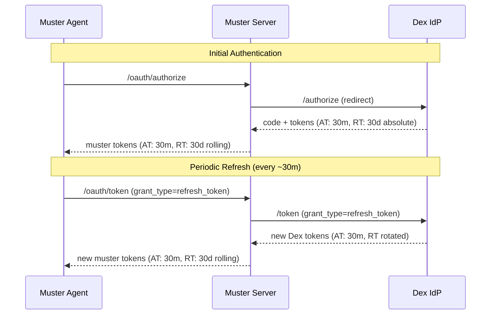

# Security Configuration

Security best practices and configuration guidance for Muster deployments.

## Overview

This guide covers security considerations for deploying and operating Muster in production environments, including authentication, token lifecycle, network security, and secure configuration management.

## Token Lifecycle

Muster's authentication involves two independent token loops: one between the **agent and muster server**, and one between the **muster server and the identity provider (Dex)**. Understanding how these interact is essential for configuring session lifetimes correctly.

### Dual Token Loop



There are four tokens in play:

| Token | Lifetime | Renewed How | Renewed When |
|-------|----------|-------------|--------------|
| Dex access token | 30m (`idTokens`) | Proactive by muster server | Within 5m of expiry during `ValidateToken` |
| Dex refresh token | 30d absolute (`absoluteLifetime`) | Rotated on each use by Dex | When muster refreshes Dex access token |
| Muster access token | 30m (capped by `capTokenExpiry`) | Client requests refresh | When client detects expiry (60s buffer) |
| Muster refresh token | 30d rolling | Rotated on each use by muster | When client refreshes muster access token |

### Access Token Capping

Muster's `DefaultAccessTokenTTL` is set to 30 minutes, intentionally matching Dex's `idTokens` expiry. The mcp-oauth library's `capTokenExpiry` function ensures that even if the configured TTL is longer, the effective access token lifetime never exceeds the provider's token lifetime:

```go
func (s *Server) capTokenExpiry(providerExpiry time.Time) time.Time {
    expiry := time.Now().Add(time.Duration(s.Config.AccessTokenTTL) * time.Second)
    if !providerExpiry.IsZero() && providerExpiry.After(time.Now()) && providerExpiry.Before(expiry) {
        expiry = providerExpiry
    }
    return expiry
}
```

This means `muster auth status` accurately shows "Expires: in 29 minutes" after login.

### Refresh Token Alignment

Muster's `DefaultRefreshTokenTTL` (the session duration) is set to 30 days, aligned with Dex's `absoluteLifetime`. This alignment is critical because:

- **Muster** uses a **rolling** refresh token TTL -- the expiry resets on each token rotation.
- **Dex** uses an **absolute** refresh token lifetime -- measured from the original login, never resets.

If the muster session duration were set longer than Dex's `absoluteLifetime`, users would see a misleading session estimate. For example, if muster showed "60 days remaining" but Dex's absolute lifetime had already elapsed, the next refresh would fail with "failed to refresh token with provider", forcing re-authentication.

By aligning the defaults to 30 days, `muster auth status` shows an accurate session estimate.

### Default Token Configuration

| Parameter | Default | Source |
|-----------|---------|--------|
| `DefaultAccessTokenTTL` | 30 minutes | `internal/server/oauth_http.go` |
| `DefaultRefreshTokenTTL` | 30 days (720h) | `pkg/oauth/types.go` (`DefaultSessionDuration`) |
| `TokenRefreshThreshold` | 5 minutes | mcp-oauth (proactive server-side Dex token refresh) |
| Agent `tokenExpiryBuffer` | 60 seconds | `internal/agent/oauth/token_store.go` |

### Configuring Session Duration

The `sessionDuration` field in the aggregator OAuth config controls the muster refresh token TTL:

```yaml
aggregator:
  oauth:
    server:
      sessionDuration: "720h"  # 30 days (default)
```

When changing this value, ensure it is aligned with Dex's `absoluteLifetime`. See the [configuration reference](../reference/configuration.md#session-duration) for details and valid values.

## Authentication and Authorization

### Agent Authentication

By default, Muster operates without authentication for local development. In production, OAuth 2.1 protection is enabled via the aggregator's OAuth configuration. See [ADR-005: Muster Auth](../explanation/decisions/005-muster-auth.md) for the architecture.

### SSO Token Forwarding

When multiple MCP servers share the same identity provider, Muster supports Single Sign-On via ID token forwarding and RFC 8693 token exchange. See [ADR-009: SSO Token Forwarding](../explanation/decisions/009-sso-token-forwarding.md) for details.

### Token Storage

Tokens are stored securely on the agent side in `~/.config/muster/tokens/` with:

- File permissions of `0600` (owner read/write only)
- Directory permissions of `0700` (owner only)
- Hashed filenames to avoid exposing server URLs

Token values are never logged in plaintext; only hashed identifiers or truncated prefixes appear in logs.

### Network Security

All OAuth communication requires HTTPS in production. The mcp-oauth library enforces:

- **PKCE** (Proof Key for Code Exchange) on every authorization flow
- **State parameter** validation to prevent CSRF attacks
- **AES-256-GCM** token encryption when an encryption key is configured
- **Rate limiting** on registration, authorization, and token endpoints

## Next Steps

- [Configure production deployment](installation.md)
- [Review operational procedures](../how-to/troubleshooting.md)
- [Configuration reference](../reference/configuration.md)
- [CLI auth reference](../reference/cli/auth.md)

## Related Resources

- [Installation Guide](installation.md)
- [Troubleshooting Guide](../how-to/troubleshooting.md)
- [System Architecture](../explanation/architecture.md)
- [ADR-004: OAuth Proxy](../explanation/decisions/004-oauth-proxy.md)
- [ADR-005: Muster Auth](../explanation/decisions/005-muster-auth.md)
- [ADR-009: SSO Token Forwarding](../explanation/decisions/009-sso-token-forwarding.md)
